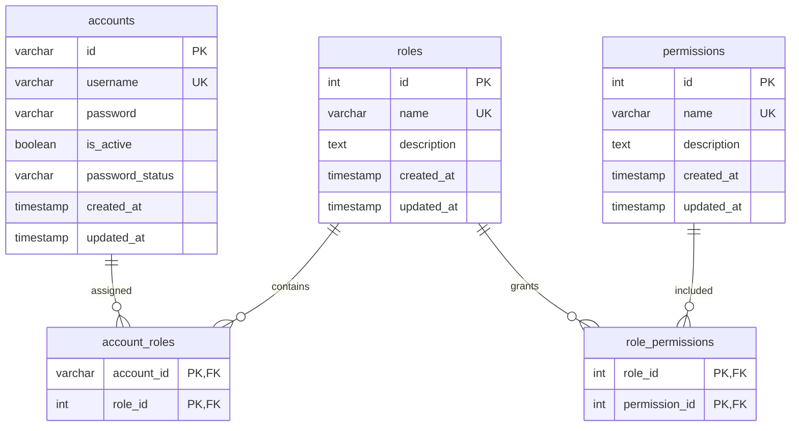
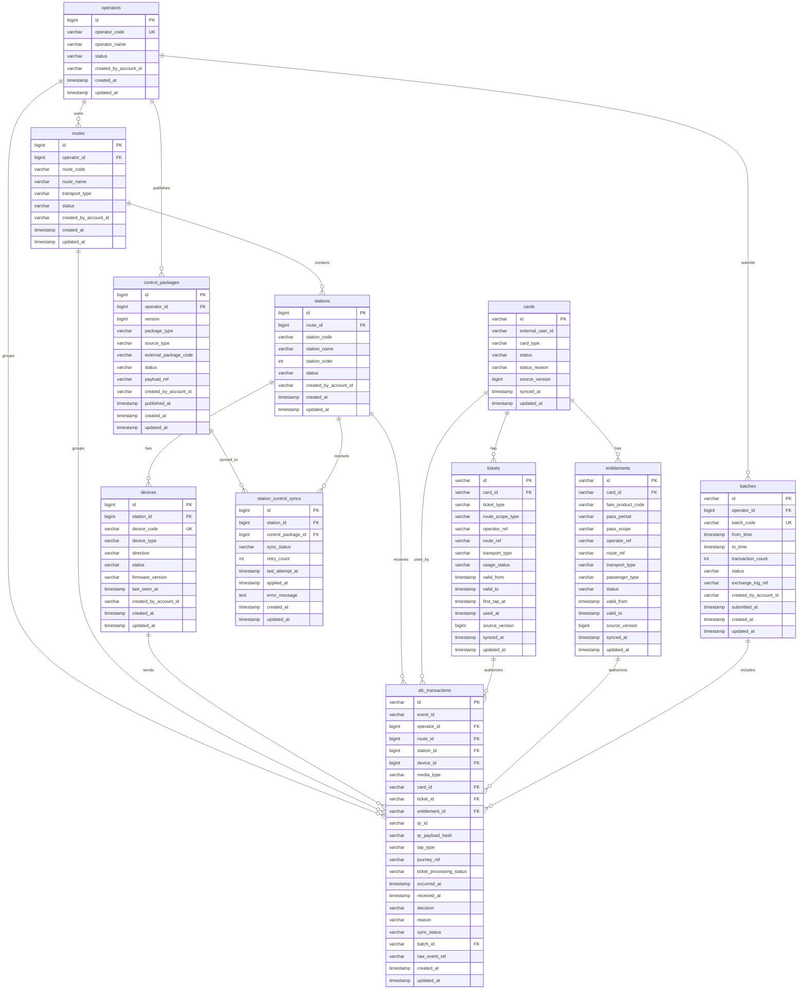

# Draft Schema `auth_db` Và `afc_ops_db`

Tài liệu này là bản nháp schema tạm thời, được suy ra từ:

- `document/Tổng hợp Chức năng Hệ thống AFC - Cấp 3 và Cấp 4 V2.md`
- `document/Breakdown Chức năng AFC Cấp 3 và Cấp 4.md`
- `document/Use Case Spec AFC Cấp 3 và Cấp 4.md`

Schema chưa phải bản migration cuối cùng. Mục tiêu là xác định các entity và quan hệ tối thiểu trước khi triển khai code.

## 1. Nguyên Tắc Chung

- `auth_db` thuộc `auth-service`.
- `afc_ops_db` thuộc `afc-ops-service`.
- Không tạo foreign key vật lý giữa hai database.
- Các bảng do nhân sự tạo hoặc thay đổi cấu hình quan trọng lưu `created_by_account_id` để truy vết trực tiếp người tạo. Trong `afc_ops_db`, field này là tham chiếu mềm sang `auth_db.accounts`.
- Không thêm `created_by_account_id` cho dữ liệu runtime, dữ liệu đồng bộ từ C5 hoặc bản ghi do job hệ thống tự sinh; nguồn tạo của các dữ liệu này được xác định bằng device/source/version/integration log tương ứng.
- Dữ liệu log, audit, raw payload, heartbeat lịch sử, incident lịch sử và request/response tích hợp không nằm trong hai RDBMS này; dự kiến lưu MongoDB.
- `afc_ops_db` có thể lưu nhiều đơn vị vận hành trong bảng `operators` để đồng bộ/giám sát dữ liệu liên quan. MVP chỉ chưa làm phân quyền account theo từng operator.

## 2. Draft `auth_db`

### 2.1. Phạm Vi

`auth_db` chỉ phục vụ tài khoản nhân sự của đơn vị vận hành:

- `OPERATOR_ADMIN`
- `OPERATOR_MANAGER`
- `STATION_OPERATOR`

Account tối thiểu chỉ cần:

- username;
- password hash;
- trạng thái active;
- trạng thái mật khẩu.

Không cần trong MVP:

- email;
- verify email;
- phone number;
- account profile;
- passenger account;
- wallet;
- OTP;
- notification/mail service.

`PASSENGER_APP` trong các use case mới không dùng account nhân sự trong `auth_db`. App/user hành khách được định danh bởi hệ ngoài hoặc C5; C4 có thể nhận `external_user_id` trong dữ liệu card/ticket/entitlement đồng bộ nếu C5 cho phép chia sẻ.

### 2.2. Role Và Permission

Vẫn giữ mô hình:

```text
accounts n-n roles
roles n-n permissions
```

Tuy nhiên, MVP **không làm tính năng quản lý quyền động**:

- Role và permission được định nghĩa trước trong code hoặc migration seed.
- Không cung cấp API/UI tạo, sửa, xóa role.
- Không cung cấp API/UI tạo, sửa, xóa permission.
- `OPERATOR_ADMIN` chỉ gán các role đã tồn tại cho account.
- Backend vẫn kiểm tra permission để code authorization rõ ràng và dễ mở rộng sau này.

### 2.3. ERD `auth_db`



### 2.4. Bảng `accounts`

| Field | Type | Constraint | Ghi chú |
| --- | --- | --- | --- |
| id | VARCHAR(36) | PK | UUID |
| username | VARCHAR(50) | NOT NULL, UNIQUE | Dùng đăng nhập |
| password | VARCHAR(100) | NOT NULL | Password hash |
| is_active | BOOLEAN | NOT NULL, DEFAULT TRUE | Khóa/mở account |
| password_status | VARCHAR(30) | NOT NULL, DEFAULT NEED_TO_CHANGE | NORMAL, NEED_TO_CHANGE, NEED_TO_RESET |
| created_at | TIMESTAMP | NOT NULL |  |
| updated_at | TIMESTAMP | NOT NULL |  |

Trong MVP, mỗi account nội bộ được hiểu là thuộc phạm vi vận hành hiện tại của hệ thống C4, nên `accounts` chưa cần `operator_id`. `afc_ops_db` vẫn có thể có nhiều `operators` để lưu dữ liệu đồng bộ/giám sát; chỉ là account chưa bị giới hạn thao tác theo từng operator. Nếu sau này cần một user chỉ được thao tác đúng một hoặc vài operator thì bổ sung `operator_id` hoặc bảng scope account-operator.

### 2.5. Bảng `roles`

| Field | Type | Constraint | Ghi chú |
| --- | --- | --- | --- |
| id | INT | PK, IDENTITY |  |
| name | VARCHAR(50) | NOT NULL, UNIQUE | Predefined role |
| description | TEXT | NOT NULL |  |
| created_at | TIMESTAMP | NOT NULL |  |
| updated_at | TIMESTAMP | NOT NULL |  |

Role seed đề xuất:

| Role | Mô tả |
| --- | --- |
| `OPERATOR_ADMIN` | Quản lý account và gán role trong phạm vi hệ thống C4 hiện tại |
| `OPERATOR_MANAGER` | Quản lý vận hành Cấp 4 |
| `STATION_OPERATOR` | Giám sát vận hành Cấp 3 |

### 2.6. Bảng `permissions`

| Field | Type | Constraint | Ghi chú |
| --- | --- | --- | --- |
| id | INT | PK, IDENTITY |  |
| name | VARCHAR(100) | NOT NULL, UNIQUE | Predefined permission |
| description | TEXT | NOT NULL |  |
| created_at | TIMESTAMP | NOT NULL |  |
| updated_at | TIMESTAMP | NOT NULL |  |

Permission seed đề xuất:

| Permission | Mô tả |
| --- | --- |
| `ACCOUNT_READ` | Xem account nhân sự |
| `ACCOUNT_WRITE` | Tạo, khóa, reset account nhân sự |
| `MASTER_DATA_READ` | Xem route, station, device |
| `MASTER_DATA_WRITE` | Tạo/cập nhật route, station, device |
| `DEVICE_MONITOR_READ` | Xem trạng thái thiết bị |
| `TRANSACTION_READ` | Tra cứu transaction |
| `INCIDENT_READ` | Xem incident log |
| `CONTROL_PACKAGE_READ` | Xem control package và trạng thái sync |
| `CONTROL_PACKAGE_WRITE` | Tạo/publish control package |
| `DASHBOARD_READ` | Xem dashboard vận hành |
| `BATCH_READ` | Xem batch Cấp 5 |
| `BATCH_WRITE` | Tạo/gửi batch Cấp 5 |
| `AUDIT_READ` | Xem audit log |

### 2.7. Bảng Mapping

#### `account_roles`

| Field | Type | Constraint |
| --- | --- | --- |
| account_id | VARCHAR(36) | PK, FK accounts |
| role_id | INT | PK, FK roles |

#### `role_permissions`

| Field | Type | Constraint |
| --- | --- | --- |
| role_id | INT | PK, FK roles |
| permission_id | INT | PK, FK permissions |

## 3. Draft `afc_ops_db`

### 3.1. Phạm Vi

`afc_ops_db` lưu dữ liệu vận hành đã chuẩn hóa cho Cấp 3/Cấp 4:

- operator;
- tuyến;
- ga/trạm;
- thiết bị;
- transaction từ thiết bị Cấp 2;
- bản sao đồng bộ card/ticket/entitlement nhận từ Cấp 5;
- trạng thái hiện hành của card nhận từ Cấp 5 để verify blacklist/cancelled/inactive;
- control package từ Cấp 4 xuống Cấp 3;
- trạng thái station đã nhận/applied package;
- batch dữ liệu vận hành gửi Cấp 5.

Không lưu trong `afc_ops_db`:

- raw media token;
- heartbeat lịch sử;
- incident lịch sử;
- raw device payload;
- audit log;
- integration request/response;
- passenger profile đầy đủ, wallet/card balance, payment, fare engine và clearing.
- source of truth của card, ticket, entitlement và blacklist; C4 chỉ lưu read model/bản sao hiện hành đồng bộ từ C5.

### 3.2. ERD `afc_ops_db`



### 3.3. Master Data

#### `operators`

| Field | Type | Constraint | Ghi chú |
| --- | --- | --- | --- |
| id | BIGINT | PK, IDENTITY |  |
| operator_code | VARCHAR(50) | NOT NULL, UNIQUE | Mã đơn vị vận hành dùng để tích hợp với C5 |
| operator_name | VARCHAR(255) | NOT NULL |  |
| status | VARCHAR(30) | NOT NULL | ACTIVE, DISABLED |
| created_by_account_id | VARCHAR(36) | NULL | Tham chiếu mềm sang auth_db.accounts; null nếu operator được bootstrap/seed |
| created_at | TIMESTAMP | NOT NULL |  |
| updated_at | TIMESTAMP | NOT NULL |  |

`operators` là master data vận hành/tích hợp, không phải scope phân quyền account trong MVP. Một account nội bộ hiện có thể thao tác trong phạm vi hệ thống C4 đang triển khai; việc giới hạn account theo operator sẽ là mở rộng sau.

#### `routes`

| Field | Type | Constraint | Ghi chú |
| --- | --- | --- | --- |
| id | BIGINT | PK, IDENTITY |  |
| operator_id | BIGINT | NOT NULL, FK operators |  |
| route_code | VARCHAR(50) | NOT NULL | Unique theo operator; phải map được với `route_ref` C5 trả về |
| route_name | VARCHAR(255) | NOT NULL |  |
| transport_type | VARCHAR(30) | NOT NULL | METRO, BUS |
| status | VARCHAR(30) | NOT NULL | ACTIVE, DISABLED |
| created_by_account_id | VARCHAR(36) | NOT NULL | Tham chiếu mềm sang auth_db.accounts; người tạo trực tiếp hoặc xác nhận import |
| created_at | TIMESTAMP | NOT NULL |  |
| updated_at | TIMESTAMP | NOT NULL |  |

Unique đề xuất: `(operator_id, route_code)`.

#### `stations`

| Field | Type | Constraint | Ghi chú |
| --- | --- | --- | --- |
| id | BIGINT | PK, IDENTITY |  |
| route_id | BIGINT | NOT NULL, FK routes |  |
| station_code | VARCHAR(50) | NOT NULL | Unique theo route; mã tích hợp ổn định khi nhận event từ C2/C5 |
| station_name | VARCHAR(255) | NOT NULL |  |
| station_order | INT | NOT NULL | Thứ tự trên tuyến |
| status | VARCHAR(30) | NOT NULL | ACTIVE, DISABLED |
| created_by_account_id | VARCHAR(36) | NOT NULL | Tham chiếu mềm sang auth_db.accounts; người tạo trực tiếp hoặc xác nhận import |
| created_at | TIMESTAMP | NOT NULL |  |
| updated_at | TIMESTAMP | NOT NULL |  |

Unique đề xuất: `(route_id, station_code)`.

Trong MVP, `stations` được mô hình theo tuyến để đơn giản hóa kiểm tra `route_id`, `station_order` và TAP_IN/TAP_OUT. Nếu một điểm dừng vật lý dùng chung nhiều tuyến bus/metro, có thể tạo nhiều bản ghi station theo từng route với cùng mã tham chiếu từ hệ ngoài nếu cần. Khi cần quản lý điểm dừng vật lý độc lập với route, mới tách thêm bảng physical station và bảng mapping route-station.

#### `devices`

| Field | Type | Constraint | Ghi chú |
| --- | --- | --- | --- |
| id | BIGINT | PK, IDENTITY |  |
| station_id | BIGINT | NOT NULL, FK stations |  |
| device_code | VARCHAR(100) | NOT NULL, UNIQUE |  |
| device_type | VARCHAR(50) | NOT NULL | MVP: QR_SCANNER_SIMULATOR |
| direction | VARCHAR(30) | NOT NULL | ENTRY, EXIT, BOTH |
| status | VARCHAR(30) | NOT NULL | ACTIVE, OFFLINE, MAINTENANCE, DISABLED |
| firmware_version | VARCHAR(100) | NULL |  |
| last_seen_at | TIMESTAMP | NULL | Heartbeat mới nhất |
| created_by_account_id | VARCHAR(36) | NOT NULL | Tham chiếu mềm sang auth_db.accounts; người tạo trực tiếp hoặc xác nhận import |
| created_at | TIMESTAMP | NOT NULL |  |
| updated_at | TIMESTAMP | NOT NULL |  |

`devices.status = OFFLINE` là trạng thái vận hành có thể được hệ thống tính từ `last_seen_at` và ngưỡng heartbeat timeout. Trạng thái cấu hình do quản trị đặt chủ yếu là `ACTIVE`, `MAINTENANCE`, `DISABLED`; nếu thiết bị đang `MAINTENANCE` hoặc `DISABLED` thì không xử lý lượt quét dù vẫn có heartbeat.

Các bảng master data lưu `created_by_account_id` vì đây là dữ liệu cấu hình ảnh hưởng trực tiếp đến phạm vi vận hành và xử lý lượt quét. Lịch sử sửa, vô hiệu hóa và giá trị trước/sau thay đổi vẫn được ghi đầy đủ vào `afc_audit_logs` trong MongoDB; chưa thêm `updated_by_account_id` để tránh trùng vai trò với audit log.

### 3.4. Dữ Liệu Nghiệp Vụ Đồng Bộ Từ Cấp 5

Các bảng này là read model/bản sao đồng bộ tại C4, không phải source of truth. C5 vẫn sở hữu card, ticket, entitlement, fare product/rule và blacklist. Redis mới là lớp cache runtime.

Nguyên tắc đồng bộ từ C5:

- C4 upsert theo `id` nghiệp vụ do C5 cấp.
- `source_version` tăng dần theo từng object; bản ghi có version cũ hơn version hiện tại bị bỏ qua.
- Nếu nhận lại cùng `id` và cùng `source_version`, xử lý idempotent, không tạo bản ghi mới.
- Sau khi commit RDBMS thành công mới refresh Redis runtime cache.
- Nếu dữ liệu đồng bộ làm một card có nhiều hơn một sản phẩm active, C4 ghi nhận lỗi dữ liệu và không tự chọn sản phẩm ưu tiên.

#### `cards`

| Field | Type | Constraint | Ghi chú |
| --- | --- | --- | --- |
| id | VARCHAR(100) | PK | `cardId` do C5 cấp |
| external_user_id | VARCHAR(100) | NULL | User/passenger id từ hệ ngoài/C5 nếu C5 cho phép đồng bộ; không FK sang auth_db |
| card_type | VARCHAR(30) | NOT NULL | MVP: VIRTUAL_QR; future: PHYSICAL |
| status | VARCHAR(30) | NOT NULL | ACTIVE, INACTIVE, CANCELLED, BLACKLISTED |
| status_reason | VARCHAR(100) | NULL | LOST_CARD, FRAUD, CANCELLED, CONVERTED_TO_VIRTUAL,... |
| source_version | BIGINT | NOT NULL | Version dữ liệu từ C5 |
| synced_at | TIMESTAMP | NOT NULL | Thời điểm C4 đồng bộ từ C5 |
| updated_at | TIMESTAMP | NOT NULL |  |

Blacklist là một trạng thái của `cards.status = BLACKLISTED` kèm `status_reason`. C4 không lưu lịch sử blacklist chính thức; lịch sử nghiệp vụ thuộc C5.

`external_user_id` không bắt buộc vì C4 không cần thông tin hành khách để quyết định mở cổng. Runtime verify chủ yếu dựa trên `card_id`, trạng thái card và sản phẩm vé active. Nếu C5 không muốn chia sẻ passenger id sang C4 vì tối thiểu hóa dữ liệu cá nhân, field này có thể null.

`cards.id` là định danh media duy nhất do C5 cấp; `card_type` chỉ cho biết media đó là QR ảo hay thẻ vật lý. C4 không lưu quan hệ "thẻ ảo được convert từ thẻ cứng nào". Nếu C5 cho phép convert thẻ cứng sang thẻ ảo, C5 tạo một card mới cho app, chuyển sản phẩm vé active sang `card_id` mới, rồi vô hiệu hóa card vật lý cũ. Sản phẩm active được chuyển có thể là `tickets.card_id` nếu card đang giữ vé lượt Metro, hoặc `entitlements.card_id` nếu card đang giữ vé tháng. C5 đồng bộ card cũ xuống C4 với `status = CANCELLED`, `INACTIVE` hoặc `BLACKLISTED`; nên C4 chỉ mở cổng cho card mới có `status = ACTIVE`. Nhờ vậy không có trường hợp một người dùng quẹt điện thoại xong người khác cầm thẻ cứng cũ quẹt tiếp.

Ví dụ sau khi convert:

```text
CARD_PHYSICAL_001: card_type = PHYSICAL, status = CANCELLED, status_reason = CONVERTED_TO_VIRTUAL
CARD_VIRTUAL_001:  card_type = VIRTUAL_QR, status = ACTIVE
ENTITLEMENT_001:   card_id = CARD_VIRTUAL_001
# hoặc nếu card đang giữ vé lượt:
TICKET_001:        card_id = CARD_VIRTUAL_001
```

#### `tickets`

| Field | Type | Constraint | Ghi chú |
| --- | --- | --- | --- |
| id | VARCHAR(100) | PK | `ticketId` do C5 cấp |
| card_id | VARCHAR(100) | NOT NULL, FK cards | Card dùng để hiển thị QR |
| ticket_type | VARCHAR(50) | NOT NULL | MVP: METRO_SINGLE_RIDE |
| route_scope_type | VARCHAR(30) | NOT NULL | SINGLE_ROUTE, NETWORK |
| operator_ref | VARCHAR(100) | NULL | Operator id/code từ C5; bắt buộc nếu vé giới hạn theo operator/tuyến |
| route_ref | VARCHAR(100) | NULL | Route id/code từ C5; dùng `*` nếu áp dụng toàn mạng trong scope |
| transport_type | VARCHAR(30) | NOT NULL | MVP vé lượt chỉ METRO |
| usage_status | VARCHAR(30) | NOT NULL | UNUSED, IN_USE, USED, EXPIRED, CANCELLED |
| valid_from | TIMESTAMP | NOT NULL | Thời điểm bắt đầu được dùng |
| valid_to | TIMESTAMP | NOT NULL | Thời điểm hết hạn dùng vé lượt |
| first_tap_at | TIMESTAMP | NULL | TAP_IN đầu tiên nếu C4/C5 đã ghi nhận |
| used_at | TIMESTAMP | NULL | Thời điểm hoàn tất sử dụng |
| source_version | BIGINT | NOT NULL | Version dữ liệu từ C5 |
| synced_at | TIMESTAMP | NOT NULL |  |
| updated_at | TIMESTAMP | NOT NULL |  |

`tickets` là vé lượt prepaid. C4 chỉ lưu bản sao để verify nhanh; C5 là nơi phát hành ticket và xác nhận trạng thái sử dụng chính thức.

Với `route_scope_type = SINGLE_ROUTE`, `operator_ref` và `route_ref` phải có giá trị cụ thể. Với `route_scope_type = NETWORK`, `route_ref` dùng `*`; `operator_ref` có thể là mã operator nếu vé chỉ áp dụng trong một đơn vị, hoặc `*` nếu C5 quy định phạm vi toàn mạng.

#### `entitlements`

| Field | Type | Constraint | Ghi chú |
| --- | --- | --- | --- |
| id | VARCHAR(100) | PK | `entitlementId` do C5 cấp |
| card_id | VARCHAR(100) | NOT NULL, FK cards | Card dùng để hiển thị QR cho entitlement này |
| fare_product_code | VARCHAR(100) | NOT NULL | MVP: MONTHLY_PASS; vé lượt Metro dùng bảng `tickets` |
| pass_period | VARCHAR(30) | NOT NULL | MVP: MONTH |
| pass_scope | VARCHAR(30) | NOT NULL | SINGLE_ROUTE, INTERLINE |
| operator_ref | VARCHAR(100) | NOT NULL | Operator id/code từ C5; dùng `*` nếu C5 quy định toàn mạng |
| route_ref | VARCHAR(100) | NOT NULL | Route id/code từ C5; dùng `*` nếu `pass_scope = INTERLINE` |
| transport_type | VARCHAR(30) | NOT NULL | BUS, METRO, ALL |
| passenger_type | VARCHAR(50) | NULL | Chỉ lưu kết quả từ C5 nếu có |
| status | VARCHAR(30) | NOT NULL | ACTIVE, INACTIVE, CANCELLED |
| valid_from | TIMESTAMP | NOT NULL | Giữ nguyên khi gia hạn |
| valid_to | TIMESTAMP | NOT NULL | Được nới khi gia hạn |
| source_version | BIGINT | NOT NULL | Version dữ liệu từ C5 |
| synced_at | TIMESTAMP | NOT NULL |  |
| updated_at | TIMESTAMP | NOT NULL |  |

Với `pass_scope = SINGLE_ROUTE`, `operator_ref` và `route_ref` phải là giá trị cụ thể; `transport_type` là BUS hoặc METRO. Với `pass_scope = INTERLINE`, MVP hiểu là vé tháng được đi đủ các tuyến hợp lệ trong phạm vi C4 nhận từ C5, không liệt kê từng tuyến trong bảng phụ; dùng `route_ref = *` và `transport_type = ALL`.

BRT được gộp vào BUS trong MVP để giảm nhánh nghiệp vụ. Nếu sau này cần tách BRT thật, chỉ cần mở rộng lại enum `transport_type`.

### 3.5. Bảng `afc_transactions`

| Field | Type | Constraint | Ghi chú |
| --- | --- | --- | --- |
| id | VARCHAR(36) | PK | UUID dùng trace xuyên hệ thống |
| event_id | VARCHAR(100) | NOT NULL | Idempotency key từ device |
| operator_id | BIGINT | NOT NULL, FK operators | Denormalized |
| route_id | BIGINT | NOT NULL, FK routes | Denormalized |
| station_id | BIGINT | NOT NULL, FK stations |  |
| device_id | BIGINT | NOT NULL, FK devices |  |
| media_type | VARCHAR(30) | NOT NULL | MVP: VIRTUAL_QR |
| card_id | VARCHAR(100) | NULL, FK cards | Card map được sau khi verify QR; null nếu QR/media không xác định được |
| ticket_id | VARCHAR(100) | NULL, FK tickets | Vé lượt Metro được dùng để authorize lượt quét; null nếu dùng vé tháng hoặc bị từ chối trước khi xác định ticket |
| entitlement_id | VARCHAR(100) | NULL, FK entitlements | Entitlement/vé tháng được dùng để authorize lượt quét; null nếu dùng vé lượt hoặc bị từ chối trước khi xác định entitlement |
| qr_id | VARCHAR(100) | NULL | Id của dynamic QR payload |
| qr_payload_hash | VARCHAR(255) | NOT NULL | Không lưu raw QR payload trong RDBMS |
| tap_type | VARCHAR(30) | NOT NULL | TAP_IN, TAP_OUT, CHECK |
| journey_ref | VARCHAR(100) | NULL | Journey id/ref do C5 trả về sau khi ghép TAP_IN/TAP_OUT |
| ticket_processing_status | VARCHAR(30) | NULL | PENDING, CONFIRMED, FAILED |
| occurred_at | TIMESTAMP | NOT NULL | Thời điểm thiết bị ghi nhận |
| received_at | TIMESTAMP | NOT NULL | Thời điểm Cấp 3 nhận |
| decision | VARCHAR(30) | NOT NULL | OPEN_GATE, DENY, ACCEPTED_FOR_FORWARDING |
| reason | VARCHAR(50) | NOT NULL | VALID, DEVICE_DISABLED, INVALID_DIRECTION,... |
| sync_status | VARCHAR(30) | NOT NULL | PENDING, SYNCED, FAILED |
| batch_id | VARCHAR(36) | NULL, FK batches | Batch gửi Cấp 5 |
| raw_event_ref | VARCHAR(100) | NULL | `_id` MongoDB raw payload |
| created_at | TIMESTAMP | NOT NULL |  |
| updated_at | TIMESTAMP | NOT NULL | Cập nhật khi đổi `sync_status`, gán batch hoặc nhận kết quả từ C5 |

Unique đề xuất: `(device_id, event_id)`.

Với transaction hợp lệ, hệ thống chỉ chọn một nguồn authorize chính: `ticket_id` cho vé lượt Metro hoặc `entitlement_id` cho vé tháng. Các event bị từ chối có thể không có cả hai field này nếu QR/card không map được hoặc media bị chặn trước khi kiểm tra sản phẩm vé.

Constraint nghiệp vụ đề xuất:

```text
ticket_id IS NULL OR entitlement_id IS NULL
```

Tức là một transaction không được vừa tiêu vé lượt vừa dùng vé tháng.

Trong MVP, C5 đảm bảo mỗi card chỉ có tối đa một sản phẩm vé active tại cùng một thời điểm: hoặc một `ticket` vé lượt, hoặc một `entitlement` vé tháng. C4 không cần xử lý case chọn giữa nhiều sản phẩm active; khi verify QR, C4 lookup card rồi chọn sản phẩm active duy nhất trong read model. Nếu C4 nhận đồng bộ khiến một card có cả ticket và entitlement active, coi đó là lỗi dữ liệu đồng bộ và trả `DENY`, `reason = ACTIVE_PRODUCT_CONFLICT` thay vì tự chọn.

Rule này là rule liên bảng nên RDBMS khó enforce trực tiếp bằng một unique constraint đơn giản. Với MVP, C4 enforce ở tầng service khi xử lý dữ liệu đồng bộ từ C5: trước khi mark ticket/entitlement active, kiểm tra card không có sản phẩm active khác. C5 vẫn là nơi enforce chính thức.

Quy ước `decision` và `reason`:

- `decision = OPEN_GATE` thì `reason = VALID`.
- `decision = DENY` thì `reason` phải là lý do từ chối cụ thể, không dùng `VALID`.
- `decision = ACCEPTED_FOR_FORWARDING` dùng cho event C3 chỉ ghi nhận/chuyển tiếp hoặc chưa quyết định mở cổng trực tiếp; `reason` có thể là `VALID` nếu payload hợp lệ để chuyển tiếp.
- `ticket_processing_status` chỉ dùng khi transaction có `ticket_id`. Nếu dùng vé tháng qua `entitlement_id` thì field này để null.
- Với vé lượt Metro, transaction ban đầu có thể `ticket_processing_status = PENDING`; sau khi C5 xác nhận thì cập nhật `CONFIRMED` hoặc `FAILED`.

Rule đưa transaction vào batch:

- Chỉ chọn transaction cùng `operator_id`, `sync_status = PENDING`, `batch_id IS NULL` và nằm trong khoảng `from_time` - `to_time`.
- Khi tạo batch thành công, gán `batch_id` cho các transaction đã chọn để tránh một transaction thuộc nhiều batch.
- Nếu gửi C5 lỗi kỹ thuật, giữ nguyên `batch_id`, đặt batch `status = FAILED` và retry lại cùng `batch_code`.
- Khi C5 accepted, đặt batch `status = ACCEPTED` và transaction `sync_status = SYNCED`.
- Nếu C5 reject nghiệp vụ, đặt batch `status = REJECTED`; transaction có thể giữ `sync_status = FAILED` để dashboard thấy cần xử lý.

### 3.6. Control Package

#### `control_packages`

| Field | Type | Constraint | Ghi chú |
| --- | --- | --- | --- |
| id | BIGINT | PK, IDENTITY |  |
| operator_id | BIGINT | NOT NULL, FK operators |  |
| version | BIGINT | NOT NULL | Tăng dần theo operator |
| package_type | VARCHAR(50) | NOT NULL | DEVICE_CONFIG, MEDIA_ACCESS_RULES |
| source_type | VARCHAR(30) | NOT NULL | LEVEL4_CREATED, LEVEL5_SYNCED |
| external_package_code | VARCHAR(100) | NULL | Mã gói/version từ Cấp 5 nếu `source_type = LEVEL5_SYNCED` |
| status | VARCHAR(30) | NOT NULL | CREATED, PUBLISHED, REVOKED |
| payload_ref | VARCHAR(100) | NULL | `_id` MongoDB chứa payload |
| created_by_account_id | VARCHAR(36) | NULL | Tham chiếu mềm sang auth_db.accounts; null nếu gói sinh từ dữ liệu Cấp 5 |
| published_at | TIMESTAMP | NULL |  |
| created_at | TIMESTAMP | NOT NULL |  |
| updated_at | TIMESTAMP | NOT NULL | Cập nhật khi sửa draft, publish/revoke hoặc khi đồng bộ trạng thái gói |

Unique đề xuất: `(operator_id, version)`.

Unique đề xuất thêm cho dữ liệu nhận từ Cấp 5: `(operator_id, source_type, external_package_code)` khi `external_package_code` khác null.

`control_packages` do Cấp 4 tạo được phép update payload/package metadata khi còn là draft, thỏa đồng thời: `source_type = LEVEL4_CREATED`, `status = CREATED`, chưa từng publish và không có `station_control_syncs`. Sau khi publish hoặc đã có sync record, package trở thành bất biến; nếu cần thay đổi thì tạo package/version mới. Job cleanup được phép hard delete metadata và payload của package nháp chỉ khi thỏa thêm điều kiện quá thời gian lưu nháp mặc định 30 ngày. Audit log tạo/sửa/cleanup vẫn được giữ.

#### `station_control_syncs`

| Field | Type | Constraint | Ghi chú |
| --- | --- | --- | --- |
| id | BIGINT | PK, IDENTITY |  |
| station_id | BIGINT | NOT NULL, FK stations |  |
| control_package_id | BIGINT | NOT NULL, FK control_packages |  |
| sync_status | VARCHAR(30) | NOT NULL | PENDING, APPLIED, FAILED |
| retry_count | INT | NOT NULL, DEFAULT 0 | Số lần thử gửi/apply package xuống station |
| last_attempt_at | TIMESTAMP | NULL | Lần gần nhất C4/C3 thử sync package |
| applied_at | TIMESTAMP | NULL |  |
| error_message | TEXT | NULL |  |
| created_at | TIMESTAMP | NOT NULL |  |
| updated_at | TIMESTAMP | NOT NULL |  |

Unique đề xuất: `(station_id, control_package_id)`.

Job retry control package sẽ chọn các bản ghi `sync_status IN (PENDING, FAILED)` theo `last_attempt_at`/`retry_count`. Khi station apply thành công, đặt `sync_status = APPLIED`, cập nhật `applied_at` và giữ lại bản ghi để truy vết package nào đã xuống station nào.

### 3.7. Bảng `batches`

| Field | Type | Constraint | Ghi chú |
| --- | --- | --- | --- |
| id | VARCHAR(36) | PK | UUID |
| operator_id | BIGINT | NOT NULL, FK operators |  |
| batch_code | VARCHAR(100) | NOT NULL, UNIQUE | Idempotency/trace với Cấp 5 |
| from_time | TIMESTAMP | NOT NULL |  |
| to_time | TIMESTAMP | NOT NULL |  |
| transaction_count | INT | NOT NULL |  |
| status | VARCHAR(30) | NOT NULL | CREATED, SUBMITTED, ACCEPTED, REJECTED, FAILED |
| exchange_log_ref | VARCHAR(100) | NULL | `_id` MongoDB request/response mới nhất của batch |
| created_by_account_id | VARCHAR(36) | NULL | Tham chiếu mềm sang auth_db.accounts; người chọn khoảng thời gian/tạo batch, null nếu batch do scheduler tạo |
| submitted_at | TIMESTAMP | NULL |  |
| created_at | TIMESTAMP | NOT NULL |  |
| updated_at | TIMESTAMP | NOT NULL |  |

Trong MVP, `batches` là logical batch. Nếu gửi C5 lỗi kỹ thuật và cần retry, hệ thống retry cùng `batch_code` và ghi thêm request/response vào `integration_exchange_logs`; chưa cần bảng `batch_items`.

## 4. Cấu Hình MongoDB/NoSQL

### 4.1. Nguyên Tắc Lưu MongoDB

MongoDB dùng cho dữ liệu có một hoặc nhiều đặc điểm sau:

- payload lớn, thay đổi format theo thiết bị hoặc hệ thống bên ngoài;
- log/audit cần truy vết nhưng không cần join phức tạp;
- dữ liệu sự kiện có thể tăng nhanh như heartbeat, incident, raw request/response;
- snapshot cần giữ nguyên bản để debug sau này.

RDBMS chỉ lưu khóa chính, trạng thái tổng hợp và `*_ref` trỏ sang `_id` MongoDB. Cách này giúp truy vấn nghiệp vụ chính vẫn rõ ràng, còn payload/log không làm bảng quan hệ phình to.

### 4.2. Database/Collection Đề Xuất

#### `auth_mongo`

| Collection | Mục đích | Field chính | Index đề xuất |
| --- | --- | --- | --- |
| `auth_audit_logs` | Log thao tác bảo mật/account | `_id`, `account_id`, `username`, `action`, `resource_type`, `resource_id`, `ip_address`, `user_agent`, `result`, `created_at`, `metadata` | `(account_id, created_at)`, `(action, created_at)`, `(created_at)` |
| `auth_login_events` | Lịch sử đăng nhập/đăng xuất/thất bại | `_id`, `account_id`, `username`, `event_type`, `result`, `failure_reason`, `ip_address`, `user_agent`, `created_at` | `(username, created_at)`, `(result, created_at)` |

#### `afc_ops_mongo`

| Collection | Mục đích | Field chính | Index đề xuất |
| --- | --- | --- | --- |
| `raw_device_events` | Payload gốc từ Cấp 2 khi gửi lượt quét | `_id`, `transaction_id`, `device_code`, `event_id`, `received_at`, `payload` | unique `(device_code, event_id)`, `(received_at)` |
| `device_heartbeats` | Lịch sử tín hiệu trạng thái định kỳ của thiết bị | `_id`, `device_id`, `device_code`, `station_id`, `status`, `firmware_version`, `sent_at`, `received_at`, `payload` | `(device_id, received_at)`, `(station_id, received_at)` |
| `device_incidents` | Lịch sử incident thiết bị | `_id`, `device_id`, `device_code`, `station_id`, `incident_type`, `severity`, `occurred_at`, `received_at`, `payload`, `resolved_at` | `(device_id, occurred_at)`, `(station_id, occurred_at)`, `(severity, occurred_at)` |
| `control_package_payloads` | Payload chi tiết của control package | `_id`, `control_package_id`, `package_type`, `source_type`, `version`, `payload`, `created_at` | unique `(control_package_id)`, `(package_type, created_at)` |
| `level5_management_payloads` | Payload nguyên bản nhận từ Cấp 5 trước/sau khi convert thành control package | `_id`, `external_package_code`, `package_type`, `version`, `received_at`, `payload`, `validation_result` | unique `(external_package_code)`, `(package_type, received_at)` |
| `level5_business_sync_payloads` | Payload nguyên bản card/ticket/entitlement/card status nhận từ C5 | `_id`, `sync_type`, `external_id`, `version`, `received_at`, `payload`, `validation_result` | `(sync_type, external_id, version)`, `(received_at)` |
| `ticket_usage_result_payloads` | Payload kết quả xác nhận sử dụng ticket do C5 trả về sau khi xử lý batch | `_id`, `transaction_id`, `journey_ref`, `ticket_processing_status`, `received_at`, `payload` | `(journey_ref)`, `(transaction_id)`, `(received_at)` |
| `integration_exchange_logs` | Request/response giữa Cấp 4 và Cấp 5 | `_id`, `direction`, `target_system`, `correlation_id`, `request`, `response`, `status`, `error_message`, `created_at` | `(correlation_id)`, `(target_system, created_at)`, `(status, created_at)` |
| `afc_audit_logs` | Log thao tác vận hành như master data, publish package, create batch | `_id`, `account_id`, `action`, `resource_type`, `resource_id`, `result`, `created_at`, `metadata` | `(account_id, created_at)`, `(resource_type, resource_id)`, `(action, created_at)` |

`level5_business_sync_payloads.sync_type` đề xuất dùng các giá trị tối thiểu: `CARD_UPSERT`, `CARD_STATUS_CHANGED`, `TICKET_UPSERT`, `TICKET_STATUS_CHANGED`, `ENTITLEMENT_UPSERT`, `ENTITLEMENT_STATUS_CHANGED`. Các payload này là log/snapshot để debug; trạng thái hiện hành vẫn nằm ở RDBMS.

### 4.3. Retention Đề Xuất Cho MVP

| Collection | Retention đề xuất | Ghi chú |
| --- | --- | --- |
| `device_heartbeats` | 30-90 ngày | Dùng cho giám sát và debug thiết bị |
| `raw_device_events` | 90 ngày hoặc theo yêu cầu audit | RDBMS vẫn giữ transaction chuẩn hóa |
| `device_incidents` | 180 ngày hoặc lâu hơn nếu cần vận hành | Không cần RDBMS riêng trong MVP |
| `integration_exchange_logs` | 180 ngày | Quan trọng khi đối chiếu gửi/nhận Cấp 5 |
| `auth_audit_logs`, `afc_audit_logs` | 1 năm hoặc theo policy bảo mật | Có thể tăng nếu yêu cầu kiểm toán |
| `control_package_payloads` | Không xóa tự động nếu package đã publish hoặc nhận từ C5; xóa cùng package nháp C4 quá hạn | Thời gian lưu nháp mặc định 30 ngày; chỉ cleanup package chưa từng publish và không có station sync |
| `level5_management_payloads` | Không xóa tự động trong MVP | Cần giữ để truy vết dữ liệu nhận từ C5 |

### 4.4. Redis Runtime Cache

Redis dùng cho dữ liệu cần lookup nhanh hoặc tự hết hạn. Redis không phải source of truth.

| Key pattern | Value chính | TTL | Mục đích |
| --- | --- | --- | --- |
| `qr:session:{qrId}` | `cardId`, `ticketId`, `entitlementId`, `nonce`, `expiresAt`, `payloadHash` | 30-60 giây | Verify dynamic QR payload |
| `qr:used:{qrId}:{eventId}` | Kết quả verify/decision | Theo thời gian chống replay | Chống xử lý lại QR/event không hợp lệ |
| `card:{cardId}` | Status, cardType, statusReason, sourceVersion | Theo cấu hình, refresh từ C5/RDBMS | Lookup card runtime |
| `ticket:{ticketId}` | Ticket vé lượt còn khả dụng | Theo `validTo` hoặc TTL ngắn | Verify vé lượt Metro nhanh |
| `entitlement:{entitlementId}` | Entitlement còn khả dụng | Theo `validTo` hoặc TTL ngắn | Verify vé tháng nhanh |
| `card:active-product:{cardId}` | `productType`, `ticketId` hoặc `entitlementId`, `validTo`, `sourceVersion` | Theo `validTo` hoặc TTL ngắn | Lookup sản phẩm active duy nhất của card trong MVP |
| `device:status:{deviceCode}` | Status, lastSeenAt | Theo heartbeat timeout | Dashboard/verify device |

Dynamic QR payload không lưu raw trong RDBMS. Redis chỉ lưu session/reference ngắn hạn; raw payload scan có thể lưu MongoDB để trace nếu cần.

Trong `qr:session:{qrId}`, chỉ một trong hai field `ticketId` hoặc `entitlementId` được có giá trị. Nếu cả hai cùng có giá trị thì coi là lỗi dữ liệu runtime và từ chối verify để tránh tiêu nhầm sản phẩm vé.

## 5. Từ Điển Type Và Status

### 5.1. `auth_db`

| Field | Giá trị | Ý nghĩa |
| --- | --- | --- |
| accounts.is_active | `true` | Account được phép đăng nhập |
| accounts.is_active | `false` | Account bị khóa, không được đăng nhập |
| accounts.password_status | `NORMAL` | User đang dùng mật khẩu hợp lệ |
| accounts.password_status | `NEED_TO_CHANGE` | User bắt buộc đổi mật khẩu sau đăng nhập, dùng cho account mới hoặc sau khi admin cấp mật khẩu tạm |
| accounts.password_status | `NEED_TO_RESET` | Account cần được admin reset mật khẩu trước khi dùng lại, ví dụ khi phát hiện rủi ro bảo mật hoặc quên mật khẩu |

### 5.2. Master Data AFC

| Field | Giá trị | Ý nghĩa |
| --- | --- | --- |
| operators.status | `ACTIVE` | Đơn vị vận hành đang hoạt động |
| operators.status | `DISABLED` | Đơn vị vận hành bị vô hiệu hóa |
| routes.transport_type | `METRO` | Tuyến metro |
| routes.transport_type | `BUS` | Tuyến xe buýt; bao gồm cả BRT trong MVP |
| routes.status, stations.status | `ACTIVE` | Tuyến/ga/trạm được dùng trong vận hành |
| routes.status, stations.status | `DISABLED` | Tuyến/ga/trạm ngừng dùng, không xóa cứng nếu đã có dữ liệu |

### 5.3. Thiết Bị

| Field | Giá trị | Ý nghĩa |
| --- | --- | --- |
| devices.device_type | `QR_SCANNER_SIMULATOR` | Webcam/app giả lập C2 dùng để scan QR trong MVP |
| devices.direction | `ENTRY` | Chỉ xử lý chiều vào |
| devices.direction | `EXIT` | Chỉ xử lý chiều ra |
| devices.direction | `BOTH` | Xử lý cả vào và ra |
| devices.status | `ACTIVE` | Thiết bị được phép xử lý event |
| devices.status | `OFFLINE` | Không có heartbeat trong ngưỡng cho phép; thường do hệ thống tự tính từ `last_seen_at` |
| devices.status | `MAINTENANCE` | Thiết bị đang bảo trì, không nên xử lý lượt quét |
| devices.status | `DISABLED` | Thiết bị bị vô hiệu hóa bởi quản trị |

### 5.4. Transaction Vận Hành

| Field | Giá trị | Ý nghĩa |
| --- | --- | --- |
| afc_transactions.media_type | `VIRTUAL_QR` | QR động của card ảo; media duy nhất được scan trong MVP |
| afc_transactions.tap_type | `TAP_IN` | Lượt vào ga/trạm/phương tiện |
| afc_transactions.tap_type | `TAP_OUT` | Lượt ra ga/trạm/phương tiện |
| afc_transactions.tap_type | `CHECK` | Lượt kiểm tra/xác thực không phân biệt vào ra |
| afc_transactions.decision | `OPEN_GATE` | Cho phép đi qua/cổng mở |
| afc_transactions.decision | `DENY` | Không cho phép đi qua |
| afc_transactions.decision | `ACCEPTED_FOR_FORWARDING` | Cấp 3 chỉ ghi nhận/chuyển tiếp khi không quyết định mở cổng trực tiếp |
| afc_transactions.reason | `VALID` | Event hợp lệ |
| afc_transactions.reason | `DEVICE_DISABLED` | Thiết bị không được phép xử lý |
| afc_transactions.reason | `INVALID_DIRECTION` | Hướng tap không khớp cấu hình thiết bị |
| afc_transactions.reason | `MEDIA_BLACKLISTED` | Card nằm trong blacklist |
| afc_transactions.reason | `CARD_INACTIVE` | Card không ở trạng thái active |
| afc_transactions.reason | `CARD_CANCELLED` | Card đã bị hủy |
| afc_transactions.reason | `UNKNOWN_MEDIA` | Không nhận diện được media ở phạm vi local |
| afc_transactions.reason | `QR_EXPIRED` | Dynamic QR payload đã hết hạn |
| afc_transactions.reason | `QR_INVALID_SIGNATURE` | QR payload sai chữ ký |
| afc_transactions.reason | `QR_REPLAYED` | QR/event bị phát hiện replay |
| afc_transactions.reason | `ENTITLEMENT_EXPIRED` | Entitlement đã hết `validTo` |
| afc_transactions.reason | `ENTITLEMENT_INACTIVE` | Entitlement không active |
| afc_transactions.reason | `TICKET_INVALID` | Ticket vé lượt không hợp lệ |
| afc_transactions.reason | `TICKET_EXPIRED` | Ticket vé lượt đã hết hạn |
| afc_transactions.reason | `TICKET_ALREADY_USED` | Ticket vé lượt đã được dùng |
| afc_transactions.reason | `TICKET_SCOPE_INVALID` | Ticket vé lượt không hợp lệ với tuyến/ga hiện tại |
| afc_transactions.reason | `ACTIVE_PRODUCT_CONFLICT` | Card có nhiều hơn một sản phẩm vé active trong read model, trái rule MVP |
| afc_transactions.sync_status | `PENDING` | Chưa được đưa vào batch/gửi lên Cấp 5 |
| afc_transactions.sync_status | `SYNCED` | Đã thuộc batch được gửi/ack thành công |
| afc_transactions.sync_status | `FAILED` | Gửi hoặc xử lý đồng bộ thất bại |

### 5.5. Card, Ticket, Entitlement Và Blacklist Đồng Bộ

| Field | Giá trị | Ý nghĩa |
| --- | --- | --- |
| cards.status | `ACTIVE` | Card được phép sử dụng |
| cards.status | `INACTIVE` | Card tạm ngừng sử dụng |
| cards.status | `CANCELLED` | Card đã hủy |
| cards.status | `BLACKLISTED` | Card bị chặn do mất card/gian lận/hủy từ C5 |
| cards.card_type | `VIRTUAL_QR` | Card ảo hiển thị bằng QR động trên App |
| cards.card_type | `PHYSICAL` | Card vật lý, future scope với C2 vì MVP không đọc card vật lý thật |
| cards.status_reason | `LOST_CARD` | Card bị báo mất |
| cards.status_reason | `FRAUD` | Card bị chặn do nghi ngờ gian lận |
| cards.status_reason | `CANCELLED` | Card đã bị hủy |
| cards.status_reason | `CONVERTED_TO_VIRTUAL` | Card vật lý đã được chuyển sang card ảo mới ở C5 |
| tickets.ticket_type | `METRO_SINGLE_RIDE` | Vé lượt Metro prepaid |
| tickets.route_scope_type | `SINGLE_ROUTE` | Vé chỉ hợp lệ trên tuyến được cấu hình |
| tickets.route_scope_type | `NETWORK` | Vé hợp lệ trong phạm vi toàn mạng/nhóm tuyến được C5 quy định |
| tickets.usage_status | `UNUSED` | Vé đã phát hành, chưa tap vào |
| tickets.usage_status | `IN_USE` | Vé đã TAP_IN, đang chờ TAP_OUT hoặc xác nhận hoàn tất |
| tickets.usage_status | `USED` | Vé đã dùng xong |
| tickets.usage_status | `EXPIRED` | Vé hết hạn |
| tickets.usage_status | `CANCELLED` | Vé bị hủy |
| entitlements.pass_period | `MONTH` | Vé tháng |
| entitlements.fare_product_code | `MONTHLY_PASS` | Vé tháng cho BUS/METRO |
| entitlements.pass_scope | `SINGLE_ROUTE` | Chỉ hợp lệ trên tuyến được cấu hình |
| entitlements.pass_scope | `INTERLINE` | Hợp lệ toàn bộ các tuyến trong phạm vi C4 nhận từ C5; dùng `route_ref = *`, `transport_type = ALL` |
| entitlements.transport_type | `BUS` | Vé tháng áp dụng cho bus; bao gồm BRT trong MVP |
| entitlements.transport_type | `METRO` | Vé tháng áp dụng cho metro |
| entitlements.transport_type | `ALL` | Vé tháng liên tuyến áp dụng cho cả BUS và METRO trong phạm vi C5 đồng bộ |
| entitlements.status | `ACTIVE` | Entitlement được phép sử dụng; vẫn cần check `validTo` |
| entitlements.status | `INACTIVE` | Entitlement tạm ngừng |
| entitlements.status | `CANCELLED` | Entitlement đã hủy |
Trạng thái blacklist hiện hành được biểu diễn bằng `cards.status = BLACKLISTED` và `cards.status_reason`. Lịch sử nghiệp vụ blacklist chính thức thuộc C5; C4 chỉ giữ trạng thái hiện hành để verify runtime.

Rule gia hạn vé tháng:

```text
Nếu entitlement còn hạn: newValidTo = currentValidTo + 1 month
Nếu entitlement hết hạn: newValidTo = now + 1 month
validFrom được giữ nguyên.
```

Vé lượt Metro không dùng `DAY_PASS` hay vé ngày. C5 phát hành `tickets` prepaid và đồng bộ read model xuống C4; C4 không lưu wallet/card balance.

### 5.6. Control Package

| Field | Giá trị | Ý nghĩa |
| --- | --- | --- |
| control_packages.package_type | `DEVICE_CONFIG` | Gói cấu hình thiết bị do Cấp 4 tạo |
| control_packages.package_type | `MEDIA_ACCESS_RULES` | Gói card status/blacklist nhận từ Cấp 5 rồi phát hành xuống Cấp 3 |
| control_packages.source_type | `LEVEL4_CREATED` | Gói do Cấp 4/operator tạo |
| control_packages.source_type | `LEVEL5_SYNCED` | Gói sinh từ dữ liệu Cấp 5 đồng bộ xuống |
| control_packages.status | `CREATED` | Gói đã tạo/đã nhận nhưng chưa phát hành xuống Cấp 3 |
| control_packages.status | `PUBLISHED` | Gói đã được phát hành, có bản ghi sync tới station |
| control_packages.status | `REVOKED` | Gói bị thu hồi/không còn dùng để phát hành mới |
| station_control_syncs.sync_status | `PENDING` | Station chưa nhận hoặc chưa apply package |
| station_control_syncs.sync_status | `APPLIED` | Station đã apply thành công |
| station_control_syncs.sync_status | `FAILED` | Station nhận/apply thất bại |

### 5.7. Batch Và Integration

| Field | Giá trị | Ý nghĩa |
| --- | --- | --- |
| batches.status | `CREATED` | Batch đã tạo, chưa gửi Cấp 5 |
| batches.status | `SUBMITTED` | Đã gửi Cấp 5, đang chờ hoặc đã nhận response sơ bộ |
| batches.status | `ACCEPTED` | Cấp 5 xác nhận nhận batch hợp lệ |
| batches.status | `REJECTED` | Cấp 5 từ chối batch |
| batches.status | `FAILED` | Gửi thất bại do lỗi kỹ thuật, có thể retry |
| integration_exchange_logs.direction | `INBOUND` | Request từ hệ thống ngoài vào Cấp 4 |
| integration_exchange_logs.direction | `OUTBOUND` | Request từ Cấp 4 đi hệ thống ngoài |
| integration_exchange_logs.status | `SUCCESS` | Giao tiếp thành công |
| integration_exchange_logs.status | `FAILED` | Giao tiếp thất bại |
| integration_exchange_logs.status | `REJECTED` | Hệ thống ngoài trả reject nghiệp vụ |
| afc_transactions.ticket_processing_status | `PENDING` | Transaction vé lượt Metro đã gửi/đang chờ C5 xác nhận |
| afc_transactions.ticket_processing_status | `CONFIRMED` | C5 đã xác nhận trạng thái sử dụng ticket |
| afc_transactions.ticket_processing_status | `FAILED` | C5 xử lý ticket thất bại hoặc chưa xác nhận được |

## 6. Index Quan Trọng

| Bảng | Index/Unique đề xuất |
| --- | --- |
| accounts | unique `username` |
| account_roles | PK `(account_id, role_id)` |
| role_permissions | PK `(role_id, permission_id)` |
| routes | unique `(operator_id, route_code)` |
| stations | unique `(route_id, station_code)` |
| devices | unique `device_code`, index `(station_id, status)` |
| afc_transactions | unique `(device_id, event_id)` |
| afc_transactions | index `(operator_id, occurred_at)` |
| afc_transactions | index `(station_id, occurred_at)` |
| afc_transactions | index `(sync_status, created_at)` |
| afc_transactions | index `(batch_id)` |
| afc_transactions | index `(card_id, occurred_at)` |
| afc_transactions | index `(ticket_id, occurred_at)` |
| afc_transactions | index `(entitlement_id, occurred_at)` |
| afc_transactions | index `(ticket_processing_status, updated_at)` nếu cần theo dõi vé lượt chờ C5 xác nhận |
| cards | index `(external_user_id, status)` nếu C5 đồng bộ `external_user_id`; có thể bỏ nếu luôn null |
| tickets | index `(card_id, usage_status, valid_to)` |
| tickets | partial unique `(card_id)` khi `usage_status IN ('UNUSED', 'IN_USE')` nếu database hỗ trợ |
| entitlements | index `(card_id, status, valid_to)` |
| entitlements | partial unique `(card_id)` khi `status = 'ACTIVE'` nếu database hỗ trợ |
| entitlements | index `(operator_ref, route_ref, transport_type, status, valid_to)` |
| cards | index `(status, status_reason)` |
| control_packages | unique `(operator_id, version)` |
| control_packages | unique `(operator_id, source_type, external_package_code)` khi `external_package_code` khác null |
| station_control_syncs | unique `(station_id, control_package_id)` |
| station_control_syncs | index `(sync_status, last_attempt_at)` |
| batches | unique `batch_code`, index `(operator_id, status, created_at)` |

## 7. Ghi Chú Cần Theo Dõi Khi Triển Khai

- `MEDIA_ACCESS_RULES` trong MVP chỉ chứa card status/blacklist đã đồng bộ từ Cấp 5; whitelist để future scope.
- Payload control package tạm chốt lưu MongoDB qua `payload_ref`; nếu payload nhỏ có thể lưu thêm summary trong RDBMS sau.
- C5 cần trả `operator_ref`, `route_ref`, `transport_type` ổn định để C4 lưu read model và verify vé tháng đơn tuyến/liên tuyến. Với liên tuyến trong MVP, C5 trả `route_ref = *`, `transport_type = ALL`.
- C5 cần đồng bộ `cards`, `tickets`, `entitlements` đủ ổn định để C4 verify QR. Vé lượt Metro dùng `tickets.usageStatus`, không dùng wallet/balance trong C4.
