# Draft AFC 5 Tầng - Sơ Đồ Luồng Dữ Liệu MVP

Ghi chú:

- App **không phải C1**. App là client/FE của hành khách.
- Trong MVP, **C1 là QR động đang hiển thị trên App**.
- C2 được giả lập bằng webcam/app quét QR.
- MVP không làm QR tĩnh, EMV, biometric, TVM/TOM, cổng soát vé thật, thiết bị đọc card vật lý thật.

## 1. Vai Trò Tổng Quan

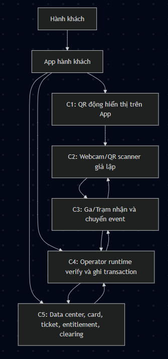


Nhớ ngắn:

```text
C5 cấp passenger domain, card/ticket/entitlement gốc
C4 cấp QR payload
App hiển thị QR
C2 scan QR
C3 chuyển event
C4 verify
C5 xử lý vé, trạng thái sử dụng và clearing
```

## 2. App, C1 Và Card Ảo

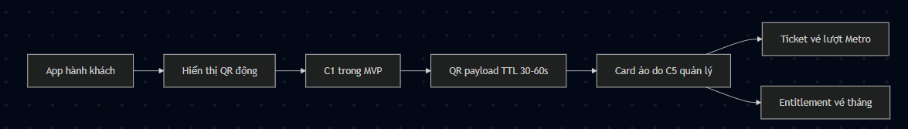


Kết luận:

```text
App không phải C1.
C1 là QR động đang hiển thị trên App.
Card ảo do C5 quản lý.
QR động là payload ngắn hạn do C4 sinh từ card/ticket/entitlement.
```

## 3. Card, Ticket Và Entitlement Là Gì?

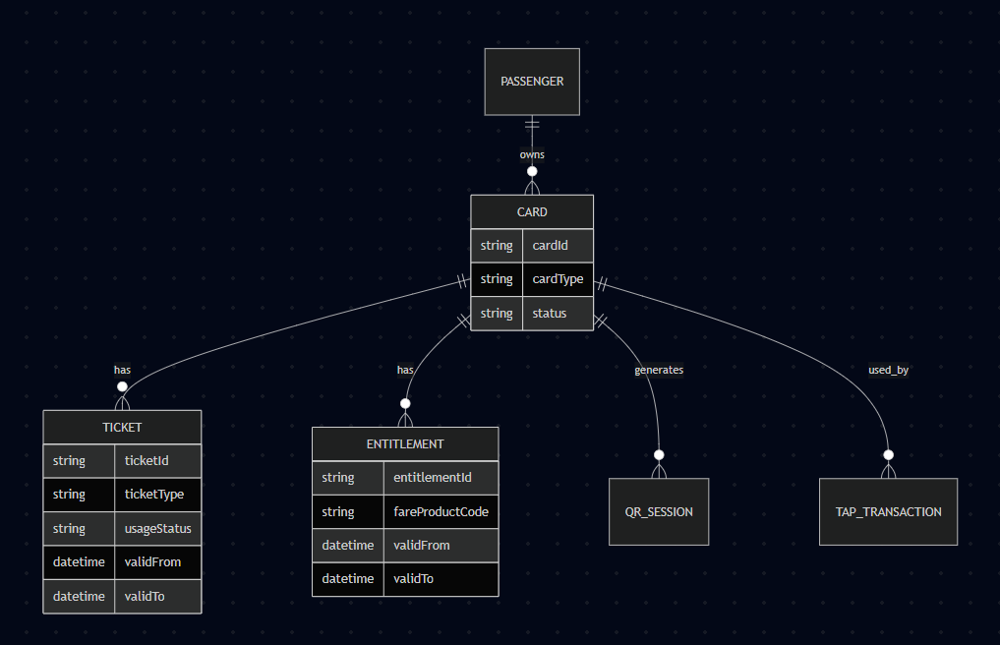


Ví dụ:

```json
{
  "entitlementId": "ENT-20260604-0001",
  "userId": "USER-001",
  "cardId": "CARD-001",
  "fareProductCode": "MONTHLY_PASS",
  "validFrom": "2026-06-01T00:00:00+07:00",
  "validTo": "2026-06-30T23:59:59+07:00",
  "allowedTransportTypes": ["METRO", "BUS"],
  "allowedRouteIds": [1, 2, 3],
  "passengerType": "STUDENT",
  "status": "ACTIVE"
}
```


| Khái niệm | Ai sở hữu | Ý nghĩa |
| --- | --- | --- |
| Fare product | C5 | Loại sản phẩm vé trong MVP: vé tháng và vé lượt Metro |
| Fare rules | C5 | Quy tắc giá/điều kiện áp dụng |
| Ticket | C5 | Vé lượt prepaid, dùng một lần trong phạm vi/thời hạn cho phép |
| Entitlement | C5 | Quyền vé tháng/vé chu kỳ đã cấp cho user/card |
| Card | C5 | Media hành khách dùng để đi lại; trong MVP là card ảo hiển thị bằng QR động |
| Dynamic QR payload | C4 | Payload ngắn hạn để App render thành QR |
| Tap/check transaction | C4 ghi nhận, C5 xử lý sâu | Sự kiện sử dụng thực tế tại thiết bị |

## 4. Dữ Liệu Mỗi Tầng Giữ

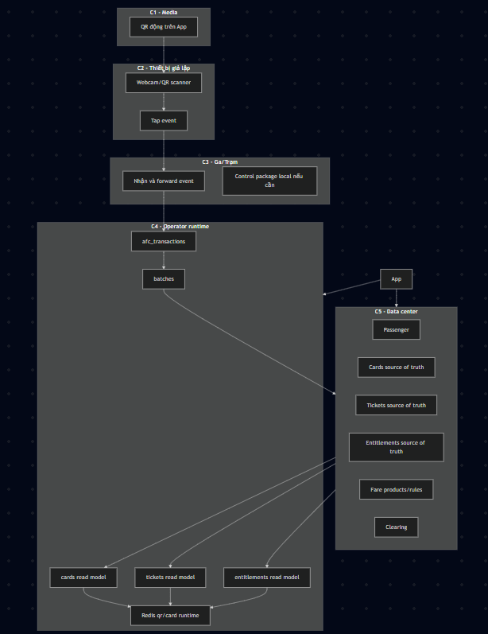


## 5. Luồng 1 - Đồng Bộ Quyền Gốc


Ý chính:

```text
C5 tạo quyền gốc.
C4 lưu read model card/ticket/entitlement.
C3/C2 nhận rule cần thiết để vận hành.
```

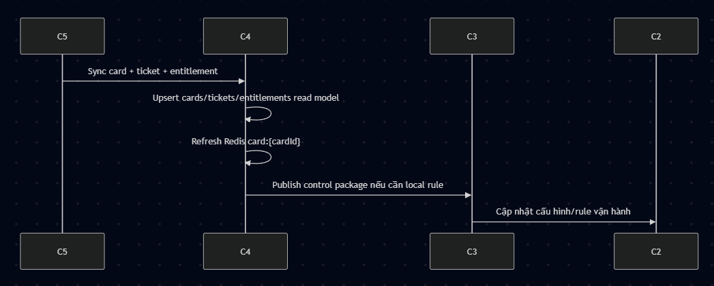

## 6. Luồng 2 - Đăng Ký Card/Vé Ban Đầu


Kết quả:

```text
C5 tạo passenger domain, card và ticket/entitlement gốc.
C5 xác định vé là đơn tuyến hay liên tuyến.
C5 xác định sản phẩm là vé tháng hoặc vé lượt Metro.
C5 xác định phạm vi tuyến/operator/transport được phép dùng.
C4 không phát hành vé; C4 chỉ nhận sync read model để cấp QR/verify runtime.
App chưa tự có QR cố định; khi cần đi, App gọi C4 để lấy QR động.
```

Ràng buộc sản phẩm vé trong MVP:

```text
BUS:
- Chỉ phục vụ vé tháng.
- Không làm vé lượt bus.

METRO:
- Phục vụ vé tháng.
- Phục vụ vé lượt prepaid một lượt.

Không làm vé ngày để giảm scope sau khi bổ sung vé lượt.
```

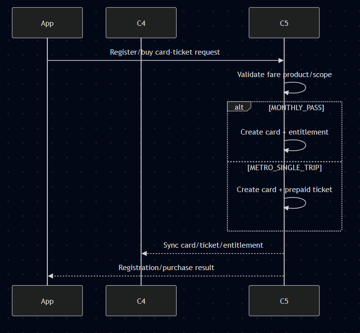

## 7. Luồng 3 - App Lấy QR Động


QR payload mẫu:

```json
{
  "qrId": "QR-20260604-0001",
  "cardRef": "encrypted-ref",
  "issuedAt": "2026-06-04T10:00:00+07:00",
  "expiresAt": "2026-06-04T10:00:30+07:00",
  "nonce": "random",
  "signature": "signed-by-c4"
}
```

Nguyên tắc:

```text
Không đưa token gốc của card thẳng vào QR.
QR chỉ là payload hiển thị ngắn hạn.
C4 sinh QR payload tự động, không cần operator manager bấm cấp.
```

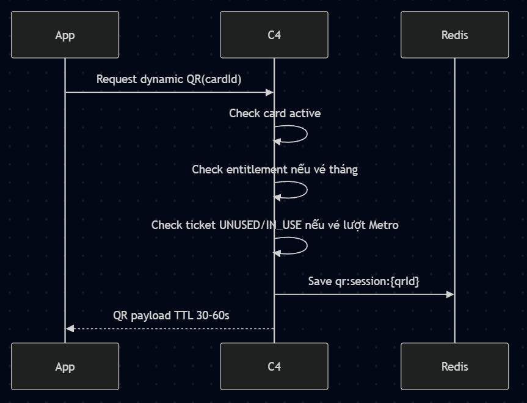

## 8. Luồng 4 - C2 Scan QR Và Verify Theo Đúng Tầng


ASCII ngắn:

```text
App -> C1(QR)
C2 scan C1
C2 -> C3 -> C4
C4 -> C3 -> C2: OPEN/DENY
C4 -> C5: transaction/batch
```

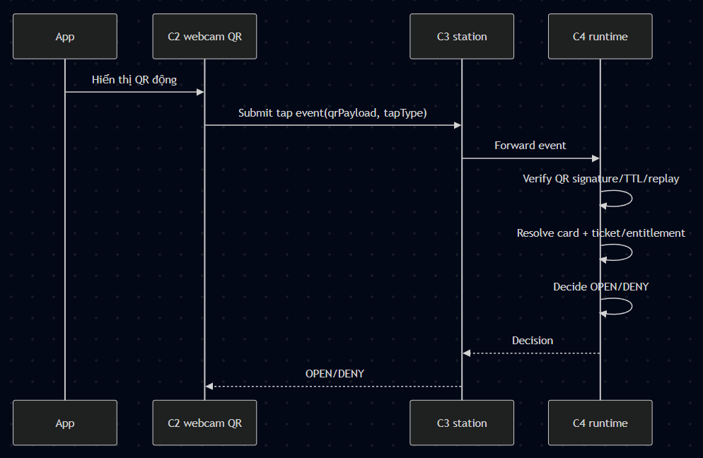

## 9. Luồng 5 - Chuyển Card Vật Lý Sang Card Ảo

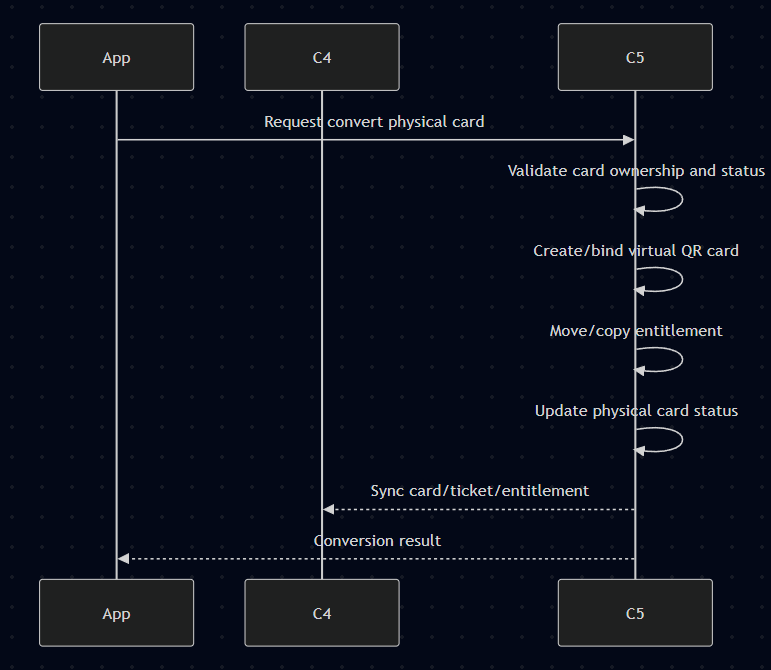


Quyết định nghiệp vụ ở C5:

```text
vô hiệu card vật lý sau khi chuyển đổi
cập nhật status của card vật lý chống dùng trùng.
```

## 10. Luồng 6 - Gia Hạn Vé Tháng


```text
Vé tháng: giữ `validFrom`, nới `validTo` thêm 1 tháng theo fare rule.

`validTo` hiện tại được dùng để kiểm tra vé còn hạn hay đã hết hạn.
Nếu còn hạn, cộng tiếp từ `validTo` hiện tại.
Nếu đã hết hạn, gia hạn từ thời điểm hiện tại `now`, không cộng từ `validTo` cũ.

Rule chốt cho MVP:

MONTHLY_PASS:
- còn hạn: `newValidTo = currentValidTo + 1 month`
- hết hạn: `newValidTo = now + 1 month`

C5 quyết định gia hạn entitlement.
C4 chỉ lưu read model entitlement đã được cập nhật và sinh QR payload từ entitlement đã gia hạn.
App không tự gia hạn vé; App chỉ gửi yêu cầu lên C5 và hiển thị kết quả.
```

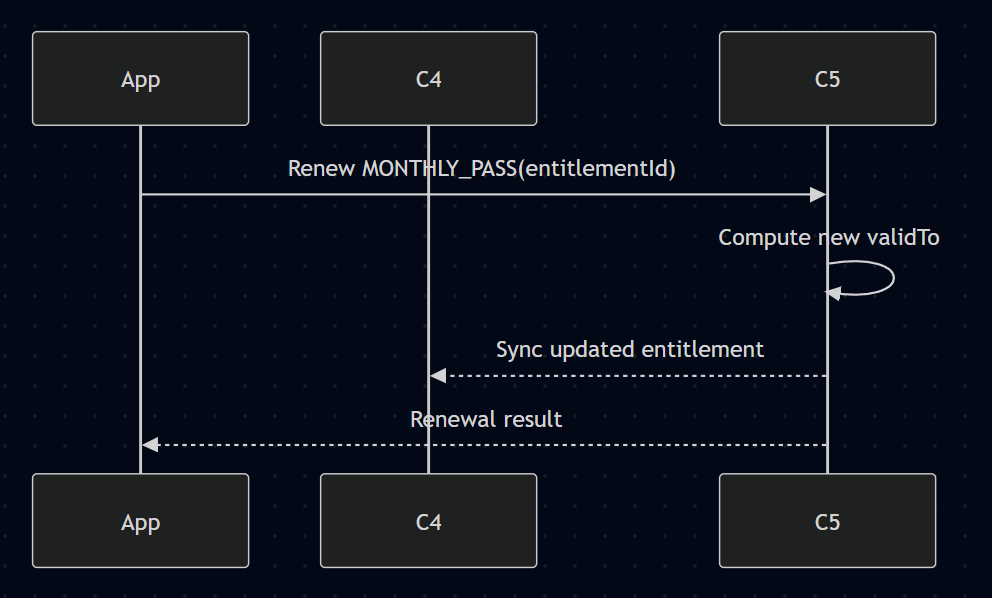

## 11. Luồng 7 - Card Status Và Blacklist

Blacklist trong MVP không tách thành bảng nghiệp vụ riêng ở C4. C5 đồng bộ trạng thái hiện hành vào `cards`; C4 chỉ dùng để verify runtime.

```text
status = ACTIVE: card có thể được dùng nếu ticket/entitlement hợp lệ.
status = BLACKLISTED/CANCELLED/INACTIVE: card bị từ chối.
status_reason: lý do như LOST_CARD, FRAUD, CANCELLED.
```

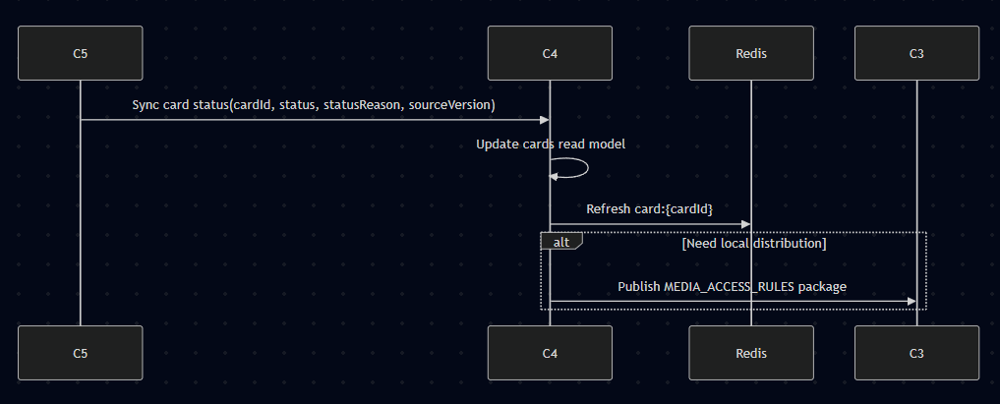

## 12. Luồng 8 - Lịch Sử Và Quyết Toán

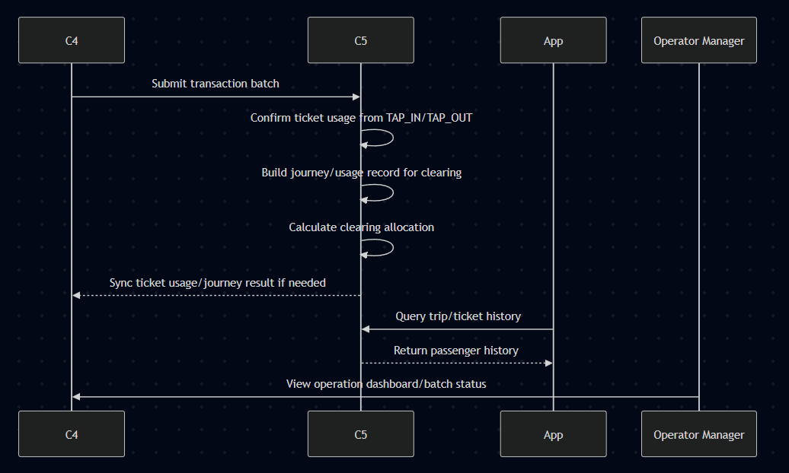

Ý chính:

```text
C4 chỉ giữ transaction và kết quả xử lý ticket/journey C5 sync về để phục vụ vận hành.
C5 là nơi xác nhận ticket, đánh dấu sử dụng và clearing/phân chia doanh thu.
Passenger trip/ticket history cho App lấy từ C5, không lấy trực tiếp từ C4.
```


## 13. Luồng 9 - Vé Tháng Bus/Metro

Luồng này dùng cho vé tháng trong MVP. Vé tháng được biểu diễn bằng `entitlement` do C5 cấp cho `card`, có hiệu lực trong khoảng `validFrom` - `validTo` và trong phạm vi tuyến/operator/transport được cấu hình.

Ý chính:

```text
Card/QR chỉ định danh card.
Entitlement là quyền đi lại theo chu kỳ.
C5 là source of truth của entitlement.
C4 giữ read model `entitlements` để verify nhanh.
BUS chỉ hỗ trợ vé tháng.
METRO hỗ trợ vé tháng và vé lượt prepaid.
```

Quy tắc mở cổng/cho phép đi với vé tháng:

```text
TAP/CHECK:
- Xác định tuyến/ga/trạm/transport hiện tại.
- Verify QR còn hạn, đúng chữ ký và không replay.
- Verify card `ACTIVE`, không BLACKLISTED/CANCELLED/INACTIVE.
- Tìm entitlement `ACTIVE` theo card.
- Kiểm tra `now` nằm trong `validFrom` - `validTo`.
- Kiểm tra phạm vi vé: SINGLE_ROUTE hoặc INTERLINE.
- Nếu hợp lệ thì OPEN.
- Nếu hết hạn, sai tuyến/phạm vi hoặc card bị chặn thì DENY.
```

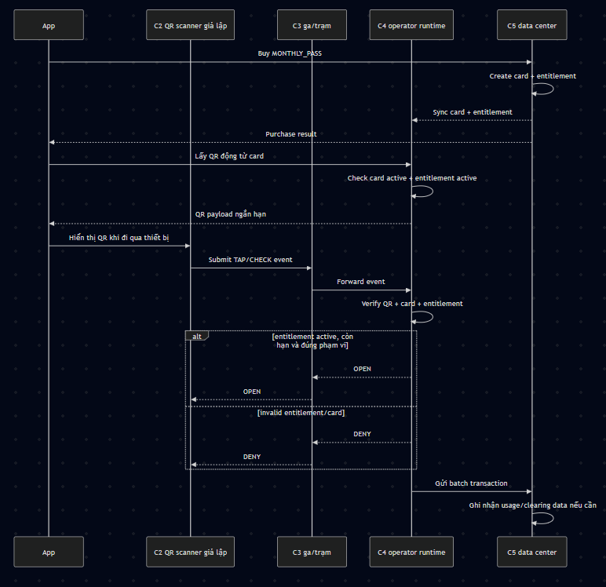

Dữ liệu C3/C4 cần có để hỗ trợ vé tháng:

| Nhóm | C3/C4 cần giữ |
| --- | --- |
| Tap/check event | `tapType`, `stationId`, `routeId`, `deviceId`, `occurredAt`, `direction` |
| Card verify | `cardId`, `cardType`, `status` |
| Entitlement verify | `entitlementId`, `fareProductCode`, `status`, `validFrom`, `validTo`, `passScope` |
| Scope verify | `operatorRef`, `routeRef`, `transportType` |
| Batch | Gom transaction `PENDING` gửi C5 |

## 14. Luồng 10 - Vé Lượt Metro Prepaid

Luồng này dùng cho vé lượt Metro trong MVP. Vé lượt được hiểu như vé giấy/vé lượt prepaid: hành khách mua trước một quyền đi một lượt, dùng trong phạm vi và thời hạn cho phép. Bus trong MVP không dùng vé lượt, chỉ dùng vé tháng.


Ý chính:

```text
Card/QR chỉ định danh card.
Ticket là quyền đi một lượt đã thanh toán trước.
C4 giữ read model `tickets` để verify nhanh.
C5 là source of truth của ticket và trạng thái sử dụng.
Không dùng wallet/balance/max fare trong MVP C3/C4.
```

Quy tắc mở cổng cho vé lượt trong MVP:

```text
TAP_IN:
- Xác định ga/tuyến khách đang vào.
- Nếu QR/card hợp lệ và có ticket `UNUSED` còn hạn, đúng phạm vi tuyến thì OPEN.
- Sau khi nhận TAP_IN hợp lệ, đánh dấu ticket `IN_USE` hoặc gửi event để C5 đánh dấu.

TAP_OUT:
- Nếu QR/card hợp lệ và ticket đang `IN_USE` thì OPEN.
- Sau TAP_OUT, đánh dấu ticket `USED` hoặc gửi event để C5 đánh dấu.
- Không tính tiền theo quãng đường ở C3/C4 trong MVP.
```

Trong luồng chính không dùng cơ chế ghi nợ. Cách chống quỵt là vé phải được thanh toán trước khi C5 phát hành `ticket`. Nếu ticket không tồn tại, hết hạn, đã dùng hoặc sai phạm vi tuyến thì C4 trả `DENY`.

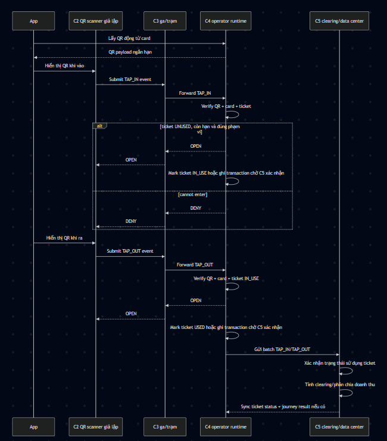

Dữ liệu C3/C4 cần có để hỗ trợ vé lượt:

| Nhóm | C3/C4 cần giữ |
| --- | --- |
| Tap event | `TAP_IN`, `TAP_OUT`, `stationId`, `routeId`, `deviceId`, `occurredAt`, `direction` |
| Card verify | `cardId`, `cardType`, `status` |
| Ticket verify | `ticketId`, `ticketType`, `usageStatus`, `validFrom`, `validTo`, `routeScope` |
| Batch | Gom transaction `PENDING` gửi C5 |
| Kết quả từ C5 | `journeyRef`, `ticketUsageStatus`, `clearingStatus` nếu C5 sync về để tra cứu |

Không đưa vào C3/C4:

```text
wallet/card balance
fare engine tính tiền theo quãng đường
clearing engine production-grade
lịch sử thanh toán chính thức
passenger profile đầy đủ
```

## 15. Ranh Giới MVP

| Phần | MVP 5 tuần |
| --- | --- |
| C1 | QR động của card ảo đang hiển thị trên App |
| App | Gọi C5 cho mua vé/gia hạn/lịch sử; gọi C4 lấy QR payload, render QR, refresh 30-60s |
| C2 | Webcam/app giả lập scan QR |
| C3 | Nhận và forward event; có thể gộp logic trong `afc-ops-service` nhưng flow vẫn mô tả C2 -> C3 -> C4 |
| C4 | Lưu read model cards/tickets/entitlements, sinh QR payload, verify QR, lưu transaction, gửi batch |
| C5 | Source of truth cho passenger domain tối thiểu, card, ticket, entitlement, fare products/rules; xử lý trạng thái vé và clearing/FMC |

Scope sản phẩm vé:

```text
BUS: vé tháng.
METRO: vé tháng và vé lượt prepaid.
Không làm vé ngày.
```

Không làm trong MVP:

```text
QR tĩnh
EMV
biometric
TVM/TOM thật
cổng soát vé thật
thiết bị đọc card vật lý thật
fare/clearing production-grade
```
