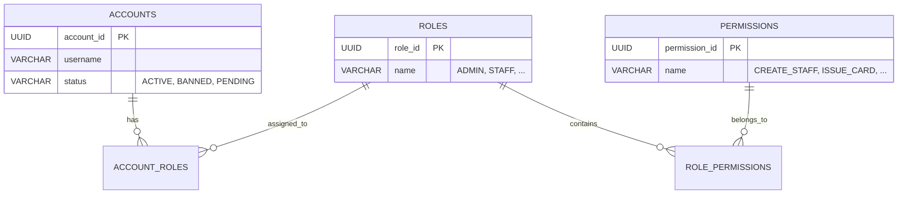
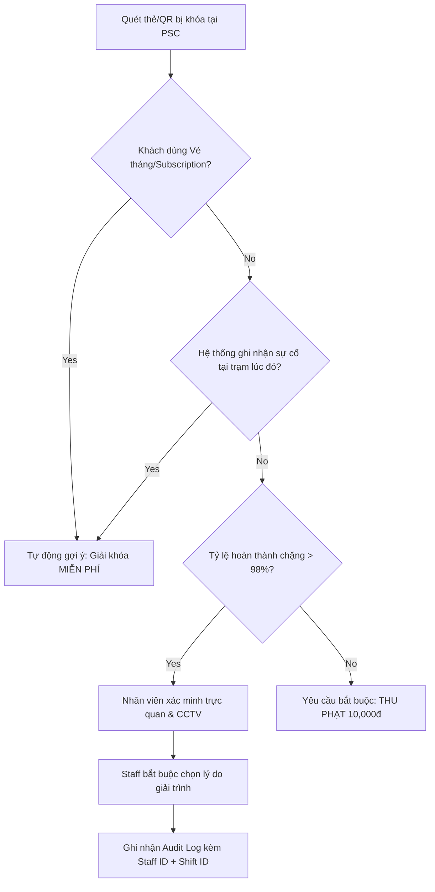

# TÀI LIỆU ĐẶC TẢ VAI TRÒ & PHẠM VI HỆ THỐNG (ROLES & SCOPES SPECIFICATION)

Tài liệu này đặc tả chi tiết mối quan hệ giữa **6 actor/scope hệ thống** (5 vai trò đăng nhập đồng bộ với `PredefinedRole.java` và 1 scope ẩn danh `GUEST`) và **Ranh giới Kiểm soát dữ liệu** (Scopes) trong kiến trúc đa đơn vị vận hành (Multi-tenant) thuộc hệ thống thẻ vé giao thông công cộng tự động (AFC).

> [!NOTE]
> Tài liệu Đặc tả Yêu cầu Phần mềm chính thức chứa thiết kế cơ sở dữ liệu vật lý, các thuật toán tính toán và quy trình soát vé nằm tại:  
> 👉 **[SRS_MetroBusTicket.md](SRS_MetroBusTicket.md)**

---

## 1. BẢN ĐỒ PHÂN LỚP VAI TRÒ (HIERARCHICAL ROLE MAP)

Hệ thống được tổ chức thành 5 tầng phân quyền đăng nhập từ vĩ mô đến vi mô, kèm scope `GUEST` cho luồng Web Portal công khai chưa đăng nhập. Cấu trúc này đảm bảo tính bảo mật và độc lập dữ liệu tuyệt đối giữa các đơn vị vận hành khác nhau.

```mermaid
graph TD
    ADMIN[ADMIN - Quản trị viên tối cao] --> PLATFORM_MNG[PLATFORM_MANAGER - Quản lý nền tảng]
    PLATFORM_MNG --> COMP_MNG[COMPANY_MANAGER - Quản lý đơn vị]
    COMP_MNG --> STAFF[STAFF - Nhân viên quầy/ca trực]
    ADMIN -.-> PASSENGER[PASSENGER - Hành khách]
    GUEST[GUEST - Khách vãng lai Web Portal]
```

---

## 2. ĐỊNH NGHĨA VAI TRÒ & RANH GIỚI KIỂM SOÁT DỮ LIỆU (SCOPE BOUNDARIES)

### 2.1. `ADMIN` (Quản trị viên hệ thống - Hội đồng trung tâm)
*   **Định nghĩa:** Vai trò Quản trị kỹ thuật và An ninh bảo mật hệ thống cấp cao nhất (Hội đồng trung tâm).
*   **Ranh giới kiểm soát (Scope Boundary):** **Central IT Administration & Security Scope (Phạm vi Quản trị Kỹ thuật & An ninh Trung tâm).**
    *   Quyền hạn giới hạn chặt chẽ trong các tác vụ kỹ thuật/an ninh: Quản lý trạng thái tài khoản (Ban/Unban), cấu hình phân quyền động (Dynamic RBAC), và xem nhật ký hoạt động hệ thống toàn cục (Global System Logs).
    *   **Ràng buộc:** Không có quyền can thiệp vào các tác vụ nghiệp vụ tài chính hoặc vận hành hàng ngày (như đối soát chia tiền, phát hành thẻ, ca kíp nhân viên, thiết lập giá vé).
*   **Ý nghĩa nghiệp vụ:** Bảo đảm an ninh kỹ thuật cho hệ thống, giám sát nhật ký vận hành kỹ thuật (System Logs) toàn cục và bảo vệ an toàn thông tin hệ thống.

### 2.2. `PLATFORM_MANAGER` (Quản lý nền tảng - Sở Giao Thông / Viettel VTS)
*   **Định nghĩa:** Đơn vị cung cấp, vận hành và quản lý tài chính liên thông của toàn bộ mạng lưới (SaaS Platform Operator).
*   **Ranh giới kiểm soát (Scope Boundary):** **Multi-tenant Platform Scope (Phạm vi Vận hành Nền tảng & Đối soát).**
    *   Quản lý không gian làm việc của các đơn vị vận hành (Tenants/Workspaces). Trong backend MVP, tenant được ánh xạ bằng `operators.operator_id`; danh mục `tenants/companies` đọc nhanh nếu cần sẽ nằm trong backend resource `tenants.json`.
    *   **Thực thi đối soát tổng hợp (Clearing & Settlement):** Thực hiện tiến trình đối soát phân chia doanh thu liên thông và giải quyết các dòng tiền kết chuyển giữa hệ thống trung tâm và các công ty con.
*   **Ý nghĩa nghiệp vụ:** Đóng vai trò là "Nhà cái/Trọng tài kinh tế" trực tiếp làm việc, thanh quyết toán dòng tiền với các quản lý đơn vị vận hành (`COMPANY_MANAGER`).

### 2.3. `COMPANY_MANAGER` (Quản lý đơn vị vận hành - e.g., Manager VinBus / Cát Linh)
*   **Định nghĩa:** Quản trị viên cấp cao nhất của riêng một đơn vị vận hành cụ thể (Tenant Admin).
*   **Ranh giới kiểm soát (Scope Boundary):** **Tenant/Company Scope - Isolated (Phạm vi Cô lập Đơn vị).**
    *   Dữ liệu hoàn toàn bị cô lập trong ranh giới đơn vị (`operator_id`, tương đương tenant/company vận hành trong `ticket-service`).
    *   Tuyệt đối không thể xem, sửa hoặc tương tác với dữ liệu (nhân sự, doanh thu, ca trực, trạm ga) của các đơn vị khác.
*   **Ý nghĩa nghiệp vụ:** Đảm bảo tính bảo mật thương mại và an toàn thông tin nội bộ giữa các doanh nghiệp vận hành độc lập cạnh tranh nhau.

### 2.4. `STAFF` (Nhân viên vận hành trực ca kíp)
*   **Định nghĩa:** Nhân viên trực quầy vé, nhân viên soát vé hoặc kiểm soát viên tại các nhà ga/điểm dừng xe bus.
*   **Ranh giới kiểm soát (Scope Boundary):** **Station/Shift Scope - Transactional (Phạm vi Giao dịch và Ca trực).**
    *   Quyền hạn bị giới hạn chặt chẽ theo địa điểm ga/quầy được gán và thời gian hoạt động của ca trực (`shift_id`).
    *   **Nhiệm vụ cốt lõi tại Quầy dịch vụ (Passenger Service Center):**
        1.  **Xử lý sự cố Vé/Thẻ:** Quét mã QR/mã thẻ bị lỗi rào chắn để tra cứu thông tin ga vào, ga đăng ký ra, và lý do bị kẹt soát vé (`IN_PROGRESS`).
        2.  **Bù cự ly trạm (Fare Adjustment):** Thu phí chênh lệch bằng tiền mặt từ khách đi quá ga (Over-riding), thực hiện cập nhật vé cho phép mở rào ra ga. Giao dịch tiền mặt được ghi nhận (`CASH_FARE_ADJUSTMENT`) và gắn với ca trực `shift_id`.
        3.  **Xử lý Giải khóa thẻ & Thu phạt (Penalty/Free Unlock):** Khi thẻ bị khóa do "Quên Check-out" quá 24 giờ, hệ thống phân biệt 2 tình huống để đảm bảo công bằng cho khách hàng:
            * **Trường hợp cố ý trốn vé/lách rào (Tailgating):** Thu phí phạt cố định bằng tiền mặt (10,000 VNĐ) và ghi nhận vào ca trực.
            * **Trường hợp lỗi hệ thống/Sự cố khách quan (Mất điện, Sơ tán khẩn cấp, Nhân viên hỗ trợ mở cổng phụ):** Thực hiện **Giải khóa miễn phí (Free Override)** với phí phạt 0 VNĐ.
            Cả hai trường hợp đều cập nhật bổ sung trạm xuống chặng trước, đổi trạng thái thẻ về `ACTIVE` để khách tiếp tục hành trình.
        4.  **Cập nhật tiến độ đơn hàng in thẻ cứng:** Khi đơn đăng ký thẻ cứng của hành khách được thanh toán trực tuyến thành công, hệ thống tự động chuyển trạng thái đơn hàng sang `PRINTING`. Nhân viên quầy ga tiến hành in ấn thẻ cứng vật lý ở môi trường bên ngoài, sau đó click cập nhật trạng thái đơn hàng (`order_status`) trên Portal sang `READY_FOR_PICKUP` hoặc `SHIPPED` và cuối cùng là `COMPLETED` khi bàn giao xong. Khâu này thuần túy là cập nhật phần mềm trên Portal để theo dõi đơn hàng, không tích hợp phần cứng máy in hay đầu đọc RFID.
        5.  **Kết ca & Đối chiếu ca trực (Shift Reconciliation):** Kết ca trực, in báo cáo đối chiếu doanh thu tiền mặt thu được tại quầy ga (bán vé tại quầy, nạp ví, tiền bù quá chặng, tiền phạt) để bàn giao chuẩn xác cho thủ quỹ ga đối chiếu ca trực.
*   **Ý nghĩa nghiệp vụ:** Triệt lưu thất thoát tài chính cấp đại lý/quầy bán vé, kiểm soát lỗi vận hành, đồng thời giải phóng sự cố di chuyển nhanh chóng cho hành khách.

### 2.5. `PASSENGER` (Hành khách tham gia giao thông)
*   **Định nghĩa:** Người tiêu dùng sử dụng dịch vụ đi lại bằng thẻ vé liên thông trên toàn mạng lưới.
*   **Ranh giới kiểm soát (Scope Boundary):** **Self-Service Scope (Phạm vi Tự phục vụ Cá nhân).**
    *   Chỉ truy cập và tương tác với dữ liệu của chính mình (thông tin tài khoản, danh sách thẻ cá nhân, lịch sử đi lại, số dư ví).
    *   Tuyệt đối không thể truy xuất dữ liệu của bất kỳ hành khách nào khác.
    *   Trên PWA, Passenger chỉ phát hành thẻ ảo, gia hạn/mua vé và số hóa thẻ cứng đã mua sang thẻ ảo; không tham gia luồng mua thẻ cứng UC07.
*   **Ý nghĩa nghiệp vụ:** Bảo vệ quyền riêng tư dữ liệu cá nhân theo quy định pháp luật.

### 2.6. `GUEST` (Khách vãng lai / Người dùng ẩn danh)
*   **Định nghĩa:** Người dùng chưa đăng nhập tài khoản hệ thống, truy cập công khai vào Cổng mua vé công cộng (Web Desktop Portal).
*   **Ranh giới kiểm soát (Scope Boundary):** **Anonymous Web Scope (Phạm vi Trình duyệt Ẩn danh).**
    *   Chỉ được phép thực hiện điền biểu mẫu mua/đăng ký thẻ cứng vật lý theo luồng UC07 Guest Checkout và mua vé chặng lẻ dùng 1 lần, thực hiện thanh toán trực tuyến qua VNPay Sandbox ở môi trường dev hoặc Sepay/VietQR ở production.
    *   Tuyệt đối không có tài khoản ví điện tử nội bộ, không có lịch sử đi lại cá nhân, và không có quyền truy xuất bất kỳ thông tin nào khác trên hệ thống.
*   **Ý nghĩa nghiệp vụ:** Triệt tiêu hoàn toàn rào cản đăng nhập, tối ưu doanh thu bán vé công cộng cho mạng lưới.

---

## 3. MA TRẬN PHÂN QUYỀN CHI TIẾT (RBAC MATRIX)

Dưới đây là ma trận ánh xạ chi tiết giữa các Vai trò và các hành vi nghiệp vụ trên hệ thống:

| Phân hệ / Nghiệp vụ | Hành vi chi tiết | `ADMIN` | `PLATFORM_MANAGER` | `COMPANY_MANAGER` | `STAFF` | `PASSENGER` | `GUEST` |
| :--- | :--- | :---: | :---: | :---: | :---: | :---: | :---: |
| **Hạ tầng Platform & Identity** | Khởi tạo Workspace/Tenant mới | | **X** | | | | |
| | Cấp tài khoản `COMPANY_MANAGER` ban đầu | | **X** | | | | |
| | **Khóa/Mở tài khoản (Ban/Unban User)** | **X** | | | | | |
| | **Cấu hình quyền động hệ thống (Dynamic RBAC)** | **X** | | | | | |
| | Xem nhật ký hệ thống toàn cục (System Logs) | **X** | | | | | |
| **Giá vé & Cấu hình** | Cấu hình giá trần toàn mạng lưới (Fare Ceiling) | | **X** | | | | |
| | Cấu hình biểu giá nội bộ tuyến/chặng | | | **X** | | | |
| **Nhân sự & Ca trực** | Tạo tài khoản/phân quyền nhân viên `STAFF` | | | **X** | | | |
| | Lập lịch phân ca trực (`shift_id`) | | | **X** | | | |
| | Đăng nhập bắt buộc gắn `shift_id` để làm việc | | | | **X** | | |
| **Quản lý Thẻ vé** | Khởi tạo phôi thẻ mới vào DB | | | | **X** | | |
| | In thẻ cứng & Cập nhật đơn hàng | | | | **X** | | |
| | Thu hồi, khóa thẻ lỗi/thẻ hết hạn | | | | **X** | | |
| | **Đăng ký mua thẻ cứng trực tuyến (Guest Checkout)** | | | | | | **X** |
| | **Số hóa thẻ cứng vật lý thành thẻ ảo trên PWA** | | | | | **X** | |
| | **Mua vé lượt chặng lẻ trực tuyến (Guest Checkout)** | | | | | **X** | **X** |
| | Đăng ký thẻ ảo trực tiếp (QR Code định danh) | | | | | **X** | |
| | Tự động duyệt đơn & Kích hoạt thẻ | | | | | **X (Auto)** | |
| | Liên kết thẻ vật lý vào tài khoản cá nhân | | | | | **X** | |
| **Vận hành Soát vé** | Giả lập quẹt Check-in (Xác minh thẻ) | | | | | X *(Auto)* | |
| | Giả lập quẹt Check-out (Xác minh vé chặng ra) | | | | | X *(Auto)* | |
| | Xử lý sự cố vé, thu phí chênh lệch tại ga | | | | X | | |
| | Giải khóa thẻ & Thu phí phạt (Quên Check-out) | | | | X | | |
| | Kết ca trực & Báo cáo doanh thu tiền mặt ca | | | | X | | |
| **Tài chính & Ví** | Xem số dư ví tài khoản | | | | | **X** | |
| | Nạp tiền vào ví điện tử (Top-up sandbox) | | | | | **X** | |
| **Đối soát & Báo cáo** | Tổng hợp đối soát cấp hệ thống (Clearing) | | **X** | | | | |
| | Xem báo cáo doanh thu nội bộ đơn vị | | | **X** | | | |
| | Tra cứu lịch sử đi lại & lịch sử giao dịch cá nhân | | | | | **X** | |

> [!NOTE]
> * **X**: Có quyền thực hiện (Full Access).
> * **X (Auto)**: Hệ thống tự động thực hiện bất đồng bộ dưới danh nghĩa tài khoản của hành khách khi quẹt tại cổng kiểm soát.
> * **Để trống**: Không có quyền truy cập (No Access).

---

## 4. PHÂN TÍCH CHUYÊN SÂU: KIẾN TRÚC PHÂN QUYỀN ĐỘNG (IDENTITY-SERVICE)

Với thiết kế sẵn có của `identity-service` theo mô hình **Account N-N Role N-N Permission (Quan hệ Nhiều - Nhiều)**, chúng ta có một nền tảng cực kỳ mạnh mẽ để xây dựng tính năng phân quyền động cấp doanh nghiệp.

### 4.1. Scope của `ADMIN` trong việc Quản lý Tài khoản (Ban/Unban)
*   **Trạng thái khóa tài khoản (Ban/Unban):** 
    *   `ADMIN` có thể cập nhật trường `status` của một tài khoản sang `BANNED`.
    *   **Ràng buộc vận hành:** Khi tài khoản bị khóa, `identity-service` sẽ ném ra ngoại lệ `LockedException` khi đăng nhập hoặc verify token, lập tức vô hiệu hóa khả năng truy cập hệ thống của người dùng đó (chặn quẹt thẻ, nạp tiền hoặc thao tác trên app).

### 4.2. Cơ chế Cấu hình Quyền Động (Dynamic Permission Configuration)
Nhờ mối quan hệ N-N giữa `ROLES` và `PERMISSIONS` thông qua bảng trung gian `role_permissions`, hệ thống có thể thay đổi quyền hạn của toàn bộ nhân sự tại thời điểm chạy (Runtime) mà không cần viết lại hay deploy lại code:
*   **Cách hoạt động:**
    1.  `ADMIN` gọi API cấu hình quyền động để thêm/bớt một bản ghi trong bảng trung gian `role_permissions` (ví dụ: Tước quyền `FORCE_COMPLETE_TRIP` khỏi vai trò `STAFF`).
    2.  Khi nhân viên `STAFF` gọi API xử lý thẻ lỗi, Spring Security của `ticket-service` sẽ đối soát token. Do quyền đã bị `ADMIN` xóa bỏ động ở DB của `identity-service`, API sẽ ngay lập tức trả về lỗi `403 Forbidden`.

---

## 5. CÁC RÀNG BUỘC PHẠM VI VẬN HÀNH KỸ THUẬT (SYSTEM BOUNDARIES)

### 5.1. Cơ chế Cô lập Đa đơn vị (Multi-tenant Isolation)
*   Mọi bảng dữ liệu liên quan đến nghiệp vụ nội bộ (ví dụ: `stations`, `routes`, `staff_shifts`, `transactions`) phải có `operator_id` trực tiếp hoặc có đường suy ra `operator_id` bắt buộc qua quan hệ tuyến/trạm.
*   Trên Backend Spring Boot, sử dụng **Hibernate Filter** hoặc viết **Aspect (AOP)** để tự động chèn thêm điều kiện scope theo `operator_id = CURRENT_USER_OPERATOR_ID` vào tất cả các câu lệnh truy vấn phát sinh từ vai trò `COMPANY_MANAGER` hoặc `STAFF`.

### 5.2. Ràng buộc toàn vẹn của Ca trực (Shift Integrity)
*   Mọi hành động phát hành thẻ, thu hồi thẻ hoặc sửa lỗi thẻ của nhân viên `STAFF` bắt buộc phải truyền kèm `shift_id`.
*   Trước khi thực thi API, Backend kiểm tra ca trực tương ứng với `shift_id` của nhân viên đó phải đang ở trạng thái `ACTIVE` (đang mở). Nếu ca trực đã đóng (`CLOSED`), từ chối giao dịch ngay lập tức.

### 5.3. Ràng buộc Múi giờ hệ thống (System Timezone UTC+7)
*   Toàn bộ hệ thống từ OS Server, JVM của các microservices cho đến Database PostgreSQL bắt buộc phải được đồng bộ chạy trên múi giờ **UTC+7 (Asia/Ho_Chi_Minh)**.
*   Đồng bộ giờ Logs và dữ liệu CSDL trùng khớp 100% giờ thực tế, giúp các batch job đối soát tự động chạy ngầm lúc 2:00 sáng chạy đúng thời gian thực của Việt Nam.

### 5.4. Tại sao tồn tại lỗi "Quên Check-out" trong hệ thống rào chắn khép kín? (Missing Check-out Edge Cases)
Mặc dù hệ thống rào chắn tự động (Barrier Turnstile Gates) kiểm soát rất chặt chẽ, trong thực tế vận hành Metro vẫn xuất hiện các kịch bản hành khách ra ga mà không quẹt thẻ/quét QR Check-out (hệ thống bị treo chuyến đi ở trạng thái `IN_PROGRESS`):
1.  **Đi bám đuôi (Tailgating / "Kẹp cổ"):** Khách hàng đi sát ngay sau lưng người đi trước để lách qua rào chắn khi cửa mở mà không tự quẹt thẻ của mình.
2.  **Sự cố kỹ thuật & Mất điện (Gate Malfunctions):** Cổng soát vé bị lỗi phần mềm/kẹt cơ học, hoặc ga bị mất điện đột ngột khiến rào chắn tự động mở bung (Fail-safe mode) để giải tỏa khách đi ra.
3.  **Thoát hiểm khẩn cấp (Emergency Evacuation):** Khi ga có sự cố diễn tập phòng cháy, báo cháy hoặc sự cố khẩn cấp, hệ thống kích hoạt chế độ thoát hiểm, toàn bộ rào chắn mở tự động 100% để hành khách thoát ra sảnh ngoài nhanh nhất mà không cần quẹt thẻ.
4.  **Nhân viên mở cổng phụ thủ công (Manual Gate Exit):** Hành khách mang vác hành lý cồng kềnh, đi xe lăn (người khuyết tật), hoặc đi cùng trẻ nhỏ được nhân viên ga hỗ trợ mở cổng phụ đi thẳng ra ngoài, bỏ qua bước quẹt thẻ vật lý/thẻ ảo.

Khi xảy ra các ca lỗi này, chuyến đi của khách sẽ bị treo ở trạng thái `IN_PROGRESS` trong DB `ticket_db`. Ở lượt di chuyển tiếp theo (ví dụ: sáng hôm sau đi làm), rào chắn Gate vào sẽ chặn thẻ lại (do luật không cho phép check-in mới khi chuyến đi cũ chưa check-out). Lúc này khách buộc phải qua Quầy dịch vụ gặp `STAFF` để kiểm tra và giải khóa thẻ để khôi phục trạng thái hoạt động bình thường (`ACTIVE`).

### 5.5. Quy trình kỹ thuật xử lý giải khóa và thu phạt "Quên Check-out" (Có phân loại sự cố)

Để đảm bảo trải nghiệm khách hàng tối ưu và tính công bằng, hệ thống tại Quầy dịch vụ (Passenger Service Center) sẽ phân tách rõ ràng quy trình xử lý giải khóa thẻ bị kẹt dựa trên nguyên nhân lỗi:

#### 1. Các trường hợp sự cố (Mất điện, Sơ tán, Cổng lỗi kỹ thuật, Nhân viên mở tay trợ giúp xe lăn)
> [!IMPORTANT]
> **Quy tắc Nghiệp vụ:** Lỗi thuộc về hạ tầng hoặc nằm trong quy trình vận hành khẩn cấp của đơn vị vận hành $\rightarrow$ **Tuyệt đối KHÔNG phạt tiền hành khách**.
* **Thao tác của Nhân viên ga (`STAFF`):** Trên màn hình Portal, nhân viên kiểm tra lịch sử thẻ, chọn lý do lỗi là **"Sự cố hệ thống / Sơ tán / Trợ giúp"** và nhấn **"Giải khóa Miễn phí (Free Override Unlock)"**.
* **Xử lý dưới Database:**
  * Cập nhật bổ sung thông tin trạm xuống của chuyến đi bị treo `IN_PROGRESS` bằng trạm ga hiện tại của ca trực.
  * Chuyển trạng thái chuyến đi cũ thành `COMPLETED`.
  * Chuyển trạng thái thẻ về `ACTIVE`.
  * **Không** tạo giao dịch biến động tiền mặt phạt (hoặc tạo giao dịch với `amount = 0`, ghi rõ lý do sự cố để phục vụ báo cáo kiểm toán hệ thống).

#### 2. Các trường hợp cố ý trốn vé, lách rào (Tailgating / Jumper)
> [!WARNING]
> **Quy tắc Nghiệp vụ:** Lỗi thuộc về hành vi cố tình vi phạm của khách hàng (lách rào, nhảy rào, bám đuôi) $\rightarrow$ **Thu phí phạt cố định bằng tiền mặt để răn đe**.
* **Thao tác của Nhân viên ga (`STAFF`):** Sau khi xác minh lỗi là do hành vi bám đuôi trốn vé, nhân viên thu **10,000 VNĐ tiền mặt** từ khách và nhấn **"Giải khóa có phạt (Penalty Unlock)"**.
* **Xử lý dưới Database (Database Transaction) được thực thi đồng bộ:**
  * **Cập nhật bổ sung chặng trước:** Tra cứu chuyến đi đang bị treo (`IN_PROGRESS`) của hành khách này, thực hiện cập nhật bổ sung thông tin trạm xuống chặng trước (gán bằng trạm ga nhân viên đang trực).
  * **Đóng chuyến đi cũ:** Chuyển trạng thái của chuyến đi cũ từ `IN_PROGRESS` sang `COMPLETED`.
  * **Mở khóa thẻ:** Cập nhật trạng thái của chiếc thẻ/vé về `ACTIVE` trong bảng `tickets`.
  * **Ghi nhận doanh thu tiền mặt ca trực:** Khởi tạo một bản ghi giao dịch mới trong bảng `transactions` để đối soát ca trực:
    * `transaction_type = 'CASH_PENALTY'` (Phạt tiền mặt)
    * `amount = 10000` (10,000 VNĐ)
    * `payment_method = 'CASH'` (Tiền mặt)
    * `status = 'SUCCESS'`
    * `wallet_id = NULL` (Không liên quan đến ví nội bộ cá nhân của khách do nộp tiền mặt trực tiếp tại quầy)
    * `shift_id = current_staff_shift_id` (Ghi nhận trực tiếp vào doanh thu tiền mặt ca trực hiện tại của nhân viên đó phục vụ cho việc đối chiếu kết ca trực sau này).

### 5.6. Cơ chế phân biệt tự động và kiểm soát chống lạm dụng (Oversight & Fraud Prevention)

Để nhân viên ga không phải tự mình "đoán mò" và tránh các hành vi gian lận (ví dụ: nhân viên ga tự ý giải khóa miễn phí cho người quen hoặc nhận tiền mặt của khách rồi chọn giải khóa miễn phí để đút túi riêng), hệ thống tích hợp các cơ chế kiểm soát kỹ thuật đa lớp sau:

#### 1. Tự động đối chiếu với Nhật ký sự cố hệ thống (Incident Logs Integration)
* **Cơ chế hoạt động:** Hệ thống duy trì collection MongoDB `incident_logs` ghi nhận các sự cố toàn ga (mất điện, sơ tán khẩn cấp, nghẽn mạng) hoặc lỗi chẩn đoán của từng cổng soát vé theo khoảng thời gian thực tế. Không tạo thêm bảng riêng `gate_malfunction_events` trong MVP; các sự kiện lỗi cổng được lưu như một loại `incident_type` trong `incident_logs`.
* **Xử lý tự động:** Khi quét thẻ bị lỗi, hệ thống đối soát thời gian check-in của chuyến đi bị treo với nhật ký sự cố của ga vào/ga ra. Nếu trùng khớp thời gian xảy ra sự cố, hệ thống **tự động khóa nút "Giải khóa có phạt"** và chỉ cho phép nhân viên ga nhấn **"Giải khóa miễn phí"**, loại bỏ hoàn toàn yếu tố cảm tính của con người.

#### 2. Luật miễn trừ tự động cho Hành khách dùng Vé tháng (Subscription Exemption)
* **Cơ chế hoạt động:** Khách hàng sở hữu vé tháng/vé chu kỳ (`Period Passes / Subscriptions`) đã thanh toán trọn gói cước đi lại không giới hạn từ trước. Họ hoàn toàn không có động cơ kinh tế để trốn vé tại chặng ra (vì dù có check-out thành công hay không thì họ cũng không bị trừ thêm tiền).
* **Xử lý tự động:** Đối với bất kỳ thẻ nào có gói vé tháng còn hiệu lực tại thời điểm xảy ra lỗi, hệ thống mặc định coi lỗi quên check-out là sơ suất vô ý hoặc do lỗi kỹ thuật của cổng và **áp dụng chính sách giải khóa miễn phí 100%**.

#### 3. Tra cứu lịch sử đi lại & Đánh giá độ tin cậy (Commuter History Auditing)
* **Cơ chế hoạt động:** Màn hình Portal của nhân viên hiển thị nhanh lịch sử di chuyển và tỷ lệ hoàn thành chuyến đi (`completion_rate`) của khách hàng.
* **Xử lý tự động:** Nếu hành khách có lịch sử đi lại chuẩn chỉ (ví dụ: tỷ lệ hoàn thành > 98% trong 100 chuyến gần nhất), hệ thống sẽ gợi ý giải khóa miễn phí vì đây rõ ràng là sự cố kỹ thuật đọc thẻ hoặc khách vô ý sơ sẩy. Ngược lại, nếu thẻ có lịch sử liên tục bị treo chặng tại cùng một ga mà không có logs sự cố hạ tầng, hệ thống sẽ gắn nhãn cảnh báo đỏ và yêu cầu áp dụng mức phạt để răn đe hành vi bám đuôi có hệ thống.

#### 4. Nhật ký kiểm toán & Giám sát hành vi nhân sự (Audit Trails & Staff Oversight)
* **Ngăn ngừa tham nhũng nội bộ:** Mỗi giao dịch **"Giải khóa miễn phí"** đều yêu cầu nhân viên ga bắt buộc phải chọn lý do giải trình cụ thể từ danh sách định sẵn (như: *Hỗ trợ cổng phụ xe lăn, Lỗi cảm biến cổng số 4, Khách mang hành lý cồng kềnh*).
* **Báo cáo phân tích bất thường (Anomaly Detection):** Hệ thống tự động tổng hợp tỷ lệ giải khóa miễn phí của từng nhân viên ga theo tuần. Nếu một nhân viên có tỷ lệ giải khóa miễn phí vượt quá ngưỡng bình thường của ga (ví dụ: > 8% số ca xử lý, trong khi trung bình của ga chỉ là 1%), hệ thống sẽ tự động gửi cảnh báo bất thường đến tài khoản `COMPANY_MANAGER` và `PLATFORM_MANAGER` để trích xuất camera CCTV đối chất, triệt tiêu hoàn toàn rủi ro nhân viên nhận tiền đút lót để giải khóa lậu.
