# TÀI LIỆU ĐẶC TẢ CHI TIẾT USE CASE (USE CASE SPECIFICATION)
**Dự án:** Hệ thống Quản lý Vé tháng Giao thông Công cộng tự động (Period-based Fare Collection - PFC)  
**Tên tài liệu:** use_case_specifications.md

---

## 1. GIỚI THIỆU TỔNG QUAN
Tài liệu này đặc tả chi tiết **27 Use Case** cốt lõi của hệ thống PFC trong phạm vi MVP. Passenger không có ví nội bộ trong MVP; thanh toán đăng ký/gia hạn vé được thực hiện trực tiếp qua cổng thanh toán. Riêng Company Manager được gửi yêu cầu giải ngân số dư ví doanh nghiệp để Platform Manager phê duyệt/từ chối thủ công. Hệ thống không tích hợp API chuyển khoản ngân hàng tự động. Mỗi Use Case được đặc tả độc lập, đầy đủ kịch bản luồng xử lý chính (Basic Flow), luồng rẽ nhánh (Alternative Flows) và các tình huống lỗi ngoại lệ (Exception Flows), không sử dụng bất kỳ liên kết tham chiếu lặp hoặc nội dung viết tắt/trực quan rút gọn nào.

### Sơ đồ UML Use Case toàn diện hệ thống:

```mermaid
graph LR
    %% Actors
    Guest["Khách vãng lai (Guest)"]
    Passenger["Hành khách (Passenger)"]
    Staff["Nhân viên ga (Staff)"]
    CompManager["Quản lý đơn vị (Company Manager)"]
    PlatManager["Quản lý nền tảng (Platform Manager)"]
    Admin["Quản trị tối cao (Admin)"]
    System["Hệ thống Scheduler (System)"]

    %% Guest & Passenger Use Cases
    Guest --> UC07["UC07: Đăng ký mua Thẻ cứng (Guest Checkout)"]
    Guest --> UC10["UC10: Gia hạn gói vé chu kỳ"]
    Passenger --> UC01["UC01: Đăng ký/đăng nhập bằng SĐT"]
    Passenger --> UC03["UC03: Đăng xuất tài khoản PWA/Portal"]
    Passenger --> UC05["UC05: Khôi phục mật khẩu"]
    Passenger --> UC06["UC06: Cập nhật hồ sơ cá nhân"]
    Passenger --> UC09["UC09: Số hóa Thẻ cứng thành Thẻ ảo"]
    Passenger --> UC13["UC13: Quét soát vé tự động qua Validator"]
    Passenger --> UC08["UC08: Đăng ký & Phát hành Thẻ ảo trực tiếp"]
    Passenger --> UC10
    Passenger --> UC04["UC04: Thay đổi mật khẩu"]

    %% Internal Staff/Admin Use Cases
    Staff --> UC02["UC02: Đăng nhập Web Portal"]
    Staff --> UC03
    Staff --> UC04
    Staff --> UC05
    Staff --> UC06
    Staff --> UC14["UC14: PSC Giải khóa thẻ kẹt ga"]
    Staff --> UC15["UC15: In thẻ cứng & Cập nhật đơn hàng"]
    Staff --> UC16["UC16: Vận hành ca trực quầy ga"]
    Staff --> UC11["UC11: Khởi tạo lô phôi thẻ cứng mới"]
    Staff --> UC12["UC12: Thu hồi và Vô hiệu hóa thẻ hỏng"]

    %% Company Manager Use Cases
    CompManager --> UC02
    CompManager --> UC03
    CompManager --> UC04
    CompManager --> UC05
    CompManager --> UC06
    CompManager --> UC19["UC19: Quản lý Nhân sự & Phân ca trực"]
    CompManager --> UC17["UC17: Gửi yêu cầu giải ngân ví doanh nghiệp"]
    CompManager --> UC20["UC20: Quản trị Tuyến ga & lưới trạm"]
    CompManager --> UC21["UC21: Cấu hình Biểu giá tuyến đơn vị"]

    %% Platform Manager Use Cases
    PlatManager --> UC02
    PlatManager --> UC03
    PlatManager --> UC04
    PlatManager --> UC05
    PlatManager --> UC06
    PlatManager --> UC22["UC22: Khởi tạo Tenant & Cấp tài khoản"]
    PlatManager --> UC17

    %% Admin Use Cases
    Admin --> UC02
    Admin --> UC03
    Admin --> UC04
    Admin --> UC05
    Admin --> UC06
    Admin --> UC23["UC23: Ban/Unban khóa tài khoản khẩn cấp"]
    Admin --> UC24["UC24: Cấu hình phân quyền động Dynamic RBAC"]
    Admin --> UC25["UC25: Giám sát kỹ thuật & Tra cứu System Logs"]

    %% System Use Cases
    System --> UC18["UC18: Chạy đối soát Clearing hằng đêm"]
```

---

## 2. DANH SÁCH CHI TIẾT 27 USE CASE HỆ THỐNG

### Bảng Mục lục theo Module Nghiệp vụ

| Module                                       | Số UC | Use Cases |
|:---------------------------------------------| :---: | :--- |
| **Module 1: Xác thực & Tài khoản**           | 6 | UC01, UC02, UC03, UC04, UC05, UC06 |
| **Module 2: Thẻ & Vé tháng**                 | 6 | UC07, UC08, UC09, UC10, UC11, UC12 |
| **Module 3: Soát vé & Vận hành quầy ga**     | 4 | UC13, UC14, UC15, UC16 |
| **Module 4: Tài chính**                      | 2 | UC17, UC18 |
| **Module 5: Quản trị vận hành đơn vị**       | 3 | UC19, UC20, UC21 |
| **Module 6: Quản trị nền tảng hệ thống**     | 1 | UC22 |
| **Module 7: Giám sát, Bảo mật & Phân quyền** | 3 | UC23, UC24, UC25 |

---

## Module 1: Xác thực & Tài khoản

*Quản lý toàn bộ vòng đời danh tính người dùng: đăng ký, đăng nhập, phân quyền và quản lý thông tin cá nhân.*

### UC01: Đăng ký & Đăng nhập bằng Số điện thoại (Passenger Mobile PWA)
*   **Mô tả:** Hành khách bắt đầu bằng số điện thoại. Nếu số điện thoại chưa có tài khoản, hệ thống gửi OTP để xác minh chủ sở hữu số điện thoại rồi yêu cầu đặt mật khẩu. Nếu số điện thoại đã có tài khoản, hệ thống chuyển sang màn hình nhập mật khẩu và không gửi OTP cho đăng nhập thường. Luồng quên mật khẩu thuộc UC05.

| Thuộc tính | Chi tiết đặc tả |
| :--- | :--- |
| **Mã Use Case** | **UC01** |
| **Tác nhân chính** | Hành khách / Passenger |
| **Tiền điều kiện** | Hành khách sở hữu số điện thoại di động đang hoạt động bình thường. |
| **Hậu điều kiện** | Hành khách đăng nhập thành công vào PWA và nhận JWT Token. Tài khoản mới chỉ được tạo sau khi xác minh OTP và đặt mật khẩu thành công. |
| **Tác nhân kích hoạt** | Khách truy cập PWA di động, nhập số điện thoại và nhấn "Tiếp tục". |

#### Luồng xử lý chính (Basic Flow):
1. **Bước 1:** Khách truy cập ứng dụng PWA trên điện thoại di động.
2. **Bước 2:** Khách nhập số điện thoại cá nhân và nhấn "Tiếp tục".
3. **Bước 3:** Backend kiểm tra định dạng, normalize số điện thoại và tra cứu tài khoản theo số điện thoại đã normalize. Response trả lại `phoneNumber` đã normalize để PWA dùng tiếp ở các bước sau.
4. **Bước 4:** Nếu số điện thoại đã có tài khoản đang hoạt động, PWA chuyển sang màn hình nhập mật khẩu.
5. **Bước 5:** Khách nhập mật khẩu, backend xác thực thông tin đăng nhập, sinh JWT Access Token/Refresh Token và trả phiên đăng nhập.
6. **Bước 6:** Hành khách đăng nhập thành công, chuyển hướng vào màn hình Dashboard chính của PWA.

#### Luồng thay thế (Alternative Flows):
*   **Alt 1a - Số điện thoại chưa có tài khoản:** Backend kiểm tra giới hạn gửi OTP, sinh OTP 6 chữ số, lưu tạm theo `phoneNumber` và mục đích sử dụng (`purpose`) với TTL 2 phút rồi gửi qua SMS Gateway/Firebase SMS. PWA chuyển sang màn hình nhập OTP.
*   **Alt 1b - Xác minh OTP đăng ký thành công:** Khách nhập OTP hợp lệ, hệ thống đánh dấu số điện thoại đã xác minh tạm thời và chuyển sang màn hình đặt mật khẩu.
*   **Alt 1c - Đặt mật khẩu đăng ký thành công:** Backend tạo mới tài khoản `PASSENGER`, lưu mật khẩu đã mã hóa, gán `isPhoneVerified = true` và khởi tạo hồ sơ rỗng. MVP không tạo ví `PASSENGER`. Sau đó hệ thống sinh JWT và đăng nhập người dùng.
*   **Alt 2a - Quên mật khẩu:** Với số điện thoại đã có tài khoản, khách nhấn "Quên mật khẩu" và được chuyển sang luồng khôi phục mật khẩu của UC05.

#### Chính sách OTP MVP:
*   OTP trong UC01 chỉ dùng cho đăng ký mới; không gửi OTP cho đăng nhập thường. OTP quên mật khẩu thuộc UC05 nhưng dùng cùng chính sách giới hạn.
*   OTP gồm 6 chữ số, hết hạn sau 2 phút. Gửi OTP mới sẽ ghi đè và vô hiệu hóa OTP cũ cùng `phoneNumber` và `purpose`.
*   Mỗi số điện thoại được gửi tối đa 5 OTP/ngày cho mỗi `purpose`, đồng thời phải chờ tối thiểu 60 giây giữa hai lần gửi.
*   Mỗi IP được gửi tối đa 20 OTP/giờ để hạn chế spam hàng loạt.
*   Mỗi OTP được nhập sai tối đa 5 lần. Khi vượt giới hạn, OTP hiện tại bị vô hiệu hóa và khách phải yêu cầu OTP mới.
*   Khi vượt giới hạn gửi OTP, backend trả HTTP `429 Too Many Requests`.
*   Các giới hạn phải được cấu hình trong application config và counter được lưu tạm trong Redis theo `phoneNumber`, IP và `purpose`, không hard-code trong service.
*   Production phải gửi OTP thật qua SMS Gateway/Firebase SMS và không trả OTP trong response. Dev/test có thể dùng fake SMS hoặc log OTP.

#### Luồng ngoại lệ (Exception Flows):
*   **Exc 1a - Số điện thoại sai định dạng:** Backend từ chối yêu cầu và PWA hiển thị lỗi định dạng số điện thoại.
*   **Exc 1b - Tài khoản bị khóa:** Nếu số điện thoại thuộc tài khoản không hoạt động, backend từ chối đăng nhập/đặt lại mật khẩu và hiển thị thông báo tài khoản bị khóa.
*   **Exc 1c - Sai mật khẩu:** Backend từ chối đăng nhập và không cấp JWT.
*   **Exc 1d - Nhập sai OTP hoặc OTP hết hạn:** Hệ thống từ chối xác minh, không tạo tài khoản/không cho đặt lại mật khẩu và cho phép yêu cầu OTP mới.
*   **Exc 1e - Vượt giới hạn gửi OTP:** Backend không gửi thêm SMS, trả HTTP `429 Too Many Requests` và yêu cầu khách thử lại sau.
*   **Exc 1f - Vượt giới hạn nhập sai OTP:** Backend vô hiệu hóa OTP hiện tại và yêu cầu khách gửi OTP mới.

---

### UC02: Đăng nhập tài khoản nội bộ (Username/Password - Admin, Staff, Managers)
*   **Mô tả:** Nhân viên ga, Quản lý đơn vị, Quản lý nền tảng và Admin tối cao đăng nhập vào Cổng quản trị Web Portal bằng tài khoản (Username/Password) được cấp sẵn.

| Thuộc tính | Chi tiết đặc tả |
| :--- | :--- |
| **Mã Use Case** | **UC02** |
| **Tác nhân chính** | Nhân viên ga / Staff, Quản lý đơn vị / Company Manager, Quản lý nền tảng / Platform Manager, Quản trị tối cao / Admin |
| **Tiền điều kiện** | Người dùng nội bộ đã được cấp tài khoản và mật khẩu từ trước. |
| **Hậu điều kiện** | Đăng nhập thành công vào hệ thống Portal, nhận JWT token chứa quyền hạn tương ứng của Role để làm việc. |
| **Tác nhân kích hoạt** | Người dùng mở trang đăng nhập Web Portal nội bộ. |

#### Luồng xử lý chính (Basic Flow):
1. **Bước 1:** Người dùng truy cập trang đăng nhập Web Portal.
2. **Bước 2:** Người dùng nhập Tên đăng nhập (`username`) và Mật khẩu (`password`), nhấn "Đăng nhập".
3. **Bước 3:** Backend `identity-service` thực hiện mã hóa kiểm tra thông tin đăng nhập:
   * Kiểm tra tài khoản tồn tại trong bảng `accounts`.
   * So khớp mật khẩu đã được băm mã hóa BCrypt.
   * Kiểm tra tài khoản đang ở trạng thái hoạt động (`is_active = TRUE`).
4. **Bước 4:** Hệ thống truy vấn các vai trò (`roles`) và quyền hạn (`permissions`) tương ứng của tài khoản từ DB.
5. **Bước 5:** Backend sinh JWT token có chứa thông tin phân quyền động của người dùng để trả về Client.
6. **Bước 6:** Chuyển hướng người dùng vào giao diện làm việc chính tương ứng với vai trò của mình.

#### Luồng ngoại lệ (Exception Flows):
*   **Exc 2a - Sai thông tin đăng nhập hoặc tài khoản bị khóa:** Hệ thống báo lỗi "Tên đăng nhập hoặc mật khẩu không chính xác" hoặc "Tài khoản của bạn đã bị tạm khóa, vui lòng liên hệ Admin". Logic đăng nhập bị từ chối.

---

### UC03: Đăng xuất tài khoản (Logout - Tất cả Actors)
*   **Mô tả:** Người dùng thực hiện đăng xuất khỏi phiên làm việc hiện tại trên Web App (PWA) hoặc Web Portal để bảo vệ an toàn thông tin tài khoản.

| Thuộc tính | Chi tiết đặc tả |
| :--- | :--- |
| **Mã Use Case** | **UC03** |
| **Tác nhân chính** | Hành khách / Passenger, Nhân viên ga / Staff, Quản lý đơn vị / Company Manager, Quản lý nền tảng / Platform Manager, Quản trị tối cao / Admin |
| **Tiền điều kiện** | Người dùng hiện đang ở trạng thái đăng nhập hợp lệ trên hệ thống. |
| **Hậu điều kiện** | Token phiên làm việc bị vô hiệu hóa, người dùng được chuyển hướng về trang đăng nhập công khai. |
| **Tác nhân kích hoạt** | Người dùng click chọn nút "Đăng xuất" trên giao diện ứng dụng. |

#### Luồng xử lý chính (Basic Flow):
1. **Bước 1:** Người dùng nhấn nút "Đăng xuất" trong mục Cài đặt/Hồ sơ tài khoản.
2. **Bước 2:** Frontend gọi API đăng xuất `POST /api/v1/auth/logout` và gửi kèm JWT token hiện tại.
3. **Bước 3:** Backend nhận token, đưa token này vào danh sách đen **Redis Blacklist** với thời gian hết hạn (TTL) bằng thời hạn còn lại của token để chặn đứng các yêu cầu sử dụng lại token này.
4. **Bước 4:** Frontend xóa bỏ JWT token khỏi bộ nhớ cục bộ (LocalStorage/SessionStorage).
5. **Bước 5:** Hệ thống chuyển hướng người dùng về màn hình đăng nhập công khai (PWA di động hoặc Portal đăng nhập nội bộ).

---

### UC04: Thay đổi mật khẩu (Change Password - Authenticated Users)
*   **Mô tả:** Người dùng đã đăng nhập, bao gồm Passenger và người dùng nội bộ (Staff, Company Manager, Platform Manager, Admin), thực hiện đổi mật khẩu tài khoản trực tiếp trong khu vực quản lý tài khoản cá nhân.

| Thuộc tính | Chi tiết đặc tả |
| :--- | :--- |
| **Mã Use Case** | **UC04** |
| **Tác nhân chính** | Hành khách / Passenger, Nhân viên ga / Staff, Quản lý đơn vị / Company Manager, Quản lý nền tảng / Platform Manager, Quản trị tối cao / Admin |
| **Tiền điều kiện** | Người dùng đang đăng nhập thành công vào Passenger PWA hoặc Web Portal nội bộ. |
| **Hậu điều kiện** | Mật khẩu của tài khoản được cập nhật băm mã hóa BCrypt mới thành công trong bảng `accounts`. |
| **Tác nhân kích hoạt** | Người dùng chọn chức năng "Đổi mật khẩu" trong phần Quản lý tài khoản. |

#### Luồng xử lý chính (Basic Flow):
1. **Bước 1:** Người dùng mở form "Thay đổi mật khẩu".
2. **Bước 2:** Người dùng nhập: Mật khẩu cũ, Mật khẩu mới và Nhập lại mật khẩu mới để xác nhận.
3. **Bước 3:** Người dùng nhấn "Cập nhật mật khẩu".
4. **Bước 4:** Backend thực hiện kiểm tra:
   * So khớp mật khẩu cũ nhập vào có khớp với mật khẩu băm hiện tại trong DB hay không.
   * Xác nhận mật khẩu mới và mật khẩu nhập lại trùng khớp nhau.
   * Kiểm tra mật khẩu mới đạt độ bảo mật tối thiểu (tối thiểu 8 ký tự, có ký tự viết hoa, số và ký tự đặc biệt).
5. **Bước 5:** Backend thực hiện băm mật khẩu mới bằng BCrypt và lưu vào trường `password` của bảng `accounts`.
6. **Bước 6:** Hệ thống hiển thị thông báo "Thay đổi mật khẩu thành công" và yêu cầu đăng nhập lại bằng mật khẩu mới để làm mới token.

#### Luồng ngoại lệ (Exception Flows):
*   **Exc 4a - Nhập sai mật khẩu cũ:** Hệ thống báo lỗi "Mật khẩu cũ không chính xác" và chặn thay đổi mật khẩu.

---

### UC05: Khôi phục mật khẩu (Forgot/Reset Password)
*   **Mô tả:** Người dùng khôi phục mật khẩu khi quên thông tin đăng nhập. Người dùng nội bộ khôi phục bằng email và reset token gửi qua liên kết. Hành khách (`PASSENGER`) khôi phục bằng số điện thoại, OTP SMS và reset token tạm thời.

| Thuộc tính | Chi tiết đặc tả |
| :--- | :--- |
| **Mã Use Case** | **UC05** |
| **Tác nhân chính** | Hành khách / Passenger, Nhân viên ga / Staff, Quản lý đơn vị / Company Manager, Quản lý nền tảng / Platform Manager, Quản trị tối cao / Admin |
| **Tiền điều kiện** | Người dùng có tài khoản đang hoạt động. Tài khoản nội bộ có email đã đăng ký; tài khoản Passenger có số điện thoại đã đăng ký. |
| **Hậu điều kiện** | Mật khẩu mới được thiết lập thành công, token/OTP khôi phục bị vô hiệu hóa. |
| **Tác nhân kích hoạt** | Người dùng nhấn "Quên mật khẩu" tại màn hình đăng nhập PWA hoặc Web Portal. |

#### Luồng xử lý chính (Basic Flow - Nội bộ qua Email):
1. **Bước 1:** Người dùng mở giao diện "Quên mật khẩu" trên Web Portal.
2. **Bước 2:** Người dùng nhập địa chỉ Email đã đăng ký và nhấn "Gửi yêu cầu khôi phục".
3. **Bước 3:** Backend kiểm tra email tồn tại trong DB, sinh một mã Token khôi phục mật khẩu (Secure Token) có thời hạn 15 phút, lưu tạm vào Redis cache, và gửi link khôi phục chứa mã token này về email cá nhân của người dùng.
4. **Bước 4:** Người dùng mở email, click vào link liên kết khôi phục nhận được.
5. **Bước 5:** Trình duyệt mở giao diện thiết lập mật khẩu mới. Hệ thống kiểm tra token gửi lên URL hợp lệ và chưa quá hạn 15 phút.
6. **Bước 6:** Người dùng nhập mật khẩu mới và nhấn "Xác nhận khôi phục".
7. **Bước 7:** Backend cập nhật băm BCrypt mật khẩu mới vào bảng `accounts`, xóa token khôi phục trong Redis và hiển thị thông báo khôi phục mật khẩu thành công.

#### Luồng thay thế (Alternative Flow - Passenger qua SĐT/OTP):
*   **Alt 5a.1:** Hành khách mở màn hình quên mật khẩu trên PWA, nhập số điện thoại đã đăng ký và nhấn "Gửi OTP".
*   **Alt 5a.2:** Backend kiểm tra số điện thoại tồn tại, tài khoản đang hoạt động và giới hạn gửi OTP. Nếu hợp lệ, backend sinh OTP 6 chữ số, lưu theo `phoneNumber` và `purpose = RESET_PASSWORD` với TTL 2 phút rồi gửi SMS.
*   **Alt 5a.3:** Hành khách nhập OTP. Backend xác minh OTP, kiểm tra giới hạn số lần nhập sai và trả reset token tạm thời nếu OTP hợp lệ.
*   **Alt 5a.4:** Hành khách nhập mật khẩu mới. Backend xác minh reset token, băm BCrypt mật khẩu mới, lưu vào `accounts`, xóa reset token và vô hiệu hóa OTP reset password.

#### Chính sách OTP khôi phục mật khẩu Passenger:
*   Áp dụng cùng chính sách OTP MVP: cooldown 60 giây, tối đa 5 OTP/ngày theo `phoneNumber + purpose`, tối đa 20 OTP/giờ theo IP, tối đa 5 lần nhập sai mỗi OTP.
*   Vượt giới hạn gửi OTP trả HTTP `429 Too Many Requests` và không gửi SMS.

#### Luồng ngoại lệ (Exception Flows):
*   **Exc 5a - Nhập email không tồn tại:** Hệ thống báo lỗi "Email không tồn tại trong hệ thống".
*   **Exc 5b - Token quá hạn:** Nếu người dùng click link sau 15 phút, hệ thống báo lỗi "Liên kết khôi phục mật khẩu đã quá hạn. Vui lòng thực hiện gửi lại yêu cầu!".
*   **Exc 5c - SĐT Passenger không tồn tại hoặc tài khoản bị khóa:** Backend từ chối gửi OTP khôi phục mật khẩu.
*   **Exc 5d - OTP reset password sai, hết hạn hoặc vượt quá số lần nhập sai:** Backend từ chối cấp reset token và yêu cầu gửi OTP mới.
*   **Exc 5e - Vượt giới hạn gửi OTP:** Backend trả HTTP `429 Too Many Requests` và không gửi SMS.

---

### UC06: Cập nhật hồ sơ cá nhân (Passenger Mobile PWA & Web Portal)
*   **Mô tả:** Người dùng hệ thống (tất cả các vai trò bao gồm Hành khách, Nhân viên ga, Quản lý đơn vị, Quản lý nền tảng và Admin) thực hiện cập nhật các thông tin hồ sơ cá nhân tiêu chuẩn trên giao diện Cài đặt tài khoản. Riêng đối với Hành khách (Passenger) đăng ký/đăng nhập bằng số điện thoại, hệ thống cung cấp một luồng rẽ nhánh riêng để hoàn thiện hồ sơ KYC và xác thực Email OTP nhằm cho phép đăng ký thẻ ảo.

| Thuộc tính | Chi tiết đặc tả |
| :--- | :--- |
| **Mã Use Case** | **UC06** |
| **Tác nhân chính** | Hành khách / Passenger, Nhân viên ga / Staff, Quản lý đơn vị / Company Manager, Quản lý nền tảng / Platform Manager, Quản trị tối cao / Admin |
| **Tiền điều kiện** | Người dùng đã đăng nhập thành công vào ứng dụng Mobile PWA hoặc Web Portal quản trị tương ứng. |
| **Hậu điều kiện** | Thông tin hồ sơ cá nhân tiêu chuẩn được cập nhật thành công trong bảng `accounts`. |
| **Tác nhân kích hoạt** | Người dùng nhấn chọn mục "Thông tin cá nhân" hoặc "Cài đặt tài khoản". |

#### Luồng xử lý chính (Basic Flow - Cập nhật hồ sơ tiêu chuẩn):
1. **Bước 1:** Người dùng chọn mục "Thông tin cá nhân" hoặc "Cài đặt tài khoản". Hệ thống hiển thị form biểu mẫu với các thông tin hiện tại của hồ sơ cá nhân.
2. **Bước 2:** Người dùng nhập các thông tin cá nhân tiêu chuẩn muốn thay đổi: Họ và tên, Ngày sinh, Địa chỉ liên lạc, Số điện thoại (chỉ đối với tài khoản nội bộ), và chọn ảnh đại diện cá nhân mới từ thiết bị.
3. **Bước 3:** Người dùng nhấn nút "Lưu thay đổi".
4. **Bước 4:** Backend nhận yêu cầu, thực hiện kiểm tra tính hợp lệ của các dữ liệu đầu vào.
5. **Bước 5:** Backend thực hiện cập nhật các trường hồ sơ tương ứng trong bảng `accounts` thuộc CSDL `auth_db`.
6. **Bước 6:** Hệ thống hiển thị thông báo "Cập nhật thông tin hồ sơ cá nhân thành công!" trên giao diện người dùng.

#### Luồng rẽ nhánh (Alternative Flows):
*   **Alt 6a - Hoàn thiện thông tin KYC & Xác thực Email kích hoạt Thẻ ảo (Dành riêng cho Passenger):**
    *   Hành khách chọn nút "Hoàn thiện thông tin KYC & Xác thực Email" trên giao diện quản lý tài khoản PWA.
    *   Hệ thống hiển thị hai phương thức xác thực KYC cho hành khách lựa chọn:
        *   **Phương thức 1 - Nhập thủ công (Manual Input):**
            *   Hành khách tự nhập Số CCCD/Hộ chiếu (`personal_id`), Họ tên, Ngày sinh, Địa chỉ và tải lên Ảnh chân dung 3x4 chính thức. Đồng thời nhập Địa chỉ Email cá nhân.
        *   **Phương thức 2 - Xác thực điện tử tự động (eKYC OCR Autofill):**
            *   Hành khách tải lên (hoặc chụp trực tiếp) ảnh mặt trước và mặt sau của thẻ CCCD/CMND.
            *   Backend gọi API eKYC OCR bảo mật của hệ thống để nhận diện hình ảnh. Hệ thống tích hợp engine AI OCR tự động trích xuất các thông tin: Số CCCD (`personal_id`), Họ và tên, Ngày sinh, Địa chỉ thường trú.
            *   Hệ thống tự động điền (autofill) các thông tin trích xuất được vào biểu mẫu đăng ký trên giao diện PWA cực kỳ nhanh chóng và chính xác.
            *   Hành khách kiểm tra lại các thông tin đã điền tự động để đảm bảo chính xác, tải lên Ảnh chân dung 3x4 chính thức và nhập Địa chỉ Email cá nhân.
    *   Hành khách nhấn chọn nút "Gửi mã xác thực Email".
    *   Backend tự động sinh ngẫu nhiên mã OTP gồm 6 chữ số có hiệu lực trong vòng 5 phút, lưu vào Redis cache và gọi Email Service gửi mã này tới hòm thư của khách hàng.
    *   Hành khách truy cập hòm thư, lấy mã OTP, nhập vào giao diện PWA và nhấn "Xác nhận hoàn tất".
    *   Backend đối khớp mã OTP gửi lên:
        * *Nếu trùng khớp:* Thực hiện Database Transaction ACID cập nhật `personal_id` và ảnh chân dung vào các trường hồ sơ của bảng `accounts`, đồng thời cập nhật địa chỉ email và đặt trạng thái **`is_email_verified = TRUE`**.
        * Hệ thống mở khóa tính năng đăng ký/số hóa thẻ ảo (UC08/UC09).
        * Hệ thống hiển thị thông báo "Tài khoản của bạn đã được xác thực hoàn toàn! Tính năng đăng ký thẻ ảo đã sẵn sàng sử dụng".

#### Luồng ngoại lệ (Exception Flows):
*   **Exc 6b - Nhập sai mã OTP xác thực email (Alt 6a):** Hành khách nhập sai OTP hoặc OTP quá hạn 5 phút, hệ thống báo đỏ lỗi "Mã xác thực OTP không chính xác hoặc đã hết hiệu lực", không lưu email và không kích hoạt trạng thái KYC của Passenger. Khách hàng phải nhấn gửi lại mã xác thực khác.
*   **Exc 6c - Lỗi quét eKYC OCR thất bại (Alt 6a - Phương thức 2):** Ảnh chụp CCCD bị mờ, lóa sáng, mất góc hoặc không đúng định dạng. Hệ thống hiển thị thông báo lỗi: "Không thể nhận diện được thông tin trên ảnh chụp CCCD. Vui lòng chụp lại ảnh rõ nét hơn hoặc chuyển sang phương thức Nhập thủ công!".

---

## Module 2: Thẻ & Vé tháng

*Toàn bộ nghiệp vụ liên quan đến thẻ vật lý và thẻ ảo: đăng ký mua thẻ, phát hành thẻ ảo, số hóa thẻ cứng, gia hạn, thu hồi và quản lý kho phôi thẻ. Luồng mua thẻ cứng trực tuyến chỉ dành cho Guest trên Web Portal; Passenger trên PWA chỉ dùng thẻ ảo và số hóa thẻ cứng thành thẻ ảo.*

### UC07: Đăng ký mua Thẻ cứng trực tuyến (Web Portal - Guest Checkout)
*   **Mô tả:** Khách vãng lai (`GUEST`) truy cập Cổng thông tin công cộng trên Web Desktop, điền hồ sơ đăng ký thẻ cứng vật lý và thanh toán trực tuyến qua payment provider mà không cần đăng nhập tài khoản. Môi trường dev dùng `VNPAY_SANDBOX`; production dùng `SEPAY`/VietQR.

| Thuộc tính | Chi tiết đặc tả |
| :--- | :--- |
| **Mã Use Case** | **UC07** |
| **Tác nhân chính** | Khách vãng lai / Guest |
| **Tiền điều kiện** | Khách có thiết bị kết nối Internet và có tài khoản thanh toán online (Ví/Thẻ ngân hàng). |
| **Hậu điều kiện** | Đơn hàng được tạo thành công ở trạng thái `PRINTING` (chờ in), phôi thẻ vật lý được tự động khởi tạo ở trạng thái `ACTIVE` (`card_medium = 'PHYSICAL'`, `owner_id = NULL`), email chứa mã `card_uid` được gửi tự động đến khách. |
| **Tác nhân kích hoạt** | Khách nhấn chọn "Đăng ký mua thẻ cứng" trên trang chủ Web Portal. |

#### Luồng xử lý chính (Basic Flow):
1. **Bước 1:** Khách hàng truy cập Cổng thông tin Web Portal và chọn tính năng "Đăng ký mua Thẻ cứng".
2. **Bước 2:** Hệ thống hiển thị biểu mẫu thông tin cá nhân.
3. **Bước 3:** Khách hàng điền đầy đủ các thông tin bắt buộc: Họ tên, Ngày sinh, Số CCCD (`personal_id`), Số điện thoại, Email, Chọn loại tuyến đăng ký (Vé tháng liên tuyến hay Một tuyến cụ thể).
4. **Bước 4:** Khách hàng chọn hình thức nhận thẻ:
   * *Nhận tại ga:* Chọn nhà ga cụ thể.
   * *Giao tận nhà:* Nhập địa chỉ cụ thể (Hệ thống tự động cộng thêm phí ship 25,000đ - 30,000đ).
5. **Bước 5:** Khách hàng tải ảnh chân dung 3x4 lên hệ thống để phục vụ việc in nổi hình ảnh lên thẻ cứng vật lý.
6. **Bước 6:** Khách hàng nhấn "Xác nhận và Thanh toán".
7. **Bước 7:** Hệ thống khởi tạo đơn hàng với trạng thái `PENDING_PAYMENT`, tự động tính tổng số tiền (Phí làm thẻ + Phí vé tháng đăng ký + Phí ship nếu có), lưu `payment_method = 'VNPAY_SANDBOX'` ở dev hoặc `payment_method = 'SEPAY'` ở production, và tạo phiên thanh toán tương ứng. Vì UC07 là luồng Guest Checkout, cột `user_id` trong bảng `orders` luôn nhận giá trị `NULL`.
8. **Bước 8:** Hệ thống hiển thị kênh thanh toán theo môi trường:
   * *Dev:* chuyển hướng khách hàng sang cổng `VNPAY_SANDBOX`.
   * *Production:* hiển thị mã `SEPAY`/VietQR với số tiền chính xác và nội dung chuyển khoản định danh theo `order_id` hoặc `transaction_id`.
9. **Bước 9:** Khách hàng thực hiện thanh toán thành công trên provider đã cấu hình.
10. **Bước 10:** Payment provider gửi callback/webhook xác nhận thanh toán thành công về Backend. Backend xác thực chữ ký/API key, đối chiếu số tiền, đối chiếu mã đơn/giao dịch và kiểm tra `provider_transaction_id` để chống xử lý trùng.
11. **Bước 11:** Hệ thống tự động xử lý nghiệp vụ trong một giao dịch CSDL ACID:
    * Cập nhật trạng thái đơn hàng sang `PRINTING` (Tự động phê duyệt và đưa vào hàng chờ in).
    * Tự động khởi tạo một bản ghi phôi thẻ vật lý (`cards`) mới với `card_medium = 'PHYSICAL'`, `status = 'ACTIVE'`, và `owner_id = NULL`.
    * Gán liên kết phôi thẻ này với đơn hàng (`orders.card_id = new_card_id`).
    * Ghi nhận/cập nhật giao dịch thanh toán thành công trong bảng `transactions`: `transaction_type = 'PAY_SUBSCRIPTION'`, `payment_method = 'VNPAY_SANDBOX'` hoặc `'SEPAY'`, `amount = total_amount`, `status = 'SUCCESS'`, `wallet_id = NULL`, `reference_id = order_id`, `provider_transaction_id` lấy từ provider.
    * Gửi email tự động thông báo xác nhận đơn hàng thành công, đính kèm mã định danh **`card_uid`** vừa cấp phát cho khách hàng.
12. **Bước 12:** Hệ thống hiển thị màn hình thông báo Đăng ký thành công kèm hóa đơn chi tiết.

#### Luồng rẽ nhánh (Alternative Flows):
*   **Alt 7a - Dev thanh toán qua `VNPAY_SANDBOX`:**
    *   Hệ thống sinh URL thanh toán sandbox và chuyển hướng khách sang VNPay.
    *   Backend nhận IPN callback, xác thực chữ ký, kiểm tra `provider_transaction_id` và hoàn tất order nếu hợp lệ.
*   **Alt 7b - Production thanh toán qua `SEPAY`/VietQR:**
    *   Hệ thống sinh mã VietQR/Sepay với số tiền chính xác và nội dung chuyển khoản định danh duy nhất.
    *   Sepay gửi webhook về backend; backend xác thực API key/chữ ký, đối chiếu số tiền/nội dung chuyển khoản và hoàn tất order nếu hợp lệ.

#### Luồng ngoại lệ (Exception Flows):
*   **Exc 7a - Hủy thanh toán hoặc hết hạn:** Khách hàng nhấn hủy hoặc không thanh toán trong 15 phút, hệ thống tự động đổi `order_status = 'CANCELLED'`, transaction chuyển `FAILED` hoặc `EXPIRED`, không tạo thẻ vật lý.
*   **Exc 7b - Callback/webhook trùng lặp:** Backend phát hiện `provider_transaction_id` đã được xử lý trước đó, trả kết quả idempotent và không tạo thêm card/order/transaction.
*   **Exc 7c - Webhook Sepay sai cú pháp hoặc sai số tiền:** Backend không đối chiếu được mã đơn/giao dịch hoặc số tiền, transaction chuyển `MANUAL_REVIEW`, order vẫn ở trạng thái chờ xử lý/thanh toán và không tạo thẻ vật lý.

---

### UC08: Đăng ký và Phát hành Thẻ ảo trực tiếp (Passenger Mobile PWA)
*   **Mô tả:** Hành khách (`PASSENGER`) sau khi đăng ký tài khoản bằng số điện thoại, xác minh OTP và đặt mật khẩu (UC01), đồng thời hoàn thiện KYC/xác thực email (UC06 - Alt 6a), thực hiện quy trình đăng ký phát hành thẻ ảo đi kèm chọn mua gói vé tháng lần đầu ngay trên ứng dụng di động Mobile PWA để kích hoạt thẻ và sử dụng đi lại tức thời mà không cần qua thẻ cứng vật lý.

| Thuộc tính | Chi tiết đặc tả |
| :--- | :--- |
| **Mã Use Case** | **UC08** |
| **Tác nhân chính** | Hành khách / Passenger |
| **Tiền điều kiện** | Hành khách đã đăng nhập thành công vào Mobile PWA, tài khoản đã được hoàn thiện thông tin KYC (`is_kyc_verified = TRUE`) và đã xác thực địaิ chỉ email cá nhân (`is_email_verified = TRUE`) thông qua quy trình tại UC06 - Alt 6a. Hành khách chưa sở hữu thẻ ảo hoạt động nào trên tài khoản. |
| **Hậu điều kiện** | Hệ thống khởi tạo và phát hành thành công một thẻ ảo điện tử mới (`card_medium = 'VIRTUAL'`) liên kết trực tiếp với tài khoản khách hàng. Khởi tạo và kích hoạt thành công một gói vé tháng/chu kỳ cước tương ứng trong bảng `subscriptions`. Trạng thái thẻ ảo và gói vé được đặt là `ACTIVE`. Thông tin thẻ ảo và thời hạn sử dụng vé tháng được hiển thị trực quan trên giao diện PWA. |
| **Tác nhân kích hoạt** | Hành khách nhấn chọn nút "Đăng ký phát hành thẻ ảo" trong màn hình Quản lý thẻ của PWA. |

#### Luồng xử lý chính (Basic Flow):
1. **Bước 1:** Hành khách truy cập phân hệ "Thẻ của tôi" trên ứng dụng di động Passenger Mobile PWA.
2. **Bước 2:** Hệ thống kiểm tra tình trạng thẻ của hành khách: xác định tài khoản chưa có thẻ ảo nào đang hoạt động (`status = 'ACTIVE'`). Hệ thống hiển thị giao diện "Đăng ký phát hành Thẻ ảo".
3. **Bước 3:** Hệ thống hiển thị danh sách các gói vé tháng/chu kỳ cước hiện hành của hệ thống (ví dụ: Gói vé tháng Một tuyến - 100,000 VNĐ, Gói vé tháng Liên tuyến - 200,000 VNĐ). Hành khách lựa chọn một gói vé tháng mong muốn để gán cho thẻ ảo sắp phát hành.
4. **Bước 4:** Hệ thống hiển thị các điều khoản sử dụng thẻ ảo di động (về quy tắc bảo mật mã QR động, trách nhiệm khi chia sẻ tài khoản, và chính sách miễn trừ trách nhiệm khi thiết bị hết pin).
5. **Bước 5:** Hành khách nhấn chọn checkbox "Tôi đồng ý với các điều khoản sử dụng và đồng ý thanh toán", lựa chọn phương thức thanh toán trực tiếp qua cổng thanh toán và nhấn nút **"Xác nhận phát hành & Thanh toán"**.
6. **Bước 6:** Backend tiếp nhận yêu cầu, thực hiện chuỗi xác thực nghiệp vụ (Business Rule Validation):
   * Kiểm tra token JWT hợp lệ và trích xuất `passenger_id`.
   * Truy vấn CSDL `auth_db.accounts`, xác nhận hồ sơ định danh đã hoàn tất và `is_email_verified = TRUE`.
   * Truy vấn CSDL `ticket_db`, xác nhận hành khách chưa có bản ghi thẻ ảo nào ở trạng thái `ACTIVE` hoặc `PENDING`.
   * Khởi tạo phiên thanh toán trực tiếp cho giá tiền gói vé tháng đã chọn (`selected_pass_price`) qua `VNPAY_SANDBOX` ở dev hoặc `SEPAY`/VietQR ở production.
7. **Bước 7:** Sau khi payment provider xác nhận thanh toán thành công, backend khởi chạy một giao dịch CSDL ACID (Database Transaction) để phát hành thẻ:
   * Sinh mã định danh thẻ ngẫu nhiên toàn cục `card_uid` duy nhất (độ dài 16 ký tự hexa hoặc định dạng UUID v4 rút gọn).
   * Tạo bản ghi mới trong bảng `cards` với cấu hình: `card_uid`, `owner_id = passenger_id`, `card_medium = 'VIRTUAL'`, `status = 'ACTIVE'` (lưu ý: loại bỏ hoàn toàn trường `balance` đối với thẻ ảo do hệ thống soát vé chỉ cần kiểm tra trạng thái `cards.status = 'ACTIVE'` và thời hạn gói vé `subscriptions.end_date`), `created_at = CURRENT_TIMESTAMP`.
   * Tạo bản ghi vé tháng mới trong bảng `subscriptions`: `card_id`, `package_code = 'MONTHLY_ALL_ROUTE'` (hoặc gói chặng tương ứng), `start_date = CURRENT_DATE`, `end_date = CURRENT_DATE + 30 days`, `status = 'ACTIVE'`.
   * Tự động tạo khóa bí mật đối xứng `qr_secret_key` dùng riêng để sinh mã Dynamic QR TOTP offline cho thẻ ảo, lưu trực tiếp vào bản ghi `cards` của thẻ ảo và đồng bộ khóa xuống PWA sau khi phát hành thành công.
   * Ghi nhận giao dịch mua vé tháng thành công trong bảng `transactions`: `transaction_type = 'PAY_SUBSCRIPTION'`, `payment_method = 'VNPAY_SANDBOX'` hoặc `'SEPAY'`, `amount = selected_pass_price`, `status = 'SUCCESS'`, `wallet_id = NULL`, `reference_id = subscription_id`.
8. **Bước 8:** Hệ thống thực hiện gửi một email thông báo phát hành thẻ ảo và kích hoạt gói vé tháng thành công (đính kèm hóa đơn điện tử, mã `card_uid` và hướng dẫn sử dụng) tới hòm thư cá nhân đã xác thực của khách hàng.
9. **Bước 9:** Trên màn hình Mobile PWA của hành khách hiển thị hiệu ứng chúc mừng sinh động kèm hình ảnh thẻ ảo 3D, mã số thẻ `card_uid` che ẩn 8 ký tự giữa, thời hạn sử dụng vé tháng hiển thị rõ ràng (`Hạn dùng: Đến 23:59 ngày X/Y/Z`), và hiển thị mã Dynamic QR TOTP tự sinh từ `qr_secret_key`, tự động xoay vòng mỗi 30 giây để hành khách soát vé đi tàu/xe bus tức thời (UC13).
10. **Bước 10:** Sự kiện phát hành thẻ và mua gói vé tháng thành công được ghi nhận vết vào collection `audit_logs` của MongoDB phục vụ giám sát vận hành.

#### Luồng rẽ nhánh (Alternative Flows):
*   **Alt 8a - Sinh Dynamic QR TOTP offline trên PWA:**
    *   Bước Alt 8a.1: Sau khi thẻ ảo được phát hành, PWA tải và lưu `qr_secret_key` cùng cấu hình thuật toán sinh mã vào vùng lưu trữ cục bộ an toàn của ứng dụng.
    *   Bước Alt 8a.2: Khi hành khách đi qua ga nhưng thiết bị mất kết nối Internet, PWA vẫn dùng thời gian hệ thống của thiết bị và `qr_secret_key` để sinh Dynamic QR TOTP hợp lệ. Gate Validator quét mã, gửi payload lên backend hoặc đối sánh theo cấu hình cache được đồng bộ để xác thực thẻ/vé và mở cửa nếu hợp lệ.
*   **Alt 8b - Thanh toán cước gói vé tháng lần đầu qua payment provider:**
    *   Bước Alt 8b.1: Hệ thống sinh phiên thanh toán với trạng thái `PENDING_PAYMENT` và chuyển hướng/hiển thị thông tin thanh toán theo provider đã cấu hình.
    *   Bước Alt 8b.2: Hành khách thực hiện thanh toán thành công. Payment provider gửi tín hiệu callback/webhook xác nhận, backend khởi chạy giao dịch ACID đồng bộ:
        *   Sinh mã định danh thẻ `card_uid` duy nhất.
        *   Tạo bản ghi mới trong bảng `cards` ở trạng thái `ACTIVE` (`card_medium = 'VIRTUAL'`, `owner_id = passenger_id`).
        *   Tạo bản ghi vé tháng mới trong bảng `subscriptions` ở trạng thái `ACTIVE` có thời hạn 30 ngày.
        *   Tạo khóa `qr_secret_key` và kích hoạt cơ chế sinh Dynamic QR TOTP offline cho thẻ ảo.
        *   Cập nhật trạng thái transaction `status = 'SUCCESS'`, `payment_method = 'VNPAY_SANDBOX'` hoặc `'SEPAY'`, `wallet_id = NULL`.
    *   Bước Alt 8b.3: Giao diện Mobile PWA tự động cập nhật thời gian thực, hiển thị popup chúc mừng và mã QR động đã được kích hoạt sử dụng ngay lập tức tương tự như Bước 9.

#### Luồng ngoại lệ (Exception Flows):
*   **Exc 8a - Tài khoản chưa thực hiện KYC hoặc chưa xác thực Email:**
    *   Tại Bước 6, backend phát hiện tài khoản của hành khách có `is_kyc_verified = FALSE` hoặc `is_email_verified = FALSE`.
    *   Backend từ chối yêu cầu phát hành thẻ ảo, trả về mã lỗi `KYCRequiredException`.
    *   Giao diện Mobile PWA hiển thị thông báo: "Bạn chưa hoàn thiện hồ sơ KYC hoặc xác thực Email cá nhân. Thẻ ảo chỉ được phát hành cho tài khoản định danh để đảm bảo an toàn giao dịch. Vui lòng hoàn thành KYC ngay!". Đồng thời hiển thị nút shortcut dẫn thẳng khách hàng sang phân hệ KYC của UC06 - Alt 6a.
*   **Exc 8b - Đã sở hữu thẻ ảo đang hoạt động:**
    *   Tại Bước 6, backend phát hiện trong CSDL `ticket_db` đã tồn tại bản ghi thẻ ảo `card_medium = 'VIRTUAL'` đang có trạng thái `ACTIVE` liên kết với `passenger_id` này.
    *   Backend lập tức ngăn chặn giao dịch để tránh spam thẻ, trả về mã lỗi `VirtualCardLimitExceededException`.
    *   Giao diện Mobile PWA hiển thị thông báo: "Mỗi hành khách chỉ được sở hữu tối đa 01 thẻ ảo hoạt động. Tài khoản của bạn đã có một thẻ ảo đang hoạt động trên hệ thống. Bạn không thể phát hành thêm!".
*   **Exc 8c - Thất bại khi sinh mã card_uid duy nhất (Trùng lặp key):**
    *   Tại Bước 7, khi thực hiện insert bản ghi thẻ mới vào bảng `cards`, CSDL báo lỗi vi phạm ràng buộc duy nhất (Unique Constraint Violation) của trường `card_uid`.
    *   Hệ thống tự động thực hiện cơ chế thử lại (Retry Mechanism) tối đa 3 lần bằng cách sinh mã `card_uid` mới và thực thi lại. Nếu sau 3 lần vẫn trùng lặp mã (xác suất cực kỳ thấp), hệ thống rollback giao dịch, trả về lỗi `CardUidGenerationFailedException`.
    *   Giao diện hiển thị lỗi: "Hệ thống đang bận xử lý yêu cầu phát hành thẻ ảo. Vui lòng thử lại sau ít phút!". snapshot lỗi được đẩy sang MongoDB `system_errors` kèm cảnh báo hệ thống (UC25).
*   **Exc 8d - Thanh toán thất bại hoặc hết hạn:**
    *   Payment provider trả trạng thái thất bại/hết hạn hoặc backend không xác thực được callback.
    *   Backend không tạo card/subscription dở dang, transaction chuyển `FAILED` hoặc `EXPIRED`.
    *   Giao diện Mobile PWA hiển thị thông báo thanh toán thất bại và cho phép tạo phiên thanh toán mới.

---

### UC09: Số hóa Thẻ cứng vật lý thành Thẻ điện tử ảo (Mobile PWA)
*   **Mô tả:** Hành khách sở hữu điện thoại thông minh thực hiện "số hóa" (convert) chiếc thẻ vật lý cứng đã mua trực tuyến thành thẻ ảo trên điện thoại để đi tàu/xe bus ngay lập tức.

| Thuộc tính | Chi tiết đặc tả |
| :--- | :--- |
| **Mã Use Case** | **UC09** |
| **Tác nhân chính** | Hành khách / Passenger |
| **Tiền điều kiện** | Khách đã mua thẻ vật lý thành công (đã có mã `card_uid` gửi qua email/lịch sử mua) và sở hữu điện thoại di động. |
| **Hậu điều kiện** | Thẻ cứng vật lý chuyển sang trạng thái vô hiệu hóa vĩnh viễn `VIRTUALIZED` trên database. Một bản ghi thẻ ảo mới được tạo thành công (`card_medium = 'VIRTUAL'`, `status = 'ACTIVE'`) liên kết chính chủ với tài khoản di động của khách và di trú toàn vẹn gói vé chu kỳ sang. |
| **Tác nhân kích hoạt** | Khách nhấn "Số hóa thẻ vật lý thành thẻ ảo" trên màn hình PWA di động. |

#### Luồng xử lý chính (Basic Flow):
1. **Bước 1:** Khách hàng đăng nhập thành công vào PWA di động qua SĐT/mật khẩu.
2. **Bước 2:** Trên màn hình chính PWA, khách hàng nhấn nút "Số hóa thẻ vật lý thành thẻ ảo".
3. **Bước 3:** Khách hàng nhập các thông tin xác thực bao gồm: Mã số thẻ cứng **`card_uid`** (nhận từ email hoặc lịch sử mua trước đó) và Số CCCD **`personal_id`** của chính mình.
4. **Bước 4:** Khách hàng nhấn "Xác nhận số hóa".
5. **Bước 5:** Backend `ticket-service` thực hiện kiểm tra đối khớp:
    * Kiểm tra phôi thẻ cứng `card_uid` tồn tại và đang ở trạng thái `status = 'ACTIVE'`.
    * Kiểm tra số CCCD `personal_id` gửi lên trùng khớp 100% với số CCCD đã điền trong đơn hàng `orders` tương ứng với chiếc thẻ đó.
6. **Bước 6:** Hệ thống thực hiện một giao dịch Database Transaction đồng bộ:
    * Chuyển trạng thái thẻ cứng vật lý gốc sang **`status = 'VIRTUALIZED'`** (Vô hiệu hóa vĩnh viễn thẻ cứng vật lý trên hệ thống).
    * Tạo một thực thể thẻ mới đại diện cho thẻ ảo với `card_id` mới, `card_medium = 'VIRTUAL'`, `status = 'ACTIVE'`, `card_uid` giữ nguyên giá trị cũ để hiển thị, và gán liên kết tài khoản sở hữu `owner_id = current_user_id`.
    * Di trú 100% các bản ghi gói vé tháng (`subscriptions`) còn thời hạn hiệu lực từ `card_id` của thẻ vật lý cũ sang `card_id` của thẻ ảo mới tạo.
7. **Bước 7:** Hệ thống gửi email thông báo số hóa thành công và hiển thị Thẻ điện tử ảo trực quan trên giao diện PWA của khách kèm theo tính năng "Hiện mã Dynamic QR" để đi tàu ngay.

#### Luồng ngoại lệ (Exception Flows):
*   **Exc 9a - Thông tin đối khớp CCCD thất bại:** Số CCCD nhập vào không khớp với dữ liệu đăng ký mua thẻ cứng ban đầu. Hệ thống hiển thị thông báo lỗi: "Thông tin xác thực CCCD không khớp với đơn hàng đăng ký mua thẻ cứng. Vui lòng kiểm tra lại hoặc liên hệ Quầy dịch vụ ga để được hỗ trợ". Logic số hóa bị chặn đứng.
*   **Exc 9b - Thẻ cứng vật lý đã bị số hóa trước đó:** Nếu trạng thái thẻ cứng gốc là `VIRTUALIZED`, hệ thống từ chối xử lý và báo lỗi: "Thẻ vật lý này đã được số hóa sang thẻ ảo trước đó. Không thể thực hiện lại thao tác!".

---

### UC10: Gia hạn gói vé chu kỳ/subscription (Passenger Mobile PWA & Web Portal)
*   **Mô tả:** Hành khách (`PASSENGER`) hoặc Khách vãng lai (`GUEST`) thực hiện gia hạn gói vé chu kỳ (`subscriptions`) đang gắn với thẻ cứng vật lý hoặc thẻ ảo. Cả Passenger và Guest đều thanh toán trực tiếp qua payment provider; dev dùng `VNPAY_SANDBOX`, production dùng `SEPAY`/VietQR. MVP không hỗ trợ thanh toán bằng ví Passenger.

| Thuộc tính | Chi tiết đặc tả |
| :--- | :--- |
| **Mã Use Case** | **UC10** |
| **Tác nhân chính** | Hành khách / Passenger, Khách vãng lai / Guest |
| **Tiền điều kiện** | **Với Passenger:** Đã đăng nhập ứng dụng Mobile PWA thành công và sở hữu thẻ cứng hoặc thẻ ảo hợp lệ ở trạng thái `ACTIVE` hoặc `EXPIRED`. **Với Guest:** Truy cập Web Portal công cộng thành công và có thông tin mã định danh thẻ cứng `card_uid` hợp lệ. |
| **Hậu điều kiện** | Thời hạn gói vé chu kỳ (`subscriptions.end_date`) được kéo dài thêm 30 ngày hoặc theo chu kỳ cước đã chọn, tính từ thời điểm hết hạn cũ hoặc thời điểm hiện tại. Ghi nhận giao dịch thành công trong bảng `transactions` và lưu lịch sử doanh thu gia hạn subscription. |
| **Tác nhân kích hoạt** | Người dùng nhấn chọn nút "Gia hạn gói vé" trên ứng dụng Mobile PWA hoặc Web Portal công cộng. |

#### Luồng xử lý chính (Basic Flow):

##### Option A: Hành khách (Passenger) gia hạn qua ứng dụng di động Mobile PWA
1. **Bước A1.1:** Hành khách truy cập phân hệ "Thẻ của tôi" trên ứng dụng di động Passenger Mobile PWA, danh sách thẻ cứng và thẻ ảo của hành khách hiển thị đầy đủ kèm theo các gói vé chu kỳ còn hiệu lực hoặc đã hết hạn (`subscriptions.end_date`).
2. **Bước A1.2:** Hành khách chọn một gói vé chu kỳ bất kỳ đang hoạt động hoặc đã hết hạn và nhấn nút **"Gia hạn gói vé"**.
3. **Bước A1.3:** Hệ thống kiểm tra thông tin cước và hiển thị form gia hạn: hiển thị thông tin thẻ liên kết, gói vé hiện tại, lựa chọn số chu kỳ gia hạn (mặc định 1 tháng / 30 ngày cước với số tiền quy định, gọi là cước gia hạn `renewal_fee`, ví dụ: 200,000 VNĐ) và phương thức thanh toán trực tiếp.
4. **Bước A1.4:** Hành khách nhấn chọn **"Xác nhận thanh toán gia hạn"**.
5. **Bước A1.5:** Backend nhận yêu cầu gia hạn, xác thực token JWT, tạo phiên thanh toán trực tiếp qua `VNPAY_SANDBOX` ở dev hoặc `SEPAY`/VietQR ở production và chờ callback/webhook từ payment provider. Khi thanh toán thành công, backend xác thực chữ ký/API key, đối chiếu số tiền, kiểm tra `provider_transaction_id` chống xử lý trùng và bắt đầu thực thi một giao dịch CSDL ACID:
   * Truy vấn bản ghi `subscriptions` hiện tại theo `subscription_id` và `card_id`. Tính toán thời điểm hết hạn mới:
     $$\text{end\_date\_new} = \max(\text{subscriptions.end\_date}, \text{CURRENT\_TIMESTAMP}) + 30\text{ ngày}$$
   * Cập nhật bản ghi gói vé trong bảng `subscriptions`: `subscriptions.end_date = end_date_new`, trạng thái subscription tự động chuyển thành `ACTIVE` nếu trước đó ở trạng thái `EXPIRED`.
   * Ghi nhận giao dịch thành công trong bảng `transactions`: `transaction_type = 'PAY_SUBSCRIPTION'`, `payment_method = 'VNPAY_SANDBOX'` hoặc `'SEPAY'`, `amount = renewal_fee`, `status = 'SUCCESS'`, `wallet_id = NULL`, `reference_id = subscription_id`.
6. **Bước A1.6:** Hệ thống gửi Email thông báo gia hạn thẻ thành công tới email cá nhân của hành khách.
7. **Bước A1.7:** Màn hình Mobile PWA tự động hiển thị popup gia hạn gói vé thành công kèm thời hạn sử dụng mới cập nhật trực quan tức thời. snapshot giao dịch được lưu vết vào MongoDB `audit_logs`.

##### Option B: Khách vãng lai (Guest) gia hạn gói vé gắn với thẻ cứng qua Web Portal công cộng
1. **Bước B1.1:** Khách vãng lai truy cập Cổng thông tin công cộng Web Portal và chọn tính năng "Gia hạn gói vé thẻ cứng trực tuyến".
2. **Bước B1.2:** Hệ thống hiển thị biểu mẫu yêu cầu nhập mã định danh thẻ cứng vật lý `card_uid` (in trên mặt sau của thẻ).
3. **Bước B1.3:** Khách vãng lai nhập mã `card_uid` và nhấn nút **"Kiểm tra thông tin"**.
4. **Bước B1.4:** Backend thực hiện truy vấn bảng `cards` theo `card_uid`. Xác thực thẻ cứng tồn tại trong hệ thống (`card_medium = 'PHYSICAL'`) và trạng thái thẻ cho phép gia hạn (`status IN ('ACTIVE', 'EXPIRED')`).
5. **Bước B1.5:** Web Portal hiển thị thông tin tóm tắt của thẻ cứng (bao gồm Họ tên chủ thẻ được che ẩn ký tự như `Ngu*** Van A`, Loại thẻ, gói vé chu kỳ đang gắn và `subscriptions.end_date`) kèm theo mức cước gia hạn 30 ngày (gọi là cước gia hạn `renewal_fee`, ví dụ: 200,000 VNĐ).
6. **Bước B1.6:** Khách vãng lai nhấn nút **"Xác nhận thanh toán gia hạn"**.
7. **Bước B1.7:** Hệ thống khởi tạo một phiên thanh toán trong bảng `transactions` với trạng thái `PENDING_PAYMENT`, `payment_method = 'VNPAY_SANDBOX'` ở dev hoặc `payment_method = 'SEPAY'` ở production, `wallet_id = NULL`, và `reference_id = subscription_id`.
8. **Bước B1.8:** Hệ thống hiển thị kênh thanh toán theo môi trường:
   * *Dev:* sinh URL thanh toán `VNPAY_SANDBOX` và chuyển hướng khách sang VNPay.
   * *Production:* sinh mã `SEPAY`/VietQR với số tiền chính xác và nội dung chuyển khoản định danh theo `transaction_id`.
9. **Bước B1.9:** Khách thực hiện thanh toán thành công trên provider đã cấu hình.
10. **Bước B1.10:** Backend tiếp nhận callback/webhook từ payment provider, xác thực chữ ký/API key, đối chiếu số tiền/nội dung, kiểm tra `provider_transaction_id` chống xử lý trùng và khởi chạy một giao dịch CSDL ACID đồng bộ:
   * Cập nhật thời hạn sử dụng mới cho gói vé chu kỳ:
     $$\text{subscriptions.end\_date} = \max(\text{subscriptions.end\_date}, \text{CURRENT\_TIMESTAMP}) + 30\text{ ngày}$$
     (Nếu trạng thái subscription đang là `EXPIRED` thì chuyển về `ACTIVE`).
   * Ghi nhận giao dịch thành công trong bảng `transactions`: Cập nhật trạng thái `status = 'SUCCESS'`, `payment_method = 'VNPAY_SANDBOX'` hoặc `'SEPAY'`, ghi nhận mã giao dịch provider vào `provider_transaction_id`.
11. **Bước B1.11:** Backend tự động gửi một email biên lai điện tử thông báo gia hạn thẻ thành công tới hòm thư cá nhân mà khách đã nhập tại cổng thanh toán.
12. **Bước B1.12:** Giao diện Web Portal tự động nhận được callback cập nhật thời gian thực, hiển thị thông báo "Gia hạn gói vé thành công!" kèm biên lai điện tử in thời hạn hết hạn mới của subscription.

#### Luồng rẽ nhánh (Alternative Flows):
*   **Alt 10a - Dev thanh toán qua `VNPAY_SANDBOX`:**
    *   Hệ thống sinh URL thanh toán sandbox, nhận IPN callback, xác thực chữ ký, kiểm tra `provider_transaction_id` và hoàn tất gia hạn nếu hợp lệ.
*   **Alt 10b - Production thanh toán qua `SEPAY`/VietQR:**
    *   Hệ thống sinh mã VietQR/Sepay theo `transaction_id`; Sepay gửi webhook về backend; backend xác thực API key/chữ ký, đối chiếu số tiền/nội dung chuyển khoản và hoàn tất gia hạn nếu hợp lệ.

#### Luồng ngoại lệ (Exception Flows):
*   **Exc 10a - Tra cứu không thấy mã thẻ hoặc thẻ không hợp lệ (Khách vãng lai):**
    *   Tại Bước B1.4, backend truy vấn CSDL nhưng không thấy mã `card_uid` tồn tại, thẻ đã ở trạng thái `VIRTUALIZED`, hoặc không có subscription phù hợp để gia hạn.
    *   Backend trả về lỗi `CardNotValidException`. Giao diện Web Portal hiển thị cảnh báo lỗi màu đỏ: "Mã số thẻ không tồn tại trên hệ thống hoặc không còn gói vé phù hợp để gia hạn. Vui lòng kiểm tra lại hoặc liên hệ quầy dịch vụ PSC để được hỗ trợ!".
*   **Exc 10b - Thanh toán thất bại hoặc hết hạn:**
    *   Payment provider trả trạng thái thất bại/hết hạn hoặc backend không xác thực được callback.
    *   Backend không thay đổi `subscriptions.end_date`, transaction chuyển `FAILED` hoặc `EXPIRED`.
    *   Giao diện PWA/Web Portal hiển thị popup lỗi và cho phép tạo phiên thanh toán mới.
*   **Exc 10c - Callback/webhook trùng lặp:** Backend phát hiện `provider_transaction_id` đã được xử lý trước đó, trả kết quả idempotent và không gia hạn subscription lần hai.
*   **Exc 10d - Webhook Sepay sai cú pháp hoặc sai số tiền:** Backend không đối chiếu được `transaction_id` hoặc số tiền, transaction chuyển `MANUAL_REVIEW`, subscription không đổi và không ghi nhận gia hạn thành công.

#### Luồng phụ trợ (Supporting Flow):
* **Alt 10e - Hành khách tra cứu lịch sử vé đã mua và hóa đơn (Ticket Purchase History Query):**
    * Hành khách truy cập vào phân hệ quản lý thẻ vé/hóa đơn trên giao diện ứng dụng di động Mobile PWA.
    * Ứng dụng gửi yêu cầu HTTP GET kèm mã xác thực JWT của hành khách đến API Gateway, hệ thống điều hướng về endpoint `/api/v1/history/subscriptions` thuộc backend `ticket-service`.
    * Backend giải mã token lấy `account_id`, thực hiện truy vấn (Query) vào bảng dữ liệu `transactions` kết hợp thông tin cấu hình từ bảng `subscriptions` để lấy lịch sử mua/gia hạn vé chu kỳ.
    * Dữ liệu trả về mảng JSON được sắp xếp theo thời gian mới nhất (`order by created_at DESC`) bao gồm: *Mã hóa đơn, Ngày mua/gia hạn, Loại vé chu kỳ, Số tiền thanh toán, Phương thức thanh toán và Trạng thái thanh toán (`SUCCESS`)*.
    * Giao diện ứng dụng PWA nhận dữ liệu và render thành một bảng danh sách hóa đơn điện tử mua vé tương ứng cho khách hàng theo dõi.
---

### UC11: Khởi tạo lô phôi thẻ cứng vật lý mới (Staff Portal)
*   **Mô tả:** Nhân viên ga (`STAFF`) thuộc bộ phận kho thẻ đăng nhập Portal, thực hiện nhập mã định danh phôi thẻ cơ học thực tế (nhập tay hoặc import file CSV) để khởi tạo hàng loạt thực thể thẻ cứng vật lý mới vào CSDL hệ thống, chuẩn bị bán/giao cho khách. Thẻ cứng không được dùng để quét tại Webcam Gate Simulator; khách muốn dùng thẻ để đi lại trên hệ thống giả lập phải convert sang thẻ điện tử và sử dụng Dynamic QR.

| Thuộc tính | Chi tiết đặc tả |
| :--- | :--- |
| **Mã Use Case** | **UC11** |
| **Tác nhân chính** | Nhân viên ga / Staff |
| **Tiền điều kiện** | Nhân viên ga đã đăng nhập thành công vào Portal ga. |
| **Hậu điều kiện** | Các bản ghi thẻ mới được tạo thành công trong bảng `cards` thuộc `ticket_db` ở trạng thái `ACTIVE` với `card_medium = 'PHYSICAL'` và `owner_id = NULL`. |
| **Tác nhân kích hoạt** | Nhân viên ga chọn mục "Khởi tạo phôi thẻ cứng" trên Portal. |

#### Luồng xử lý chính (Basic Flow):
1. **Bước 1:** Nhân viên ga chọn mục "Khởi tạo phôi thẻ cứng" trên Portal.
2. **Bước 2:** Hệ thống hiển thị giao diện nạp phôi thẻ, cung cấp hai tùy chọn: Nhập mã đơn lẻ hoặc nạp hàng loạt qua file CSV.
3. **Bước 3:** Nhân viên nhập hoặc upload danh sách mã định danh độc nhất của phôi (`card_uid`, ví dụ: `CARD2026-000001`).
4. **Bước 4:** Nhân viên nhấn "Lưu lô thẻ vào hệ thống".
5. **Bước 5:** Backend tiếp nhận danh sách `card_uid`, thực thi kiểm tra bảo mật và ghi nhận lô phôi thẻ mới vào CSDL trung tâm qua một giao dịch Database Transaction:
   * Khởi tạo bản ghi trong bảng `cards` với `card_uid = card_uid`, `card_medium = 'PHYSICAL'`, `status = 'ACTIVE'`, `owner_id = NULL`, và `created_by = current_staff_id`.
6. **Bước 6:** Portal hiển thị thông báo "Nạp thành công lô gồm X phôi thẻ cứng vật lý!". Bản ghi logs snapshot lưu vết nghiệp vụ được ghi nhận vào `audit_logs` của MongoDB.

#### Luồng ngoại lệ (Exception Flows):
*   **Exc 11a - Trùng lặp mã thẻ `card_uid`:** Backend phát hiện một hoặc nhiều `card_uid` trong lô nạp đã tồn tại trong database. Hệ thống tự động tách lọc danh sách bị trùng, chặn nạp các thẻ này, vẫn nạp các thẻ hợp lệ khác và trả về danh sách cảnh báo mã trùng trên màn hình Portal để nhân viên ga kiểm tra lại phôi thẻ.

---

### UC12: Thu hồi và Vô hiệu hóa thẻ vật lý hỏng/lỗi (Staff Portal)
*   **Mô tả:** Khi hành khách trả lại thẻ vật lý bị nứt, gãy, in sai thông tin, mất hoặc không còn nhu cầu sử dụng, nhân viên ga (`STAFF`) thực hiện tra cứu mã thẻ trên Portal, vô hiệu hóa thẻ hỏng/vô hiệu lực và thực hiện thu hồi cơ học để tiêu hủy. Lý do thu hồi không liên quan tới lỗi quét tại Webcam Gate Simulator vì simulator chỉ hỗ trợ Dynamic QR của thẻ/vé điện tử.

| Thuộc tính | Chi tiết đặc tả |
| :--- | :--- |
| **Mã Use Case** | **UC12** |
| **Tác nhân chính** | Nhân viên ga / Staff |
| **Tiền điều kiện** | Nhân viên ga đã đăng nhập Portal thành công và gắn ca trực đang mở. |
| **Hậu điều kiện** | Trạng thái của thẻ vật lý bị đổi sang `EXPIRED` vĩnh viễn trên database, các gói vé chu kỳ còn hạn (nếu có) bị đóng băng để chuẩn bị xử lý hoàn tất/di trú nếu khách chuyển sang thẻ điện tử. |
| **Tác nhân kích hoạt** | Nhân viên nhấn nút "Thu hồi thẻ hỏng/mất/vô hiệu lực" sau khi kiểm tra yêu cầu của khách. |

#### Luồng xử lý chính (Basic Flow):
1. **Bước 1:** Nhân viên ga truy cập phân hệ "Thu hồi & Xử lý thẻ lỗi" trên Portal.
2. **Bước 2:** Nhân viên ga nhập thủ công mã `card_uid` do khách cung cấp hoặc tra cứu theo số điện thoại/email/CCCD trên Portal.
3. **Bước 3:** Hệ thống Portal hiển thị thông báo chi tiết của thẻ: Trạng thái hiện tại, Chủ sở hữu (nếu là thẻ chính chủ), Danh sách gói vé chu kỳ (`subscriptions`) đang hoạt động.
4. **Bước 4:** Nhân viên nhấn nút **"Thu hồi & Vô hiệu hóa thẻ"**, chọn lý do thu hồi (Hỏng vật lý, In sai thông tin, Mất thẻ, Khách yêu cầu hủy) và giữ lại thẻ cơ học của khách nếu có.
5. **Bước 5:** Backend nhận yêu cầu, thực thi Database Transaction ACID đồng bộ:
   * Chuyển trạng thái thẻ trong bảng `cards` thành `status = 'EXPIRED'`.
   * Đóng băng toàn bộ gói vé chu kỳ đang hoạt động của thẻ này (chuyển trạng thái sang `SUSPENDED`).
   * Lưu vết ca trực `shift_id` của nhân viên thực hiện thu hồi.
6. **Bước 6:** Portal hiển thị thông báo "Đã vô hiệu hóa thẻ thành công! Vui lòng cất giữ thẻ lỗi vào khay thu hồi cơ học". snapshot ghi vết lưu tại `audit_logs` của MongoDB.

#### Luồng ngoại lệ (Exception Flows):
*   **Exc 12a - Thẻ đã bị vô hiệu hóa từ trước:** Nếu thẻ tra cứu có trạng thái khác `ACTIVE` (ví dụ: `VIRTUALIZED` hoặc `EXPIRED`), hệ thống từ chối xử lý và hiển thị thông báo lỗi: "Thẻ này không ở trạng thái hoạt động bình thường, không thể thực hiện thu hồi lỗi!".

---

## Module 3: Soát vé & Vận hành quầy ga

*Luồng soát vé tự động tại cổng Gate Validator, xử lý sự cố và nghiệp vụ vận hành ca trực quầy dịch vụ ga (PSC).*

### UC13: Quét soát vé tự động qua cổng Gate Validator (Metro & Bus)
*   **Mô tả:** Hành khách quét mã Dynamic QR Code của Thẻ ảo trên điện thoại lên Camera của cổng soát vé Gate Validator để thực hiện mở cổng vào ga (Check-in) và mở cổng ra ga (Check-out). MVP chỉ hỗ trợ thẻ ảo có vé chu kỳ/subscription hợp lệ, không hỗ trợ vé lượt lẻ.

| Thuộc tính | Chi tiết đặc tả |
| :--- | :--- |
| **Mã Use Case** | **UC13** |
| **Tác nhân chính** | Hành khách / Passenger, Hệ thống soát vé tự động (Gate Validator) |
| **Tiền điều kiện** | Hành khách đã có Thẻ ảo `ACTIVE` chứa vé chu kỳ còn hiệu lực. |
| **Hậu điều kiện** | Chuyến đi `journeys` được khởi tạo và chuyển từ `IN_PROGRESS` $\rightarrow$ `COMPLETED`, cổng soát vé tự động mở bung ra cho hành khách đi qua. |
| **Tác nhân kích hoạt** | Khách hàng quét mã Dynamic QR Code điện thoại lên mắt đọc Camera của Validator. |

#### Luồng xử lý chính (Basic Flow):
##### Phân đoạn A: Quét Check-in tại Ga Vào (Entry Gate)
1. **Bước A1:** Khách hàng mở PWA trên điện thoại di động, nhấn hiển thị mã "Dynamic QR Code".
2. **Bước A2:** Khách hàng quét mã QR này lên đầu đọc Camera của cổng soát vé Gate Vào.
3. **Bước A3:** Validator giải mã chuỗi Token bảo mật JWT nhận được và gửi yêu cầu xác thực Check-in về Backend `ticket-service` (chứa `card_uid`, `station_id`).
4. **Bước A4:** Backend kiểm tra bảo mật: giải mã chuỗi JWT, đối chiếu chữ ký số và timestamp. Xác nhận mã QR hợp lệ (chưa quá 30 giây).
5. **Bước A5:** Backend kiểm tra trạng thái thẻ ảo: Phải ở trạng thái `status = 'ACTIVE'` (Nếu bị `LOCKED` hoặc `EXPIRED` $\rightarrow$ Báo đèn đỏ từ chối).
6. **Bước A6:** Backend thực hiện kiểm tra quyền đi lại (Vé):
   * Tìm thấy gói vé chu kỳ còn hiệu lực (`subscriptions` có trạng thái `ACTIVE` và ngày hiện tại nằm trong hạn dùng) $\rightarrow$ Khởi tạo bản ghi chuyến đi `journeys` mới ở trạng thái `status = 'IN_PROGRESS'` kèm thông tin ga vào (`entry_station_id`) và thời gian bắt đầu.
7. **Bước A7:** Backend trả về kết quả thành công trong vòng < 300ms. Validator báo đèn xanh, hiển thị dòng chữ chào mừng và mở rào chắn cho khách qua ga.
8. **Bước A8:** Hệ thống đẩy bản ghi quẹt thẻ thành công bất đồng bộ vào collection `validator_logs` của MongoDB.

##### Phân đoạn B: Quét Check-out tại Ga Ra (Exit Gate)
9. **Bước B1:** Đến ga ra, khách hàng tiếp tục mở Dynamic QR Code trên PWA và quét lên Camera của Gate Ra.
10. **Bước B2:** Validator giải mã và gửi yêu cầu xác thực Check-out về Backend `ticket-service`.
11. **Bước B3:** Backend định vị chuyến đi đang hoạt động của thẻ này có trạng thái `status = 'IN_PROGRESS'` trong CSDL.
12. **Bước B4:** Backend tiến hành kiểm tra Vé đi ra:
    * Đóng chuyến đi bằng cách chuyển trạng thái chuyến đi `journeys` thành `COMPLETED`, cập nhật ga ra `exit_station_id` = ga hiện tại, và giá tiền cự ly = 0đ.
13. **Bước B5:** Backend trả về kết quả thành công. Validator báo đèn xanh, hiển thị số tiền trừ (0đ) và mở rào chắn cho khách ra ngoài.
14. **Bước B6:** Hệ thống đẩy bản ghi quẹt thẻ thành công bất đồng bộ vào collection `validator_logs` của MongoDB.

#### Luồng rẽ nhánh (Alternative Flows):
*   **Alt 13a - Soát vé trên Phân hệ xe Bus (Check-in 1 chiều):**
    *   Hành khách lên xe bus và quét Dynamic QR của thẻ ảo lên camera đầu đọc của validator trên xe.
    *   Hệ thống kiểm tra subscription bus còn hạn $\rightarrow$ Xác nhận thành công.
    *   Hệ thống tự động khởi tạo và kết thúc chuyến đi lập tức ở trạng thái `COMPLETED` trong bảng `journeys` (điểm lên = điểm hiện tại, điểm xuống = điểm cuối cùng của tuyến). Validator xe bus báo đèn xanh.

#### Luồng ngoại lệ (Exception Flows):
*   **Exc 13b - Quét đúp (Anti-passback):** Hành khách quẹt thẻ liên tiếp trong vòng 60 giây tại cùng một trạm kiểm soát. Validator báo đèn đỏ từ chối và hiển thị cảnh báo: "Thao tác quá nhanh. Vui lòng đợi 60 giây trước khi quét lại!".
*   **Exc 13d - Quẹt thẻ bị khóa (LOCKED do lỗi quên check-out chặng trước):** Hệ thống phát hiện thẻ ảo của khách đang ở trạng thái `LOCKED`. Validator báo đèn đỏ và hiển thị cảnh báo: *"Thẻ bị tạm khóa do lỗi hành trình trước. Vui lòng liên hệ Quầy dịch vụ ga để được mở khóa"*.

#### Luồng rẽ nhánh (Alternative Flows):
* **Alt 13e - Hành khách tra cứu lịch sử chuyến đi và vé đã mua (History Query):**
    * Hành khách truy cập vào phân hệ tra cứu lịch sử trên giao diện ứng dụng di động Mobile PWA.
    * Hệ thống hiển thị 02 tab tùy chọn riêng biệt tường minh: "Lịch sử chuyến đi" và "Lịch sử mua vé".
    * **Khách hàng chọn xem "Lịch sử chuyến đi":**
        * Ứng dụng gửi yêu cầu HTTP GET kèm mã xác thực JWT của hành khách đến API Gateway, hệ thống điều hướng về endpoint `/api/v1/history/journeys` thuộc backend `ticket-service`.
        * Backend giải mã token lấy `account_id`, thực hiện truy vấn (Query) vào bảng dữ liệu `journeys` để bốc tách toàn bộ danh sách hành trình của chính khách hàng đó.
        * Dữ liệu trả về mảng JSON được sắp xếp theo thời gian mới nhất (`order by created_at DESC`) bao gồm: *Mã hành trình, Tên ga vào (Check-in), Thời gian vào, Tên ga ra (Check-out), Thời gian ra, Cự ly di chuyển, Số tiền cước khấu trừ và Trạng thái chuyến đi*.
        * Giao diện ứng dụng PWA nhận dữ liệu và render thành một danh sách (List View) trực quan.
---

### UC14: PSC Xử lý sự cố và Giải khóa Thẻ kẹt ga (Portal - Quầy dịch vụ PSC)
*   **Mô tả:** Hành khách gặp sự cố kẹt soát vé do thẻ bị khóa `LOCKED` vì quên check-out quá 24h di chuyển tới Quầy dịch vụ ga (PSC). Nhân viên ga (`STAFF`) quét thẻ tra cứu lỗi và mở khóa vận hành trên Portal để giải phóng hành khách. MVP chỉ hỗ trợ vé chu kỳ/subscription, không xử lý vé lượt lẻ và không bù chặng over-riding.

| Thuộc tính | Chi tiết đặc tả |
| :--- | :--- |
| **Mã Use Case** | **UC14** |
| **Tác nhân chính** | Nhân viên ga / Staff, Hành khách / Passenger |
| **Tiền điều kiện** | Nhân viên ga đã đăng nhập thành công vào Portal gắn ca trực `shift_id` đang mở `status = 'ACTIVE'`. Thẻ ảo của khách hàng đang ở trạng thái `LOCKED`. |
| **Hậu điều kiện** | Thẻ ảo của khách hàng được giải khóa trở lại trạng thái `ACTIVE`. Chuyến đi bị treo được hoàn tất thủ công thành `COMPLETED`. Audit log ghi nhận staff, ca trực và lý do xử lý. |
| **Tác nhân kích hoạt** | Nhân viên ga quét mã QR thẻ lỗi của khách hàng tại thiết bị hỗ trợ ở Quầy ga. |

#### Luồng xử lý chính (Basic Flow):
##### Kịch bản 1: Giải khóa thẻ bị khóa do "Quên Check-out" chặng cũ > 24 giờ
1. **Bước 1:** Nhân viên ga quét mã QR thẻ của khách tại Quầy dịch vụ để đọc thông tin định danh `card_uid`.
2. **Bước 2:** Hệ thống Portal hiển thị thông tin thẻ: Chủ thẻ, Lịch sử di chuyển gần nhất, Trạng thái thẻ (`status = 'LOCKED'`), và chuyến đi gần nhất đang bị treo ở trạng thái `status = 'IN_PROGRESS'` quá 24 giờ.
3. **Bước 3:** Hệ thống kiểm tra khách đang có subscription hợp lệ hoặc vừa hết hạn trong phạm vi xử lý sự cố. Vì MVP chỉ hỗ trợ vé chu kỳ đã thanh toán trước, hành khách không bị trừ thêm tiền khi quên check-out.
4. **Bước 4:** Nhân viên ga chọn lý do giải trình định sẵn và nhấn "Xác nhận Giải khóa".
5. **Bước 5:** Backend thực hiện một giao dịch Database Transaction đồng bộ:
   * Cập nhật bổ sung thông tin trạm xuống của chuyến đi cũ bị treo bằng chính trạm ga hiện tại nhân viên đang trực.
   * Chuyển trạng thái chuyến đi cũ từ `IN_PROGRESS` sang `COMPLETED`.
   * Cập nhật trạng thái thẻ ảo về **`ACTIVE`** trong bảng `cards`.
   * Ghi audit log gồm `staff_id`, `shift_id`, `card_uid`, `journey_id` và lý do xử lý.
6. **Bước 6:** Portal báo mở khóa thành công. Nhân viên ga trả lại điện thoại cho khách hàng tiếp tục di chuyển đi chặng mới. Ghi vết snapshot vào `audit_logs` của MongoDB.

#### Luồng ngoại lệ (Exception Flows):
*   **Exc 14a - Ca trực của nhân viên đã bị đóng:** Backend phát hiện ca trực `shift_id` của nhân viên này đã đóng (`status = 'CLOSED'`). Hệ thống từ chối thực hiện thao tác và báo lỗi: "Ca trực hiện tại đã kết thúc. Vui lòng mở ca trực mới trước khi xử lý sự cố!".

---

### UC15: In thẻ cứng vật lý và Cập nhật trạng thái đơn hàng (Portal - Ca trực)
*   **Mô tả:** Nhân viên ga (`STAFF`) tại Quầy/Bộ phận phát hành thẻ đăng nhập Portal, tra cứu hàng chờ các đơn đăng ký thẻ cứng vật lý trực tuyến đã thanh toán thành công, tiến hành in ấn thẻ cơ học bên ngoài thực tế và click cập nhật tiến trình phần mềm của đơn hàng trên hệ thống.

| Thuộc tính | Chi tiết đặc tả |
| :--- | :--- |
| **Mã Use Case** | **UC15** |
| **Tác nhân chính** | Nhân viên ga / Staff |
| **Tiền điều kiện** | Nhân viên đã đăng nhập thành công vào Portal của đơn vị vận hành. Có các đơn hàng đăng ký mua thẻ cứng vật lý đã thanh toán online thành công (trạng thái đơn hàng tự động chuyển sang `PRINTING`). |
| **Hậu điều kiện** | Trạng thái đơn hàng (`order_status`) trên database được chuyển dịch tuần tự: `PRINTING` $\rightarrow$ `READY_FOR_PICKUP` (chờ nhận tại ga) hoặc `SHIPPED` (đã gửi shipper) $\rightarrow$ `COMPLETED` (đã bàn giao xong thẻ cho khách). |
| **Tác nhân kích hoạt** | Nhân viên chọn mục "Quản lý Đơn hàng thẻ cứng" trên Portal. |

#### Luồng xử lý chính (Basic Flow):
1. **Bước 1:** Nhân viên ga mở mục "Quản lý Đơn hàng thẻ cứng" trên Portal. Hệ thống hiển thị danh sách các đơn hàng đang ở trạng thái `PRINTING` (hệ thống tự động duyệt sau khi khách thanh toán thành công trực tuyến).
2. **Bước 2:** Nhân viên click chọn một đơn hàng cụ thể để xem thông tin chi tiết: Họ tên, Ngày sinh, CCCD, Ảnh chân dung, Tuyến xe đăng ký in trên thẻ, Hình thức nhận thẻ.
3. **Bước 3:** Nhân viên thực hiện in ấn thẻ cứng vật lý cơ học bằng máy in thẻ chuyên dụng đặt bên ngoài thực tế (in hình ảnh chân dung và thông tin của khách hàng lên phôi thẻ cứng).
4. **Bước 4:** Sau khi in xong thẻ cứng vật lý thực tế, nhân viên nhấn nút "Xác nhận đã in xong thẻ" trên Portal.
5. **Bước 5:** Hệ thống đối chiếu hình thức nhận thẻ đã chọn trong đơn hàng để tự động chuyển trạng thái đơn hàng:
   * *Nếu hình thức là nhận tại ga:* Hệ thống cập nhật `order_status = 'READY_FOR_PICKUP'` và gửi email tự động thông báo cho khách hàng đến ga nhận thẻ.
   * *Nếu hình thức là giao tận nhà:* Hệ thống cập nhật `order_status = 'SHIPPED'`, nhân viên đóng gói thẻ cứng vật lý và bàn giao cho đơn vị vận chuyển.
6. **Bước 6:** Khi hành khách đến ga nhận thẻ (hoặc shipper xác nhận đã giao thẻ thành công), nhân viên ga hoặc hệ thống đối tác vận chuyển click **"Xác nhận bàn giao thành công"**.
7. **Bước 7:** Hệ thống cập nhật trạng thái đơn hàng sang **`COMPLETED`** để chính thức đóng đơn hàng. 
8. **Bước 8:** Hệ thống đẩy bản ghi log biến động đơn hàng vào collection `audit_logs` của MongoDB để lưu vết.

#### Luồng ngoại lệ (Exception Flows):
*   **Exc 15a - Khách hàng từ chối nhận thẻ do in lỗi thông tin:** Nhân viên ga hủy cập nhật `COMPLETED`, chuyển trạng thái đơn hàng ngược về `PRINTING` trong hàng chờ in lại để chỉnh sửa in thẻ mới miễn phí cho khách.

---

### UC16: Check-in/Check-out ca trực quầy ga (Staff Portal)
*   **Mô tả:** Nhân viên ga (`STAFF`) thực hiện mở ca khi bắt đầu phiên làm việc tại quầy dịch vụ và đóng ca khi kết thúc. MVP chỉ lưu thời gian mở/đóng ca và trạm trực; không thực hiện nghiệp vụ kế toán ca trực.

| Thuộc tính | Chi tiết đặc tả |
| :--- | :--- |
| **Mã Use Case** | **UC16** |
| **Tác nhân chính** | Nhân viên ga / Staff |
| **Tiền điều kiện** | Nhân viên ga đã đăng nhập thành công vào Portal của đơn vị vận hành. |
| **Hậu điều kiện** | Ca trực chuyển từ trạng thái `ACTIVE` sang `CLOSED`, bản ghi ca trực lưu `ended_at` để phục vụ audit vận hành. |
| **Tác nhân kích hoạt** | Nhân viên nhấn chọn "Mở ca trực mới" khi bắt đầu ca làm việc tại quầy. |

#### Luồng xử lý chính (Basic Flow):
1. **Bước 1:** Nhân viên ga đăng nhập Portal tại Quầy dịch vụ và nhấn chọn "Mở ca trực mới" (`Create Shift`).
2. **Bước 2:** Hệ thống ghi nhận một ca trực mới vào bảng `staff_shifts` ở trạng thái `ACTIVE` kèm theo các thông tin: `shift_id` tự sinh, `staff_id` (ID nhân viên), `started_at` (thời gian bắt đầu thực tế), và `station_id` (nhà ga hiện tại nhân viên đang trực).
3. **Bước 3:** Nhân viên thực hiện các công việc nghiệp vụ tại quầy dịch vụ ga trong suốt ca làm việc. Các thao tác cần audit có thể ghi nhận `shift_id` hiện hành để truy vết phiên làm việc.
4. **Bước 4:** Kết thúc ca làm việc, nhân viên nhấn chọn nút "Kết ca" trên giao diện Portal.
5. **Bước 5:** Hệ thống tự động cập nhật trạng thái ca trực thành **`CLOSED`**, ghi nhận thời gian kết thúc ca `ended_at = CURRENT_TIMESTAMP` và hiển thị tóm tắt ca gồm `started_at`, `ended_at`, `station_id`.
6. **Bước 6:** Staff có thể xem lại tóm tắt ca đã đóng trên Portal để phục vụ audit vận hành nội bộ.

#### Luồng ngoại lệ (Exception Flows):
*   **Exc 16a - Staff đã có ca đang mở:** Backend từ chối mở ca mới nếu staff đang có một ca `ACTIVE`.
*   **Exc 16b - Đóng ca không hợp lệ:** Backend từ chối đóng ca nếu `shift_id` không thuộc staff hiện tại hoặc ca đã ở trạng thái `CLOSED`.

---

## Module 4: Tài chính

*Quản lý ví doanh nghiệp, yêu cầu giải ngân và đối soát doanh thu: Passenger không có ví nội bộ trong MVP; Company Manager được gửi yêu cầu giải ngân số dư ví doanh nghiệp để Platform Manager duyệt/từ chối thủ công; hệ thống không tích hợp API chuyển khoản ngân hàng tự động. Luồng thanh toán trực tiếp cho đơn thẻ/vé được mô tả trong UC07, UC08 và UC10 tương ứng với nghiệp vụ phát sinh thanh toán.*

### UC17: Gửi và duyệt yêu cầu giải ngân ví doanh nghiệp (Company Manager & Platform Manager)
*   **Mô tả:** Quản lý đơn vị vận hành (`COMPANY_MANAGER`) gửi yêu cầu giải ngân từ số dư ví doanh nghiệp (`OPERATOR` wallet) về tài khoản ngân hàng thực tế của công ty. Platform Manager kiểm tra và phê duyệt/từ chối yêu cầu trên Portal. Hệ thống chỉ hỗ trợ ghi nhận yêu cầu, kiểm tra số dư, duyệt/từ chối và cập nhật sổ sách ví; thao tác chuyển khoản ngân hàng thực tế được Platform Manager thực hiện ngoài hệ thống.

| Thuộc tính | Chi tiết đặc tả |
| :--- | :--- |
| **Mã Use Case** | **UC17** |
| **Tác nhân chính** | Quản lý đơn vị / Company Manager, Quản lý nền tảng / Platform Manager |
| **Tiền điều kiện** | Company Manager đã đăng nhập, được gán đúng `operator_id` và có ví `OPERATOR` đang `ACTIVE`. Platform Manager đã đăng nhập Portal quản trị trung tâm khi xử lý duyệt/từ chối. |
| **Hậu điều kiện** | Nếu yêu cầu được tạo: sinh bản ghi `withdrawal_requests` trạng thái `PENDING`. Nếu được duyệt: bản ghi chuyển `APPROVED`, ví doanh nghiệp bị trừ sổ sách theo số tiền giải ngân, tạo giao dịch `OPERATOR_PAYOUT`. Nếu bị từ chối: bản ghi chuyển `REJECTED`, số dư ví không thay đổi. |
| **Tác nhân kích hoạt** | Company Manager chọn chức năng "Yêu cầu giải ngân" trong màn hình Ví doanh nghiệp; Platform Manager chọn duyệt/từ chối trong danh sách yêu cầu chờ xử lý. |

#### Luồng xử lý chính (Basic Flow):
1. **Bước 1:** Company Manager mở màn hình "Ví doanh nghiệp" trên Portal. Hệ thống hiển thị số dư `wallets.balance`, lịch sử `CREDIT_CLEARING`, các yêu cầu giải ngân gần đây và trạng thái xử lý.
2. **Bước 2:** Company Manager nhấn "Gửi yêu cầu giải ngân", nhập số tiền muốn giải ngân và thông tin tài khoản ngân hàng nhận tiền của doanh nghiệp.
3. **Bước 3:** Backend kiểm tra quyền sở hữu operator, ví phải có `wallet_type = 'OPERATOR'`, `status = 'ACTIVE'`, và `wallets.balance >= requested_amount`.
4. **Bước 4:** Backend tạo bản ghi trong bảng `withdrawal_requests` với `status = 'PENDING'`, `wallet_id = operator_wallet_id`, `requested_by = company_manager_account_id`, kèm thông tin ngân hàng nhận tiền.
5. **Bước 5:** Portal hiển thị thông báo gửi yêu cầu thành công. Platform Manager nhận thông báo có yêu cầu giải ngân mới cần xử lý.
6. **Bước 6:** Platform Manager mở danh sách yêu cầu `PENDING`, kiểm tra số dư ví doanh nghiệp, lịch sử đối soát và thông tin tài khoản ngân hàng nhận tiền.
7. **Bước 7:** Platform Manager thực hiện chuyển khoản ngân hàng thực tế ngoài hệ thống nếu quy trình nội bộ yêu cầu, sau đó chọn **"Phê duyệt"** trên Portal.
8. **Bước 8:** Backend thực thi transaction ACID:
   * Khóa dòng ví doanh nghiệp trong `wallets`.
   * Kiểm tra lại `wallets.balance >= requested_amount` để tránh duyệt quá số dư.
   * Cập nhật `withdrawal_requests.status = 'APPROVED'`, `reviewed_by`, `reviewed_at`, `review_note`.
   * Trừ sổ sách ví doanh nghiệp: `wallets.balance = wallets.balance - requested_amount`.
   * Tạo giao dịch `transactions`: `transaction_type = 'OPERATOR_PAYOUT'`, `amount = -requested_amount`, `status = 'SUCCESS'`, `wallet_id = operator_wallet_id`, `reference_id = request_id`.
9. **Bước 9:** Hệ thống gửi email/thông báo kết quả cho Company Manager và lưu vết audit log.

#### Luồng rẽ nhánh (Alternative Flows):
*   **Alt 18a - Platform Manager từ chối yêu cầu:** Tại Bước 7, nếu thông tin ngân hàng sai, số liệu cần kiểm tra thêm hoặc yêu cầu không hợp lệ, Platform Manager chọn **"Từ chối"**, nhập lý do bắt buộc. Backend cập nhật `withdrawal_requests.status = 'REJECTED'`, lưu `reviewed_by`, `reviewed_at`, `review_note`; không tạo giao dịch trừ ví và không thay đổi `wallets.balance`.

#### Luồng ngoại lệ (Exception Flows):
*   **Exc 18a - Company Manager gửi yêu cầu vượt quá số dư:** Backend phát hiện `wallets.balance < requested_amount`, từ chối tạo yêu cầu và hiển thị lỗi "Số dư ví doanh nghiệp không đủ để gửi yêu cầu giải ngân".
*   **Exc 18b - Ví doanh nghiệp bị khóa/tạm dừng:** Nếu `wallets.status != 'ACTIVE'`, hệ thống từ chối tạo hoặc duyệt yêu cầu cho tới khi Platform Manager xử lý trạng thái ví.
*   **Exc 18c - Số dư thay đổi trong lúc duyệt:** Khi Platform Manager phê duyệt, backend kiểm tra lại số dư sau khi khóa dòng. Nếu số dư không còn đủ, transaction rollback, yêu cầu giữ `PENDING` và hiển thị cảnh báo cần kiểm tra lại.

---

### UC18: Chạy ngầm đối soát & Phân chia doanh thu clearing (System Scheduler)
*   **Mô tả:** Tiến trình Scheduler chạy ngầm đối soát hằng đêm lúc `02:00 AM`, tự động tính toán đối soát và bù trừ phân bổ doanh thu vé tháng/vé chu kỳ của ngày hôm trước vào Ví doanh nghiệp.

| Thuộc tính | Chi tiết đặc tả |
| :--- | :--- |
| **Mã Use Case** | **UC18** |
| **Tác nhân chính** | Hệ thống tự động / Clearing Scheduler (Tác nhân chính), Platform Manager (Giám sát) |
| **Tiền điều kiện** | Đến mốc thời gian cấu hình hệ thống `02:00 AM` hằng ngày. |
| **Hậu điều kiện** | Số dư ví nội bộ `OPERATOR` tương ứng (`wallets.balance`) được cộng tiền phân bổ chính xác. Tạo báo cáo bù trừ chi tiết trong bảng `clearing_settlements`. Toàn bộ chuyến đi được đánh dấu `processed_status = 'PROCESSED'`. |
| **Tác nhân kích hoạt** | Đồng hồ hệ thống chạm múi giờ Việt Nam `02:00 AM` (Biểu thức Cron: `0 0 2 * * ?`). |

#### Luồng xử lý chính (Basic Flow):
1. **Bước 1:** Đúng `02:00 AM`, Scheduler khởi chạy tiến trình đối soát tài chính toàn mạng lưới cho ngày hôm trước.
2. **Bước 2:** Hệ thống quét toàn bộ các chuyến đi (`journeys`) đã hoàn thành của ngày hôm trước có trạng thái `status = 'COMPLETED'` và trạng thái đối soát `processed_status = 'PENDING'`.
3. **Bước 3:** **Tính toán Phân bổ Doanh thu Vé tháng (Subscription Allocation):**
   * Hệ thống tính tổng Quỹ phân bổ vé tháng của ngày hôm trước (Tổng giá trị vé tháng bán ra chia đều cho số ngày hiệu lực).
   * Đếm tổng số lượt đi vé tháng của toàn hệ thống và đếm lượt đi vé tháng thực tế của từng công ty vận hành (i) dựa trên trường `route_id` hoặc `operator_id` liên kết với ga/tuyến quét được.
   * Áp dụng công thức tính số tiền phân bổ vé tháng cho từng công ty:
     `Allocation_Sub(i) = Tổng_Quỹ_Ngày * (Lượt_Đi_Vé_Tháng_Của_i / Tổng_Lượt_Đi_Vé_Tháng_Toàn_Hệ_Thống)`
4. **Bước 4:** **Tổng hợp kết quả bù trừ chi tiết:**
   * Tính tổng số tiền thực nhận cuối cùng của từng công ty: `Total_Net_Settlement(i) = Allocation_Sub(i)`.
5. **Bước 5:** **Thực thi giao dịch tài chính ACID trên Database:**
   * Với từng công ty vận hành thành viên, tạo/cập nhật bản ghi trong bảng `clearing_settlements` theo cặp `(clearing_date, operator_id)`.
   * **Cộng tiền trực tiếp:** Cập nhật tăng số dư ví nội bộ doanh nghiệp bên bảng `wallets` ở `auth_db`: `balance = balance + Total_Net_Settlement(i)`.
   * Ghi nhận một bản ghi giao dịch kế toán trong bảng `transactions` bên `ticket_db`: `transaction_type = 'CREDIT_CLEARING'`, `amount = Total_Net_Settlement(i)`, `wallet_id = operator_wallet_id`.
   * Đổi trạng thái toàn bộ các chuyến đi vừa quét thành `processed_status = 'PROCESSED'` để đánh dấu đã đối soát xong, ngăn chặn đối soát lặp.
6. **Bước 6:** Tiến trình hoàn thành thành công và tự động gửi email báo cáo doanh thu đối soát hằng ngày cho Platform Manager và đại diện quản lý của từng công ty vận hành (`COMPANY_MANAGER`).

#### Luồng ngoại lệ (Exception Flows):
*   **Exc 19a - Lỗi sập hệ thống DB hoặc nghẽn mạng đối soát:** Do bước thực thi tài chính được chạy trong một Database Transaction duy nhất, toàn bộ dữ liệu sẽ được **Rollback** 100% về trạng thái cũ nếu gặp sự cố. Hệ thống tự động kích hoạt cảnh báo đỏ gửi SMS/Telegram đến đội ngũ kỹ thuật để vào can thiệp chạy lại (rerun) tiến trình thủ công an toàn, đảm bảo không bị thất thoát hoặc lệch tiền ví của doanh nghiệp.

---

## Module 5: Quản trị vận hành đơn vị

*Công cụ dành cho Company Manager vận hành tuyến ga: quản lý nhân sự, phân ca trực, quản trị tuyến trạm và cấu hình biểu giá cước.*

### UC19: Quản lý Nhân viên ga & Phân lịch ca trực (Company Manager)
*   **Mô tả:** Quản lý công ty vận hành (`COMPANY_MANAGER`) thực hiện quản lý danh sách nhân sự, khởi tạo tài khoản Portal cho nhân viên ga (`STAFF`) thuộc quyền quản lý và thiết lập phân ca trực (`roster/shift_id`) chi tiết theo nhà ga/trạm dừng của từng ngày để vận hành hệ thống quầy PSC.

| Thuộc tính | Chi tiết đặc tả |
| :--- | :--- |
| **Mã Use Case** | **UC19** |
| **Tác nhân chính** | Quản lý đơn vị / Company Manager |
| **Tiền điều kiện** | Tài khoản `COMPANY_MANAGER` đã đăng nhập thành công và được gán chính xác mã doanh nghiệp `company_id`/`operator_id`. |
| **Hậu điều kiện** | Tài khoản `STAFF` được tạo hoặc cập nhật thành công, phân ca trực được lưu vết đầy đủ trong bảng `staff_shifts` gắn với `company_id`. |
| **Tác nhân kích hoạt** | Quản lý chọn mục "Quản lý nhân sự & Phân lịch ca trực" trên Portal Doanh nghiệp. |

#### Luồng xử lý chính (Basic Flow):
1. **Bước 1:** Quản lý truy cập mục "Quản lý Nhân sự & Phân ca" trên Portal.
2. **Bước 2:** Quản lý chọn hình thức tác vụ:
   * *Tạo tài khoản STAFF:* Nhập Họ tên, Số điện thoại, Email, Số CMND/CCCD và Tên đăng nhập. Hệ thống tự động gán vai trò `ROLE_STAFF` và đính kèm `company_id` của doanh nghiệp hiện tại.
   * *Thiết lập ca trực:* Chọn nhân viên cụ thể, chọn nhà ga/trạm làm việc (`station_id`), chọn ngày trực và khung thời gian ca trực (Ca Sáng: 06:00 - 14:00, Ca Chiều: 14:00 - 22:00).
3. **Bước 3:** Quản lý nhấn chọn "Xác nhận Lưu".
4. **Bước 4:** Backend nhận yêu cầu, thực hiện xác thực phân quyền và ghi nhận vào DB:
   * Lưu tài khoản mới vào bảng `accounts` bên `auth_db`.
   * Ghi nhận lịch trực vào bảng `staff_shifts` ở trạng thái `PENDING` (chờ Staff vào mở ca hoạt động ở UC16).
5. **Bước 5:** Hệ thống gửi email tự động đính kèm mật khẩu tạm thời cho nhân viên mới, đồng thời hiển thị thông báo "Tác vụ nhân sự thành công!" trên màn hình Company Manager. Ghi logs nghiệp vụ vào `audit_logs` của MongoDB.

#### Luồng rẽ nhánh (Alternative Flows):
*   **Alt 20b - Nhập hàng loạt nhân viên và phân lịch ca trực từ tệp (Bulk Import Staff & Shifts):**
    *   **Bước 1:** Quản lý chọn mục "Nhập hàng loạt từ tệp" trên giao diện Quản lý Nhân sự & Phân ca.
    *   **Bước 2:** Hệ thống cung cấp tùy chọn tải xuống Tệp mẫu (Template file `.csv` hoặc `.xlsx` có cấu trúc định vị các trường dữ liệu rõ ràng).
    *   **Bước 3:** Quản lý tải tệp mẫu về, nhập danh sách nhân viên mới (Họ tên, Số điện thoại, Email, Số CCCD, Tên đăng nhập mong muốn) và/hoặc Lịch phân ca trực (Tên đăng nhập/Mã nhân viên, Mã nhà ga/Trạm làm việc `station_code`, Ngày trực, Khung ca làm việc) và thực hiện tải tệp (Upload) lên hệ thống.
    *   **Bước 4:** Backend tiếp nhận tệp, khởi tạo parser để trích xuất dữ liệu và thực hiện kiểm tra kiểm thử cú pháp định dạng (Validation).
    *   **Bước 5:** Backend thực hiện kiểm tra tính hợp lệ của từng dòng dữ liệu: kiểm tra định dạng email, số điện thoại, số CCCD; kiểm tra tính hợp lý của ngày trực và mã nhà ga; kiểm tra trùng lặp thông tin giữa các dòng trong tệp và đối sánh với CSDL hiện hữu (UC19 - Exc 20a).
    *   **Bước 6:** Backend thực hiện giao dịch ACID lô (Batch Transaction):
        *   *Nếu toàn bộ dữ liệu hợp lệ:* Hệ thống tự động tạo hàng loạt tài khoản `STAFF` gắn liền với `company_id` của doanh nghiệp, tự động gán vai trò `ROLE_STAFF`, lưu thông tin hồ sơ trực tiếp vào bảng `accounts`, tạo lịch ca trực tương ứng trong bảng `staff_shifts` ở trạng thái `PENDING`, đồng thời kích hoạt Email Service tự động gửi mật khẩu tạm thời ngẫu nhiên cho từng nhân viên mới.
        *   *Nếu phát hiện bất kỳ dòng lỗi nào:* Hệ thống thực hiện Rollback toàn bộ giao dịch, không ghi nhận bất kỳ dữ liệu nào vào CSDL, đồng thời tạo ra một Tệp báo cáo lỗi chi tiết (Error Report File) đánh dấu chính xác số dòng lỗi, tên trường lỗi và nguyên nhân chi tiết lỗi.
    *   **Bước 7:** Hệ thống hiển thị thông báo "Nhập dữ liệu nhân sự và lịch trực từ tệp thành công!" (nếu tệp hợp lệ 100%) hoặc hiển thị thông báo báo lỗi kèm đường dẫn tải tệp lỗi. Ghi nhận nhật ký nghiệp vụ vào `audit_logs` của MongoDB.

#### Luồng ngoại lệ (Exception Flows):
*   **Exc 20a - Trùng lặp thông tin nhân sự:** Backend phát hiện Tên đăng nhập hoặc Email của nhân viên mới đã tồn tại trong CSDL. Hệ thống chặn lại, hiển thị thông báo lỗi chi tiết và yêu cầu Quản lý nhập lại thông tin khác.
*   **Exc 20c - Tệp nhập liệu không đúng cấu trúc mẫu hoặc trống rỗng (Alt 20b):** Tệp tải lên không khớp với cấu trúc cột quy định của hệ thống hoặc không chứa bất kỳ dòng dữ liệu nào. Hệ thống từ chối xử lý và báo lỗi: "Tệp nhập liệu không hợp lệ. Vui lòng sử dụng tệp mẫu tiêu chuẩn được cung cấp!".
*   **Exc 20d - Phát hiện lỗi dữ liệu logic khi nhập lô (Alt 20b):** Hệ thống phát hiện một hoặc nhiều dòng dữ liệu trong tệp vi phạm ràng buộc nghiệp vụ (trùng lặp email/CCCD, mã nhà ga không tồn tại, sai định dạng thông tin). Hệ thống hủy bỏ toàn bộ phiên giao dịch nhập lô, hiển thị cảnh báo: "Phát hiện lỗi dữ liệu tại [N] dòng trong tệp. Vui lòng tải về tệp báo cáo lỗi để sửa đổi trước khi thử lại!".

---

### UC20: Quản trị Tuyến trạm và Lưới nhà ga của đơn vị (Company Manager)
*   **Mô tả:** Quản lý công ty vận hành (`COMPANY_MANAGER`) thực hiện quản lý danh mục tuyến trạm, thêm các nhà ga/trạm dừng xe bus mới và sắp xếp thứ tự trạm dừng của tuyến thuộc phạm vi quản lý của doanh nghiệp để đồng bộ cấu hình soát vé.

| Thuộc tính | Chi tiết đặc tả |
| :--- | :--- |
| **Mã Use Case** | **UC20** |
| **Tác nhân chính** | Quản lý đơn vị / Company Manager |
| **Tiền điều kiện** | Company Manager đăng nhập thành công Portal và được gán chính xác `company_id`. |
| **Hậu điều kiện** | Dữ liệu tuyến trạm mới được cập nhật thành công vào CSDL `ticket_db` và đồng bộ tức thời tới các đầu đọc soát vé Validator thuộc tuyến. |
| **Tác nhân kích hoạt** | Quản lý chọn phân hệ "Quản lý Tuyến Trạm" trên Portal Doanh nghiệp. |

#### Luồng xử lý chính (Basic Flow):
1. **Bước 1:** Quản lý truy cập phân hệ "Quản lý Tuyến Trạm" trên Portal Doanh nghiệp.
2. **Bước 2:** Hệ thống hiển thị danh sách các tuyến hiện tại thuộc quyền quản lý của đơn vị (ví dụ: Tuyến xe bus 01, Tuyến Metro Cát Linh - Hà Đông).
3. **Bước 3:** Quản lý chọn hình thức quản trị:
   * *Thêm Tuyến mới:* Nhập Tên tuyến, Mã tuyến (ví dụ: `BUS_01`), Điểm đầu, Điểm cuối.
   * *Cập nhật Trạm dừng (Stations):* Thêm trạm mới vào tuyến, nhập Tên trạm, Tọa độ GPS trạm, và sắp xếp thứ tự dừng (`station_order` tăng dần từ 1, 2, 3... phục vụ tính toán cự ly đi lại).
4. **Bước 4:** Quản lý nhấn nút **"Lưu cấu hình Tuyến trạm"**.
5. **Bước 5:** Backend tiếp nhận yêu cầu, thực thi xác thực quyền hạn Tenant Isolation (chỉ cho phép sửa tuyến trạm đính kèm `company_id` của chính đơn vị đó) và ghi nhận cập nhật vào các bảng `routes`, `stations` của `ticket_db`. Dữ liệu `route_stations` phục vụ tra cứu nhanh/Fare Engine được lưu trong resource `route_stations.json` và nạp vào RAM, không tạo bảng SQL riêng trong MVP.
6. **Bước 6:** Portal báo cấu hình thành công. Hệ thống tự động phát tín hiệu Event Driven (qua Kafka/RabbitMQ) thông báo cho các đầu đọc Validator lắp ráp trên xe bus/nhà ga của tuyến đó tải lại cấu hình tuyến trạm mới nhất. snapshot lưu tại `audit_logs` của MongoDB.

#### Luồng rẽ nhánh (Alternative Flows):
*   **Alt 21b - Nhập hàng loạt mạng lưới tuyến đường và nhà ga/trạm dừng từ tệp (Bulk Import Routes & Stations):**
    *   **Bước 1:** Quản lý chọn mục "Nhập lưới tuyến trạm từ tệp" trên giao diện Quản lý Tuyến Trạm.
    *   **Bước 2:** Hệ thống cung cấp tùy chọn tải xuống Tệp cấu trúc mẫu (Template file `.csv` hoặc `.xlsx` chứa hai phân khu dữ liệu hoặc sheet: Tuyến đường và Danh sách trạm dừng liên kết).
    *   **Bước 3:** Quản lý điền thông tin mạng lưới tuyến trạm của đơn vị vào tệp mẫu:
        *   *Phần Tuyến đường:* Mã tuyến (ví dụ: `METRO_01`), Tên tuyến, Điểm đầu, Điểm cuối.
        *   *Phần Trạm dừng:* Mã tuyến liên kết, Tên trạm, Thứ tự trạm (`station_order` từ 1, 2, 3...), Vĩ độ GPS (Latitude), Kinh độ GPS (Longitude).
    *   **Bước 4:** Quản lý tải tệp mẫu đã điền dữ liệu lên hệ thống.
    *   **Bước 5:** Backend nhận tệp, thực thi bộ Parser để chuyển đổi dữ liệu thành các cấu trúc đối tượng CSDL, tiến hành xác thực dữ liệu đầu vào.
    *   **Bước 6:** Backend thực hiện kiểm tra toàn vẹn nghiệp vụ trên từng dòng dữ liệu: kiểm tra xem thứ tự các trạm dừng `station_order` của từng tuyến có liên tục tăng dần bắt đầu từ 1 và không trùng lặp hay không (UC20 - Exc 21a), xác thực tính chính xác của tọa độ GPS, kiểm tra xem mã tuyến hoặc tên trạm đã có trong hệ thống hay chưa, và thực thi kiểm tra phân vùng dữ liệu cô lập (Tenant Isolation - đảm bảo các trạm dừng đính kèm thuộc quyền sở hữu của `company_id` hiện tại).
    *   **Bước 7:** Backend thực hiện giao dịch ACID Batch (Lô):
        *   *Trường hợp 100% dữ liệu hợp lệ:* Ghi nhận hàng loạt tuyến mới vào bảng `routes`, các trạm dừng vào bảng `stations` với `route_id` và `station_order`; dữ liệu `route_stations` phục vụ tra cứu nhanh được xuất/đồng bộ vào resource `route_stations.json`.
        *   *Trường hợp có bất kỳ dòng nào vi phạm dữ liệu:* Thực hiện hủy (Rollback) toàn bộ giao dịch để tránh làm sai lệch lưới nhà ga hiện hữu, đồng thời tự động kết xuất Tệp báo cáo lỗi chi tiết (Error Report File) định vị rõ dòng lỗi và nguyên nhân lỗi cho Quản lý.
    *   **Bước 8:** Hệ thống hiển thị thông báo "Nhập lưới tuyến trạm từ tệp thành công! Đã tạo mới [X] tuyến đường và [Y] trạm dừng" và tự động phát tín hiệu Event Driven (qua Kafka/RabbitMQ) thông báo cho các đầu đọc Gate Validator lắp đặt trên tuyến tương ứng tải lại ngay cấu hình mạng lưới mới nhất. Ghi logs nghiệp vụ vào `audit_logs` của MongoDB.

#### Luồng ngoại lệ (Exception Flows):
*   **Exc 21a - Thứ tự trạm dừng bị trùng lặp hoặc nhảy quãng:** Nếu Quản lý cấu hình thứ tự trạm `station_order` bị trùng lặp (ví dụ: có hai trạm số 3) hoặc nhảy số không liên tục, backend phát hiện và từ chối cập nhật, hiển thị cảnh báo: "Thứ tự các trạm dừng trong tuyến không hợp lệ. Vui lòng sắp xếp thứ tự liên tục tăng dần!".
*   **Exc 21b - Tệp cấu hình tuyến trạm sai định dạng cấu trúc hoặc trống (Alt 21b):** Tệp do Quản lý tải lên không đúng với mẫu cột quy định hoặc không chứa dữ liệu. Hệ thống từ chối xử lý, báo lỗi: "Cấu trúc tệp không hợp lệ hoặc dữ liệu trống. Vui lòng kiểm tra lại tệp mẫu của hệ thống!".
*   **Exc 21c - Lỗi dữ liệu lưới tuyến trạm trong tệp nhập lô (Alt 21b):** Hệ thống phát hiện lỗi logic dữ liệu trong tệp (tọa độ GPS sai định dạng, trùng lặp mã tuyến, thứ tự trạm dừng vi phạm ràng buộc Exc 21a, hoặc vi phạm Tenant Isolation). Hệ thống từ chối import toàn bộ tệp, rollback và báo lỗi: "Dữ liệu lưới tuyến trạm trong tệp có lỗi. Vui lòng tải tệp báo cáo lỗi để kiểm tra và sửa đổi!".

---

### UC21: Thiết lập Cấu hình Biểu giá tuyến của đơn vị (Company Manager)
*   **Mô tả:** Quản lý công ty vận hành (`COMPANY_MANAGER`) cấu hình các gói vé chu kỳ/subscription của đơn vị mình, gồm mã gói, tên gói, loại phương tiện, thời hạn, giá bán, tuyến áp dụng nếu có và trạng thái hiệu lực. Dữ liệu được lưu trong bảng `fare_policies` của `ticket_db` và có thể đồng bộ sang cache/resource đọc nhanh cho API danh mục và Fare Engine.

| Thuộc tính | Chi tiết đặc tả |
| :--- | :--- |
| **Mã Use Case** | **UC21** |
| **Tác nhân chính** | Quản lý đơn vị / Company Manager |
| **Tiền điều kiện** | Company Manager đăng nhập Portal Doanh nghiệp thành công và được xác thực `company_id`. |
| **Hậu điều kiện** | Gói vé chu kỳ được lưu thành công trong bảng `fare_policies`, cache/resource đọc nhanh được đồng bộ và UC08/UC10 dùng dữ liệu mới khi tạo thanh toán/subscription. |
| **Tác nhân kích hoạt** | Quản lý chọn phân hệ "Cấu hình Biểu giá cước" trên Portal Doanh nghiệp. |

#### Luồng xử lý chính (Basic Flow):
1. **Bước 1:** Quản lý truy cập phân hệ "Cấu hình Biểu giá cước" trên Portal Doanh nghiệp.
2. **Bước 2:** Quản lý nhập thông tin gói vé chu kỳ: `package_code`, `package_name`, `subscription_type`, `duration_days`, `price`, `currency`, `route_id` nếu gói chỉ áp dụng một tuyến, `effective_from`, `effective_to` và `status`.
3. **Bước 3:** Quản lý nhấn chọn nút **"Lưu gói vé"**.
4. **Bước 4:** Backend tiếp nhận request, xác thực tenant isolation theo `operator_id`, validate mã gói không trùng trong cùng operator, `price > 0`, `duration_days > 0` và thời gian hiệu lực hợp lệ.
5. **Bước 5:** Hệ thống ghi dữ liệu vào bảng `fare_policies` trong `ticket_db`, sau đó đồng bộ bản ghi sang cache/resource đọc nhanh theo key `policy_id`, `package_code` hoặc composite `operator_id:package_code`.
6. **Bước 6:** Portal hiển thị thông báo "Cấu hình gói vé thành công!". Snapshot dữ liệu cũ và mới được ghi nhận vào collection `audit_logs`.

#### Luồng ngoại lệ (Exception Flows):
*   **Exc 21a - Gói vé không hợp lệ:** Nếu Company Manager nhập giá nhỏ hơn hoặc bằng 0, thời hạn nhỏ hơn hoặc bằng 0, hoặc `package_code` trùng trong cùng operator và thời gian hiệu lực, backend từ chối lưu và trả lỗi validation.

---

## Module 6: Quản trị nền tảng hệ thống

*Công cụ dành cho Platform Manager (Sở Giao thông / Viettel VTS): khởi tạo Tenant và quản lý các công ty vận hành thành viên.*

### UC22: Khởi tạo Tenant & Cấp tài khoản Company Manager (Platform Manager)
*   **Mô tả:** Quản lý nền tảng (`PLATFORM_MANAGER` - đại diện Sở Giao Thông / Viettel VTS) thực hiện khởi tạo hồ sơ, kích hoạt Tenant mới (các công ty vận hành tham gia mạng lưới như VinBus, Metro Hà Nội) và tự động sinh tài khoản Quản lý đơn vị (`COMPANY_MANAGER`) cùng số dư ví nội bộ doanh nghiệp để sẵn sàng vận hành kỹ thuật và hạch toán tài chính.

| Thuộc tính | Chi tiết đặc tả |
| :--- | :--- |
| **Mã Use Case** | **UC22** |
| **Tác nhân chính** | Quản lý nền tảng / Platform Manager |
| **Tiền điều kiện** | Tài khoản `PLATFORM_MANAGER` đăng nhập thành công vào Portal Quản trị Trung tâm. |
| **Hậu điều kiện** | Bản ghi Tenant mới được lưu thành công ở trạng thái `ACTIVE`, tài khoản `COMPANY_MANAGER` được cấp phát hoạt động và ví nội bộ doanh nghiệp được tự động khởi tạo trong bảng `wallets` với `balance = 0đ`. |
| **Tác nhân kích hoạt** | Platform Manager chọn phân hệ "Quản lý Đơn vị vận hành (Tenant Management)". |

#### Luồng xử lý chính (Basic Flow):
1. **Bước 1:** Platform Manager đăng nhập Portal Quản trị, chọn mục "Quản lý Đơn vị vận hành (Tenant Management)".
2. **Bước 2:** Platform Manager nhập thông tin chi tiết của đơn vị vận hành thành viên mới bao gồm: Tên công ty (ví dụ: VinBus, Metro Hà Nội), Mã số thuế, Địa chỉ trụ sở, và thiết lập tỷ lệ phí dịch vụ thu hộ nền tảng (ví dụ: 1.5% doanh thu bán vé).
3. **Bước 3:** Platform Manager nhập thông tin người đại diện quản trị doanh nghiệp (Họ tên, SĐT, Email).
4. **Bước 4:** Platform Manager nhấn nút **"Khởi tạo Tenant"**.
5. **Bước 5:** Backend tiếp nhận yêu cầu và thực thi giao dịch ACID đồng bộ:
   * Khởi tạo bản ghi đơn vị vận hành mới trong bảng `operators`; nếu cần danh mục `tenants`/`companies` để hiển thị nhanh thì đồng bộ dữ liệu này vào backend resource `tenants.json`.
   * Tạo tài khoản quản trị trong bảng `accounts` với quyền `ROLE_COMPANY_MANAGER` liên kết với `operator_id` mới.
   * Tự động tạo bản ghi ví nội bộ doanh nghiệp trong bảng `wallets` bên `auth_db` với `wallet_type = 'OPERATOR'`, `account_id = company_manager_account_id` và `balance = 0`.
   * Sinh mật khẩu ngẫu nhiên tạm thời và kích hoạt Email Service tự động gửi thông tin bàn giao tài khoản đến email người đại diện doanh nghiệp.
6. **Bước 6:** Portal hiển thị thông báo "Khởi tạo đơn vị thành viên mới thành công!". Bản ghi logs snapshot lưu vết nghiệp vụ được ghi nhận vào `audit_logs` của MongoDB.

#### Luồng ngoại lệ (Exception Flows):
*   **Exc 22a - Trùng lặp MST hoặc Email đại diện doanh nghiệp:** Backend phát hiện mã số thuế hoặc email người đại diện đã được đăng ký trước đó trong hệ thống. Backend từ chối khởi tạo, giữ nguyên dữ liệu cũ và thông báo lỗi chi tiết cho Platform Manager trên Portal.

---

## Module 7: Giám sát, Bảo mật & Phân quyền

*Công cụ dành cho Admin tối cao: khóa/mở khóa tài khoản vi phạm, cấu hình ma trận phân quyền động (Dynamic RBAC) và giám sát toàn bộ nhật ký vận hành hệ thống.*

### UC23: Khóa và Mở khóa tài khoản vi phạm khẩn cấp - Ban/Unban Account (Admin)
*   **Mô tả:** Khi phát hiện hành khách hoặc nhân viên ga có hành vi cố ý phá hoại vật chất hệ thống, gian lận tài chính nghiêm trọng (ví dụ: bám đuôi soát vé trốn cước liên tục) hoặc vi phạm nghiêm trọng quy chế vận hành, Quản trị viên tối cao (`ADMIN`) thực hiện tra cứu và **Khóa (Ban) hoặc Mở khóa (Unban) tài khoản khẩn cấp tại Runtime (thời điểm chạy)** nhằm bảo vệ an ninh hệ thống và ngăn chặn tổn thất.

| Thuộc tính | Chi tiết đặc tả |
| :--- | :--- |
| **Mã Use Case** | **UC23** |
| **Tác nhân chính** | Quản trị tối cao / Admin |
| **Tiền điều kiện** | Tài khoản `ADMIN` đăng nhập thành công vào Portal Bảo mật kỹ thuật. |
| **Hậu điều kiện** | **Kịch bản Khóa (Ban):** Trường `accounts.is_active` cập nhật thành `FALSE` trong `auth_db`, JWT token đang hoạt động của người dùng bị thu hồi Runtime (chặn soát vé tại Gate và chặn gọi API trên app tức thời). **Kịch bản Mở khóa (Unban):** Trường `accounts.is_active` cập nhật thành `TRUE`, mở khóa quyền sử dụng hệ thống bình thường. |
| **Tác nhân kích hoạt** | Admin thực hiện tác vụ bảo mật khóa/mở khóa tài khoản trên màn hình Security. |

#### Luồng xử lý chính (Basic Flow):
1. **Bước 1:** Admin truy cập màn hình "Bảo mật kỹ thuật & An ninh tài khoản" (Security Management) trên Web Portal.
2. **Bước 2:** Admin nhập SĐT, Email hoặc Username để tra cứu tài khoản cần xử lý.
3. **Bước 3:** Hệ thống hiển thị chi tiết thông tin tài khoản khớp điều kiện bao gồm: Họ tên, Vai trò (PASSENGER/STAFF/COMPANY_MANAGER), Số điện thoại, Email và trạng thái hoạt động (`is_active`).
4. **Bước 4:** Admin thực hiện tác vụ thay đổi trạng thái:
   * **Kịch bản A - Khóa tài khoản khẩn cấp (Ban):** Admin nhấn nút **"Khóa tài khoản khẩn cấp"** trên giao diện tài khoản tương ứng và nhập lý do khóa bắt buộc (ví dụ: "Gian lận soát vé bám đuôi liên tục").
   * **Kịch bản B - Mở khóa tài khoản (Unban):** Admin nhấn nút **"Mở khóa tài khoản"** đối với tài khoản đang có trạng thái `is_active = FALSE` và nhập lý do mở khóa bắt buộc.
5. **Bước 5:** Backend nhận yêu cầu và thực thi giao dịch ACID đồng bộ:
   * Cập nhật trường `accounts.is_active = FALSE` (khi Ban) hoặc `accounts.is_active = TRUE` (khi Unban) bên `auth_db`.
   * **Đặc trị Kịch bản Ban (Runtime Token Invalidation):**
     * Backend trích xuất mã định danh tài khoản (`account_id`) của người dùng bị khóa.
     * Backend đẩy chỉ thị vô hiệu hóa toàn bộ JWT tokens hiện hành liên kết với `account_id` này vào **Redis Blacklist** với thời gian sống (TTL) bằng thời hạn còn lại của token.
     * *Tại Gate soát vé:* Nếu hành khách cố tình quẹt thẻ ảo tại Validator, validator giải mã gửi request check-in lên backend, backend sẽ đối khớp Redis Blacklist và trả về mã lỗi từ chối soát vé tức khắc (Response time < 300ms). Rào chắn đóng chặt báo đèn đỏ. Người dùng cũng bị kích hoạt đăng xuất tự động trên app PWA ngay giây tiếp theo.
6. **Bước 6:** Backend ghi nhận một bản ghi log chi tiết tác vụ của Admin vào collection `audit_logs` của MongoDB bao gồm: `admin_id`, `target_account_id`, `action = 'BAN'/'UNBAN'`, `reason = lý do`, và `timestamp = thời gian thực`.
7. **Bước 7:** Hệ thống hiển thị thông báo cập nhật trạng thái tài khoản thành công trên giao diện Portal của Admin.

#### Luồng ngoại lệ (Exception Flows):
*   **Exc 25a - Admin tự ý khóa tài khoản của chính mình:** Backend chặn đứng hành vi tự khóa tài khoản của chính tài khoản `ADMIN` đang thao tác để bảo vệ hệ thống không bị lỗi mất kiểm soát cục bộ, hiển thị thông báo lỗi: "Không thể tự khóa tài khoản Admin đang đăng nhập!".

---

### UC24: Cấu hình phân quyền động - Dynamic RBAC Configuration (Admin)
*   **Mô tả:** Quản trị viên tối cao (`ADMIN`) thực hiện gán hoặc tước quyền hạn (Permissions) đối với các vai trò (Roles) trong hệ thống trực tiếp trên giao diện ma trận phân quyền. Cấu hình được áp dụng động (Dynamic RBAC) ngay tức khắc tại thời điểm thực tế (Runtime) trực tiếp trên database mà không cần phải biên dịch lại mã nguồn hay restart server.

| Thuộc tính | Chi tiết đặc tả |
| :--- | :--- |
| **Mã Use Case** | **UC24** |
| **Tác nhân chính** | Quản trị tối cao / Admin |
| **Tiền điều kiện** | Tài khoản `ADMIN` đăng nhập thành công vào Portal Bảo mật kỹ thuật. |
| **Hậu điều kiện** | Phân quyền của vai trò bất kỳ được thay đổi động trực tiếp trên DB, thay đổi quyền hạn có hiệu lực lập tức kể từ giây tiếp theo đối với tất cả tài khoản thuộc vai trò đó. |
| **Tác nhân kích hoạt** | Admin thực hiện tác vụ thay đổi ma trận quyền hạn trên giao diện Portal kỹ thuật. |

#### Luồng xử lý chính (Basic Flow):
1. **Bước 1:** Admin truy cập phân hệ "Cấu hình Phân quyền động (Dynamic RBAC)" trên Web Portal.
2. **Bước 2:** Admin chọn Vai trò cụ thể cần cấu hình (ví dụ: `STAFF`) từ danh mục các Vai trò hệ thống.
3. **Bước 3:** Hệ thống tải và hiển thị bảng ma trận Quyền hạn (Permissions Matrix) hiện tại của vai trò đó, bao gồm danh sách các quyền hoạt động như: `FORCE_COMPLETE_TRIP` (Đóng chặng thủ công), `OVERRIDE_INCIDENT` (Giải khóa thẻ), `VIEW_FINANCIAL_REPORTS` (Xem báo cáo tài chính)...
4. **Bước 4:** Admin thực hiện thay đổi:
   * Tích chọn thêm quyền mới để gán thêm quyền cho vai trò.
   * Bỏ tích chọn quyền hiện tại (ví dụ: tước quyền `FORCE_COMPLETE_TRIP` của vai trò `STAFF`).
5. **Bước 5:** Admin nhấn nút **"Cập nhật phân quyền"**.
6. **Bước 6:** Backend nhận yêu cầu và thực thi giao dịch ACID đồng bộ:
   * Thực hiện xóa/thêm các bản ghi tương ứng trong bảng trung gian `role_permissions` thuộc `auth_db`.
   * **Kích hoạt Cơ chế Dynamic Reloading:** Backend tự động đẩy một thông báo xóa bộ nhớ đệm phân quyền (Evict Authorization Cache) vào Redis. Kể từ giây tiếp theo, bất kỳ nhân viên `STAFF` nào gửi yêu cầu gọi API đóng chặng thủ công, Spring Security sẽ kiểm tra và do bộ nhớ đệm đã bị xóa, nó sẽ tải lại phân quyền mới trực tiếp từ DB, phát hiện quyền `FORCE_COMPLETE_TRIP` đã bị tước và lập tức ném ra lỗi `403 Forbidden` từ chối API.
7. **Bước 7:** Backend ghi nhận một bản ghi log chi tiết kèm snapshot ma trận quyền cũ và mới vào collection `audit_logs` của MongoDB phục vụ đối soát an ninh.

#### Luồng ngoại lệ (Exception Flows):
*   **Exc 26a - Admin tự ý tước quyền hệ thống cốt lõi của chính vai trò ADMIN:** Backend chặn đứng hành vi tước các quyền quản trị tối cao của chính vai trò `ADMIN` (như quyền `CONFIG_RBAC` hoặc `MANAGE_USERS`) để bảo vệ hệ thống không bị lỗi mất kiểm soát cục bộ, trả về thông báo lỗi: "Không được phép tước quyền quản trị hệ thống cốt lõi của vai trò ADMIN!".

---

### UC25: Giám sát kỹ thuật & Tra cứu System Logs (Admin)
*   **Mô tả:** Quản trị viên tối cao (`ADMIN`) truy cập giao diện giám sát an ninh Portal, thực hiện tra cứu, tìm kiếm và lọc các nhật ký vận hành hệ thống từ các kho lưu trữ MongoDB thời gian thực để phân tích rủi ro hạ tầng và giám sát hoạt động tài chính, soát vé.

| Thuộc tính | Chi tiết đặc tả |
| :--- | :--- |
| **Mã Use Case** | **UC25** |
| **Tác nhân chính** | Quản trị tối cao / Admin |
| **Tiền điều kiện** | Tài khoản `ADMIN` đăng nhập thành công vào Portal Bảo mật kỹ thuật. |
| **Hậu điều kiện** | Logs hệ thống được tra cứu, hiển thị cấu trúc JSON chi tiết, phân tích và xuất dữ liệu báo cáo thành công ra định dạng Excel/CSV. |
| **Tác nhân kích hoạt** | Admin nhấn chọn mục "Giám sát kỹ thuật & Nhật ký Logs hệ thống" trên Portal. |

#### Luồng xử lý chính (Basic Flow):
1. **Bước 1:** Admin đăng nhập Portal, truy cập mục "Nhật ký hệ thống & Tra cứu logs an ninh".
2. **Bước 2:** Hệ thống hiển thị bảng điều khiển trung tâm và cung cấp các tùy chọn tra cứu nâng cao từ 3 kho lưu trữ dữ liệu MongoDB riêng biệt:
   * **`audit_logs`:** Ghi vết mọi hành vi tác động cấu hình của Admin, Platform Manager, Company Manager, Staff (như Ban/Unban tài khoản, thay đổi ma trận quyền RBAC, nhân viên ga mở/đóng ca trực, unlock thẻ kẹt ga...).
   * **`validator_logs`:** Ghi nhận 100% lượt quét mã QR/thẻ soát vé thực tế tại các validator ga vào/ga ra của tàu Metro và xe bus (bao gồm mã thẻ, thời gian quét, ga quét, kết quả thành công/thất bại, mã lỗi kỹ thuật validator...).
   * **`incident_logs`:** Ghi vết các sự cố hạ tầng kỹ thuật (validator mất kết nối internet, Gate rào chắn bị cạy/mở cưỡng bức không quét mã, ga Metro mất điện cục bộ...).
   * **`system_errors`:** Ghi vết exception kỹ thuật, lỗi retry thất bại, lỗi callback thanh toán, lỗi sinh mã định danh và các sự cố backend cần tra cứu phục vụ debug/audit.
3. **Bước 3:** Admin lựa chọn kho log cần xem và nhập các tham số lọc tìm kiếm nâng cao:
   * Khoảng thời gian cụ thể phát sinh log (Date/Time range).
   * Định danh đối tượng tác động (Tên đăng nhập, Số điện thoại, Email, `account_id`).
   * Định danh hạ tầng thực tế (`station_id`, `validator_id`, `route_id`).
   * Mức độ cảnh báo của lỗi (INFO, WARNING, ERROR, CRITICAL).
4. **Bước 4:** Admin nhấn nút **"Tìm kiếm"**.
5. **Bước 5:** Backend nhận yêu cầu, thiết lập câu lệnh truy vấn MongoDB tối ưu (sử dụng Index kết hợp `{ created_at: -1, level: 1 }` và `{ station_id: 1, created_at: -1 }`) để phản hồi bảng dữ liệu cực nhanh trong vòng < 500ms bất kể quy mô hàng triệu dòng log.
6. **Bước 6:** Giao diện hiển thị Data Table phân trang, tô màu nổi bật cảnh báo tùy theo cấp độ (INFO: Xanh nhạt, WARNING: Vàng, ERROR: Cam, CRITICAL: Đỏ tươi).
7. **Bước 7:** Admin có thể nhấp chọn một dòng log bất kỳ để mở rộng xem cấu trúc Payload JSON thô rực rỡ, chứa snapshot dữ liệu chi tiết được lưu vết tại thời điểm xảy ra sự cố.
8. **Bước 8:** Admin có thể nhấn nút "Xuất báo cáo kỹ thuật", hệ thống xuất file Excel/CSV đã được mã hóa bảo mật chứa danh sách logs đang truy vấn để tải về máy tính cá nhân phục vụ kiểm toán an ninh.

#### Luồng ngoại lệ (Exception Flows):
*   **Exc 27a - Cảnh báo sự cố khẩn cấp thời gian thực (Real-time Critical Alert):** Khi hệ thống ghi nhận một log có cấp độ nghiêm trọng `CRITICAL` trong `incident_logs` (ví dụ: mất kết nối validator tại trạm Metro quá 15 phút), backend tự động kích hoạt Webhook bắn tín hiệu khẩn cấp đến kênh Telegram/Slack của đội kỹ thuật và hiển thị nhấp nháy chuông cảnh báo đỏ khẩn cấp trực tiếp trên Portal của Admin để kích hoạt luồng ứng phó sự cố hạ tầng.

---

## 3. DUY TRÌ TÍNH NHẤT QUÁN & BẢO MẬT HỆ THỐNG
* **Sửa lỗi Sơ đồ Mermaid:** Toàn bộ sơ đồ UML Use Case đã được tối ưu cú pháp `graph LR` chuẩn mực, cam kết hiển thị hoàn mỹ 100% trên các trình xem Markdown hỗ trợ Mermaid mà không gặp bất kỳ lỗi biên dịch nào.
* **100% Độc lập và Chi tiết:** Tài liệu được viết đầy đủ kịch bản cho từng Use Case MVP đang hoạt động trong dải mã UC01 đến UC25, không sử dụng liên kết tham chiếu hoặc nội dung tóm tắt rút gọn. Passenger không có luồng rút tiền; UC17 chỉ áp dụng cho yêu cầu giải ngân ví doanh nghiệp và không tích hợp chuyển khoản ngân hàng tự động.

* **Ràng buộc Stateless:** Tất cả các luồng đăng nhập nội bộ và hành khách đều sinh JWT token lưu tại client, giúp Backend xác thực không trạng thái cực kỳ nhẹ và bảo mật cao.

Tài liệu này là bản đặc tả chi tiết và hoàn thiện nhất, đóng vai trò làm kim chỉ nam tối cao cho việc phát triển phần mềm PFC.

